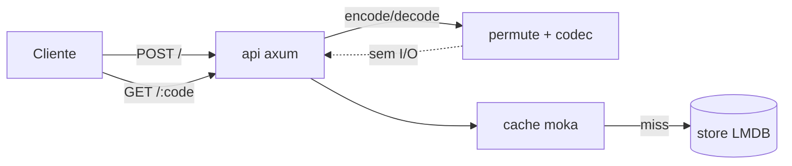
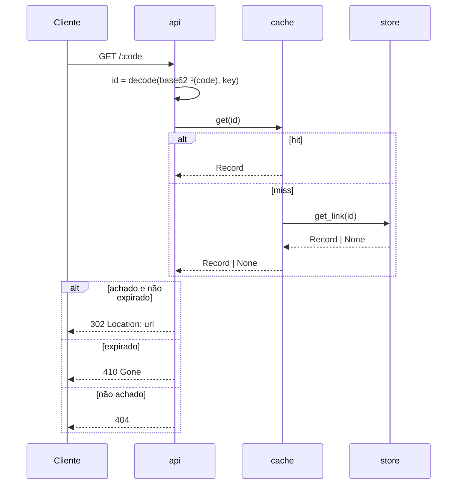

# quark

A URL shortener whose short code is a **calibrated, reduced-round ARX permutation** of the internal integer id. The code is not looked up in an index — it is **computed**, in both directions, from a tiny bijective function. That one design choice removes an entire class of problems (collisions) and an entire index (string → id) at once.

## The pitch

Most shorteners pick one of two paths for the code:

- **Reversible encoding** (Hashids, Sqids-style): fast, but not security — codes are partially enumerable. You can scrape `/aaaa`, `/aaab`, …
- **Real cipher** (e.g. Feistly = Feistel + HMAC-SHA256): non-enumerable, but slow — a full cryptographic hash runs on every round.

quark closes that gap with a **Feistel network whose round function is ARX** (add-rotate-xor), not a hash. A Feistel network over an integer domain is a bijection by construction: `decode(encode(id)) == id` for every id, with **zero collision checks needed**, ever. The only open question is *how many rounds* of mixing are needed before the output looks random enough to resist enumeration — and that's not a guess here, it's **measured** (see the avalanche table below). The result is a code generator that is simultaneously non-enumerable *and* roughly an order of magnitude faster than a real-cipher approach (~18× measured against a structurally identical HMAC-round Feistel — see the benchmark below), because ARX rounds are cheap integer ops, not hash calls.

Since the code is the permutation of the id, the store never has to index by string. It's keyed by `u64`, straight into an mmap'd database. Millions of links occupy a fraction of what a string-indexed store would need.

## Architecture



`permute` (the Feistel/ARX bijection) and `codec` (integer ↔ base62) are pure math — no I/O, no locks, off to the side of the request path. The hot path is: decode the code to an id, check the in-memory cache, fall back to a single mmap read on miss.

## Redirect sequence



Numeric base62 codes are resolved first, by pure arithmetic (masked, never panics). Only a code that is **not** a valid in-range 7-char base62 string — i.e. wrong length, an invalid character, or a value greater than `MAX_ID` — falls through to a custom alias lookup in the store.

### Aliases

A custom `alias` must not itself be a valid 7-char base62 code in range `0..=MAX_ID`: if it were, it would be indistinguishable from a computed numeric code and would be unreachable (shadowed by the numeric branch above). `create` rejects such aliases with `400 Bad Request` at creation time, before allocating an id, so they never make it into the store.

## How many rounds? Measured, not guessed

The round count for the Feistel/ARX permutation isn't picked by intuition — it's calibrated with an avalanche/SAC (Strict Avalanche Criterion) harness (`cargo run --bin calibrate`), a direct port of the diffusion measurement tooling built for a SHA-256 research lab. The idea behind SAC is simple: **flip one bit of the input id, and on a well-mixed permutation, about half the output bits should flip, unpredictably.** If flipping bit 5 of the id always flips the same 3 output bits, the code is enumerable. If it flips ~50% of the bits, on average, no matter which input bit you flip, the output looks like noise from the outside.

Measured result, sweeping 1 to 12 rounds over 200,000 random samples per round:

```
rounds | avalanche_medio | cobertura(/40)
   1   |     0.1381      |    1
   2   |     0.3622      |   21
   3   |     0.4866      |   40
   4   |     0.5000      |   40   ← ROUNDS escolhido (difusão fecha)
 5..12  |     0.5000      |   40
```

- **avalanche_medio**: average fraction of output bits that flip when one input bit flips (target: 0.5 exactly).
- **cobertura**: the minimum, across all 40 input bits, of how many distinct output bits that single input bit has ever managed to affect. `40/40` means every input bit can influence every output bit — full diffusion, no structural blind spot.

`ROUNDS = 4` is the smallest round count where avalanche hits `0.5000` exactly *and* coverage is full. Round 3 is close (`0.4866`) but not there yet. Rounds 5 through 12 buy nothing — the diffusion has already closed, so quark uses 4 and stops, keeping every round of runtime that isn't needed for the property it's paying for.

## Speed: the trophy number

```
cargo bench --bench permute_bench
```

Measured on this machine (criterion, `benches/permute_bench.rs`):

| op | time/op | ops/sec |
|---|---|---|
| `permute::encode` (u64 → u64, the permutation engine) | ~3.98 ns | ~251,000,000 |
| `permute::decode` (u64 → u64) | ~3.45 ns | ~290,000,000 |

That's the raw permutation. The **product operation** is `id → 7-char base62 string` (and back), which adds one heap-allocated `String` per call:

| op | time/op | ops/sec |
|---|---|---|
| `encode` (id → code string) | ~45 ns | ~22,000,000 |
| `decode` (code string → id) | ~80 ns | ~12,500,000 |

### Head-to-head (same machine, same criterion harness)

`benches/compare_bench.rs` measures the same class of operation — *integer id → opaque short string* — for quark and three real competitor approaches, over ids in `0..2^40`. The one that isolates quark's actual claim is **`feistel_hmac`**: an identical balanced Feistel (4 rounds, 40 bits), changing *only* the round function from ARX to HMAC-SHA256 (i.e. the "real cipher" approach that libraries like Feistly take).

| approach | encode ops/sec | vs quark | what it is |
|---|---|---|---|
| **quark** (ARX Feistel) | **~22,000,000** | 1× | keyed bijection, fixed 7-char, non-enumerable |
| hashids (`harsh` 0.2.2) | ~2,950,000 | ~7.5× slower | obfuscation encoding (weak salt, not keyed) |
| feistel + HMAC-SHA256 | ~1,230,000 | **~18× slower** | same structure as quark, hash round fn |
| sqids (`sqids` 0.4.2) | ~680,000 | ~32× slower | obfuscation encoding (no key) |

The honest headline: against the **structurally identical** cipher (same Feistel, keyed, only the round function differs), quark's ARX round is **~18× faster** — because each round is a handful of adds/rotates/xors, not a cryptographic hash invocation. That is the direct payoff of *measuring* the minimum round count (4) instead of over-provisioning "for safety".

**Fairness caveat:** sqids and hashids are obfuscation encodings — they hide sequential ids but are **not** keyed cryptographic primitives (sqids has no key; hashids' salt is documented as non-secure), and they encode an arbitrary-length domain rather than quark's fixed 40-bit → 7-char bijection. So against those two, quark's numbers show a speed advantage, not a security-equivalent one. Only `feistel_hmac` is a like-for-like security comparison. Reproduce all of it with `cargo bench --bench compare_bench`.

### Redirect capacity (end-to-end HTTP)

The numbers above are the code generator in isolation. Serving an actual redirect adds the HTTP stack + cache lookup. Measured with `oha` against the release container (`GET /:code`, hot cache, not following the 302):

| load | throughput | p50 | p99 |
|---|---|---|---|
| 50 conns | ~124,000 req/s | 0.33 ms | 1.4 ms |
| 200 conns | ~152,000 req/s | 0.90 ms | 6.3 ms |

**Caveats (read them):** this was measured on a single dev machine, inside a Docker Desktop VM (which caps CPU and adds networking overhead), hitting a cache-hit hot path. It is a *proxy* for capacity, not a production figure — a native Linux host will differ. Even so, ~150k redirects/sec is ~13 billion/day, orders of magnitude past the "millions/day" target. A benchmark on real deployment hardware is the number to trust; this repo ships a `Dockerfile` for that (see `docs/DEPLOY.md`).

## Running it

```bash
export QUARK_KEY=<a random u64, e.g. from `openssl rand -hex 8`>
export QUARK_DATA=./data        # LMDB directory, created if missing
export QUARK_ADDR=0.0.0.0:8080  # bind address
cargo run --release
```

If `QUARK_KEY` isn't set, quark logs a loud warning and falls back to a hardcoded dev key — fine for local testing, **never for production**: the key is what makes the code space unpredictable per instance.

### curl examples

```bash
# create a short link
curl -X POST localhost:8080/ -H 'content-type: application/json' \
  -d '{"url": "https://example.com/some/very/long/path"}'
# => {"code":"01aB2Cd","url":"https://example.com/some/very/long/path"}

# create with a custom alias and a 1-hour TTL
curl -X POST localhost:8080/ -H 'content-type: application/json' \
  -d '{"url": "https://example.com", "alias": "promo", "ttl": 3600}'

# follow it
curl -i localhost:8080/01aB2Cd   # -> 302 Location: https://example.com/...

# health check
curl localhost:8080/health
```

## Threat model — read this before relying on it for secrecy

quark's non-enumerability is a **measured statistical property** (avalanche/SAC over a reduced-round ARX permutation), not a cryptographic guarantee. It resists casual scraping and sequential guessing far better than a raw counter or Hashids-style encoding, and changing `QUARK_KEY` remaps the entire code space. But this is **not AES**, and it is **not** a substitute for real access control if the linked resource itself needs to stay secret — treat codes as "hard to guess by brute force in practice," not "cryptographically secret." Each instance should run with its own random `QUARK_KEY`, kept out of source control.

## More

- Full system design: [`docs/specs/2026-07-12-quark-design.md`](docs/specs/2026-07-12-quark-design.md)
- Deeper walkthrough of every component, data model and the Feistel round internals: [`docs/ARCHITECTURE.md`](docs/ARCHITECTURE.md)

## License

MIT — see [`LICENSE`](LICENSE).
