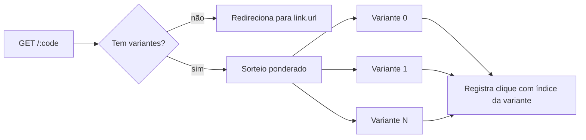

**Português** · [English](AB-TESTING.md)

# Teste A/B (destinos rotativos)

Um único código curto pode dividir o tráfego entre vários destinos por peso,
para você comparar o desempenho de cada um. Este é o item **#17** do roadmap.

## Como funciona

- Um link pode opcionalmente carregar uma lista de **variantes**: pares
  `{ url, weight }`. O peso é um número inteiro, no mínimo 1.
- **A URL principal do link é o destino padrão.** Quando um link não tem
  variantes, todo redirect vai para ela, exatamente como antes. Adicionar
  variantes não remove a URL principal; ela continua como fallback se as
  variantes forem removidas depois.
- A cada redirect de um link **com** variantes, o servidor sorteia um valor
  aleatório e escolhe uma variante com probabilidade proporcional ao seu
  peso. Duas variantes com peso 1:1 dividem aproximadamente 50/50; peso 3:1
  favorece aproximadamente 75/25.
- O sorteio é **sem estado**: um sorteio aleatório por redirect, sem contador
  e sem escrita extra no armazenamento. Um link sem variantes paga apenas uma
  checagem barata de lista vazia, então o caso comum (sem teste A/B rodando)
  não tem custo adicional.
- **Não há atribuição fixa (sticky)**. Cada clique é um sorteio independente,
  então o mesmo visitante pode cair em uma variante diferente no próximo
  clique. Se você precisa de "sempre mandar este visitante pra mesma
  variante", isso exigiria um cookie ou identificador, o que não faz parte
  desta versão.
- **Não há seleção automática de vencedor**. O quark mostra a contagem de
  cliques por variante; decidir qual venceu e atualizar o link é com você.



## Configurando variantes

No painel, abra **Criar link** ou **Editar link** e expanda a seção
**Variantes A/B**:

1. Adicione uma linha para cada destino: uma URL e um peso (padrão 1).
2. Toda URL de variante passa pela mesma validação da URL principal (precisa
   ser `http://` ou `https://`, e é checada contra a mesma proteção SSRF de
   rede interna no servidor).
3. Até 10 variantes por link.
4. Salve. O link passa a mostrar um selo "A/B: N" na tabela de links.

Exemplo: um link com `url: https://exemplo.com/landing-a` e duas variantes,
`https://exemplo.com/landing-a` (peso 2) e `https://exemplo.com/landing-b`
(peso 1), manda aproximadamente dois terços dos cliques para landing-a e um
terço para landing-b.

Pela API, o mesmo formato é aceito por `POST /` e `PATCH /admin/links/:code`:

```json
{
  "url": "https://exemplo.com/landing-a",
  "variants": [
    { "url": "https://exemplo.com/landing-a", "weight": 2 },
    { "url": "https://exemplo.com/landing-b", "weight": 1 }
  ]
}
```

## Estatísticas por variante

`GET /:code/stats` inclui `aggregates.per_variant`, um mapa do índice da
variante (como string, `"0"`, `"1"`, …) para a contagem de cliques. A tela de
estatísticas do painel mostra um gráfico "Cliques por variante" na página de
estatísticas do link sempre que esse dado está presente. Links sem variantes,
ou variantes que ainda não receberam cliques, não mostram esse gráfico ali.

## Fora do escopo (por enquanto)

- **Atribuição fixa (sticky)**: mostrar a mesma variante pro mesmo visitante
  em visitas repetidas.
- **Vencedor automático / realocação de tráfego**: otimização estilo
  multi-armed bandit que desloca peso sozinha para a variante de melhor
  desempenho.

Ambos são follow-ups naturais assim que esta base (dividir por peso, medir
por variante) estiver em uso.
