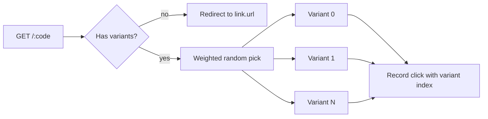

**English** · [Português](AB-TESTING.PT_BR.md)

# A/B testing (rotating destinations)

A single short code can split traffic across multiple destinations by weight,
so you can compare how each one performs. This is roadmap item **#17**.

## How it works

- A link optionally carries a list of **variants**: `{ url, weight }` pairs.
  Weight is a whole number, at least 1.
- **The link's main URL is the default destination.** When a link has no
  variants, every redirect goes there, exactly as before. Adding variants
  does not remove the main URL; it stays as the fallback if variants are
  later cleared.
- On each redirect to a link **with** variants, the server draws one random
  value and picks a variant with probability proportional to its weight. Two
  variants weighted 1:1 split roughly 50/50; weighted 3:1 skews roughly 75/25.
- The pick is **stateless**: one random draw per redirect, no counter and no
  extra store write. A link without variants pays only a cheap emptiness
  check, so the common case (no A/B test running) has no added cost.
- There is **no sticky assignment**. Each click is an independent draw, so
  the same visitor can land on a different variant on their next click. If
  you need "always send this visitor to the same variant," that needs a
  cookie or identifier, which is not part of this version.
- There is **no automatic winner selection**. quark shows you the click count
  per variant; deciding which one wins and updating the link is up to you.



## Setting up variants

In the panel, open **Create link** or **Edit link** and expand the
**A/B variants** section:

1. Add a row for each destination: a URL and a **traffic percentage**. The
   panel splits 100% evenly across the rows (two variants start at 50/50); a
   live total shows "Total: X% / 100%" and turns red until the percentages add
   up to exactly 100. "Distribute evenly" resets to an even split.
2. Every variant URL goes through the same validation as the main URL
   (must be `http://` or `https://`, and is checked against the same
   internal-network SSRF guard on the server).
3. Up to 10 variants per link.
4. Save. The link now shows an "A/B: N" badge in the links table.

The panel presents each variant as a percentage of traffic, which maps to the
`weight` field below: with the total at 100, the weight is the percentage. The
API still accepts raw relative weights directly (see below), so `2` and `1` are
equivalent to `67%` and `33%`.

Example: a link with `url: https://example.com/landing-a` and two variants,
`https://example.com/landing-a` (weight 2) and `https://example.com/landing-b`
(weight 1), sends roughly two thirds of clicks to landing-a and one third to
landing-b.

Via the API, the same shape is accepted by `POST /` and
`PATCH /admin/links/:code`:

```json
{
  "url": "https://example.com/landing-a",
  "variants": [
    { "url": "https://example.com/landing-a", "weight": 2 },
    { "url": "https://example.com/landing-b", "weight": 1 }
  ]
}
```

## Per-variant stats

`GET /:code/stats` includes `aggregates.per_variant`, a map from variant
index (as a string, `"0"`, `"1"`, …) to click count. The panel's stats screen
shows a "Clicks per variant" chart under the link's stats page whenever this
data is present. Links without variants, or variants that have not received
any clicks yet, show no chart there.

## Out of scope (for now)

- **Sticky assignment**: showing the same visitor the same variant on repeat
  visits.
- **Automatic winner / traffic reallocation**: multi-armed-bandit-style
  optimization that shifts weight toward the better-performing variant on
  its own.

Both are natural follow-ups once this baseline (split by weight, measure per
variant) is in use.
