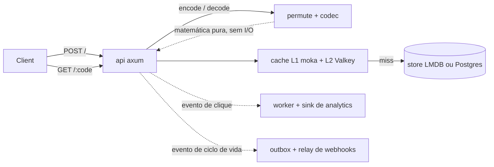
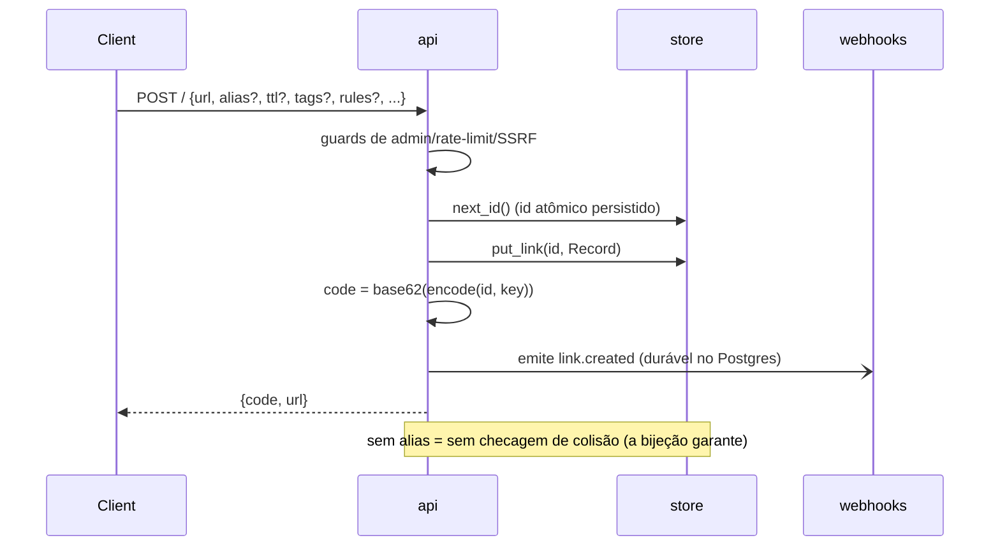
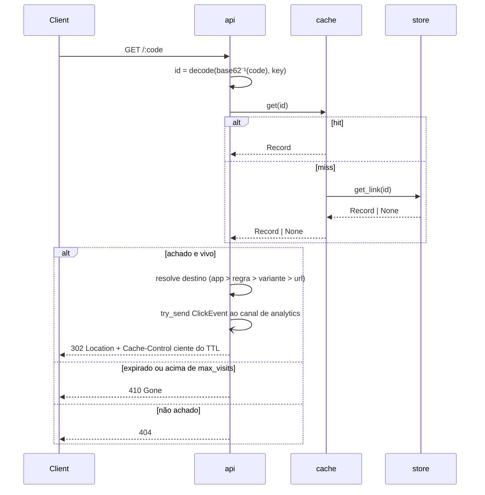
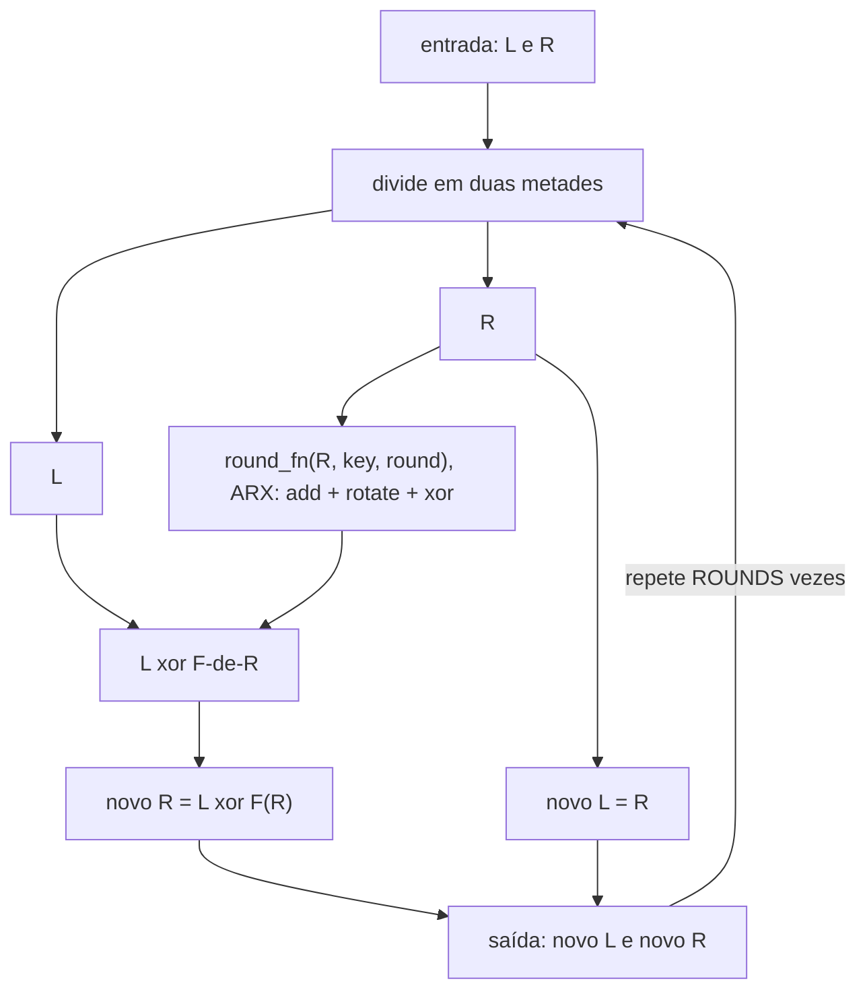
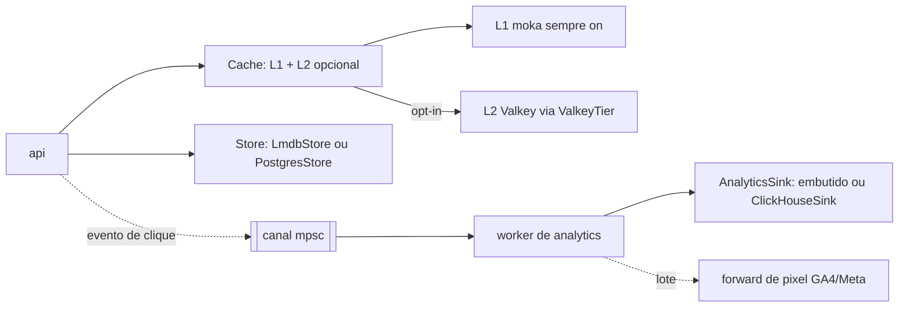

[English](ARCHITECTURE.md) · **Português**

# Arquitetura

Este documento explica como o quark funciona para quem nunca viu o código. Não assume contexto além de "é um encurtador de URL". Para a justificativa de design e o log de decisões, veja [`docs/specs/2026-07-12-quark-design.md`](specs/2026-07-12-quark-design.md); para o pitch e os números de benchmark, o [README](../README.PT_BR.md). Para toda a superfície HTTP veja [API](API.PT_BR.md), para cada configuração [CONFIGURATION](CONFIGURATION.PT_BR.md), e para a história multi-nó [SCALING](SCALING.PT_BR.md).

## Visão geral

O quark é um único binário Rust feito de poucos módulos pequenos e de propósito único. Dois deles (`permute` e `codec`) não fazem I/O nenhum; são funções puras sobre inteiros. Todo o resto existe para mover bytes entre a rede e o banco o mais barato possível. Store, cache e analytics ficam atrás de traits, então o mesmo binário roda como um nó único sem dependências ou contra Postgres, Valkey e ClickHouse, escolhidos no startup por quais env vars estão setadas.



| Módulo | Responsabilidade | Depende de |
|---|---|---|
| `permute` | A bijeção entre id e código: uma rede Feistel balanceada com função de round ARX. `encode(u64) -> u64`, `decode(u64) -> u64`, domínio de 40 bits, 4 rounds. Sem estado, sem I/O. | (núcleo puro) |
| `codec` | Inteiro para string base62 de 7 caracteres, URL-safe, e de volta. | (núcleo puro) |
| `store` | Persistência atrás da trait `Store`: links por `u64`, aliases, blocklist, webhooks, tokens, pixels, docs well-known, visitas, o outbox de webhook. Backends: `lmdb.rs` (embutido default) e `postgres.rs` (compartilhado). | `heed` (LMDB), `sqlx` (Postgres) |
| `cache` | Mapa concorrente L1 `id -> Record` na frente do store, com tier L2 opcional e um circuit breaker. | `moka`, `redis` (L2 opt-in) |
| `analytics` | Captura de clique fora do redirect (fire-and-forget), worker de lote em background, agregados mais últimos N eventos; a trait `AnalyticsSink` e as impls embutida e ClickHouse. Também dirige o forward de conversão. | `tokio` mpsc, `clickhouse` (opt-in) |
| `pixel` | Forward de conversão server-side para GA4 e Meta CAPI a partir do worker de analytics, com ids de dedup por clique. | `reqwest` |
| `webhooks` | Eventos HTTP de saída assinados (Standard Webhooks) mais canais de chat; `delivery.rs` tem o worker best-effort em memória e o relay durável do outbox Postgres. | `reqwest`, `hmac`, `sha2` |
| `auth` | Tokens de API nomeados e escopos; geração de token e hash SHA-256. | `sha2` |
| `import` | Parsing de import em lote CSV/JSON para `POST /admin/import`. | `csv`, `serde_json` |
| `abuse` | Guards do `POST /`: rate limit por IP, blocklist de destino (domínio mais subdomínio, cacheada) e helpers puros de host interno / self-loop. Nunca no caminho do redirect. | `redis` (opt-in) |
| `invalidate` | Invalidação de cache e blocklist cross-node por um canal pub/sub do Valkey. No-op no nó único. | `redis` |
| `cluster` | Preflight de startup que falha um deploy multi-nó estrito sem suas deps de estado compartilhado. Decisão pura, com teste unitário. | (puro) |
| `calibrate` | Harness offline de avalanche/SAC que mede a difusão do `permute` e escolhe `ROUNDS`. Fora do serviço em execução. | `permute` (uma cópia da matemática) |

`permute` e `calibrate` são o diferencial; todo o resto é engenharia padrão e trocável (LMDB podia virar `redb`, moka qualquer outro cache, axum qualquer coisa que fale HTTP). Os handlers HTTP e o router vivem todos num módulo só, `src/api.rs`, agrupados por comentário; os tipos de request/response são structs serde inline nesse arquivo.

## Fluxo de criação



A API valida que a URL é `http(s)://`, roda os guards de abuso, então pede ao store o próximo id, um contador persistido para reinícios não reusarem ids. Grava o `Record` pela chave do id inteiro cru, depois computa o código público rodando o id por `permute::encode` e base62. Note o que falta: não há checagem de "esse código já existe?". Como `encode` é uma bijeção, dois ids diferentes nunca produzem o mesmo código, então a checagem de colisão é eliminada por design no nível de tipo, não em runtime.

Aliases customizados são um caminho de propósito separado: ainda alocam um id e registro reais (para a lógica de redirect não precisar de dois caminhos), mas passam por uma tabela `aliases: alias -> id` que precisa de checagem de unicidade, porque um humano escolheu a string e dois humanos podem escolher a mesma. É o único lugar do sistema que faz checagem de colisão, e é opt-in.

Os guards de abuso rodam no `create`, e só no `create`, nunca no redirect. Em ordem, mais barato primeiro: rate limit por IP (`429` se acima), validação de URL (`400`), extração do host (`400` se sem host), o guard interno/loop (`403` para IPs privados/loopback/`localhost` ou o próprio host da instância, nunca resolve DNS) e a checagem de blocklist (`403` para um domínio ou subdomínio listado). Regras, variantes e destinos de app passam pelas mesmas checagens SSRF/blocklist para uma regra não contrabandear um host interno.

### O Record

Cada link é um `Record` (`src/store/mod.rs`), gravado como JSON no LMDB ou em colunas no Postgres:

| Campo | Tipo | Significado |
|---|---|---|
| `url` | `String` | O destino default. |
| `expiry` | `Option<u64>` | Expiração de TTL, segundos unix. |
| `created` | `u64` | Hora de criação. |
| `tags` | `Vec<String>` | Tags normalizadas (trim, minúsculas, dedup, teto 20). |
| `max_visits` | `Option<u32>` | Teto de visitas; `None` é ilimitado. |
| `rules` | `Vec<Rule>` | Regras de redirect geo/dispositivo, primeira que casa ganha. |
| `variants` | `Vec<Variant>` | Destinos A/B por peso. |
| `app_ios` | `Option<String>` | Destino deep-link iOS. |
| `app_android` | `Option<String>` | Destino deep-link Android. |

`Rule` é `{field: country|device, values: [...], to: url}`; `Variant` é `{url, weight}`. Todo campo depois de `created` é `#[serde(default)]`, então um registro antigo desserializa para frente sem migração. O contador de visitas fica separado do `Record` (chave própria no LMDB, coluna no Postgres) para um clique incrementar um contador sem reescrever o registro todo.

### Aliases

Como o `redirect` resolve um código base62 numérico primeiro, um alias customizado não pode ser uma string base62 válida de 7 chars na faixa `0..=MAX_ID`: tal alias decodificaria como um id numérico e ficaria inalcançável para sempre. O `create` checa isso com o próprio parser do codec antes de alocar um id, rejeitando a colisão com `400 Bad Request`.

## Fluxo de redirect



O quark primeiro tenta parsear o segmento do path como código base62 numérico e rodar por `permute::decode`. Se o parse falha (tamanho errado, caractere inválido ou valor fora da faixa), cai num lookup de alias. Então o caminho quente (códigos numéricos, a maioria esmagadora do tráfego num encurtador read-heavy) nunca toca a tabela `aliases`: aritmética pura para o id, depois um lookup de cache. Só num miss de cache cai numa leitura mmap do LMDB (um lookup de page-table no caso comum) ou numa query Postgres. Expiração é checada preguiçosamente na leitura; não há varredor em background.

### Precedência de destino

Carregado um registro vivo, o destino é resolvido compondo três mecanismos de segmentação em ordem de prioridade:

1. **Deep-link de app por dispositivo.** Um visitante no iOS ou Android, quando o link seta um `app_ios` / `app_android` que casa, é a intenção mais específica e ganha. Plataforma é um substring check no User-Agent (`iPhone`/`iPad`/`iPod`, ou `Android`).
2. **Regra geo/dispositivo.** Senão a primeira `Rule` que casa (país do `cf-ipcountry`, dispositivo do User-Agent) dá o destino. Veja [REDIRECT-RULES](REDIRECT-RULES.PT_BR.md).
3. **Variante A/B.** Senão, se o link tem variantes, uma escolha por peso (um único sorteio `getrandom`, sem escrita no store) escolhe uma variante e o índice dela é registrado no clique. Veja [AB-TESTING](AB-TESTING.PT_BR.md).

Um link sem nada disso (o caso comum) redireciona para `rec.url` direto, movendo a string sem alocação. Antes, se `max_visits` está setado o redirect incrementa o contador de visitas e retorna `410 Gone` passado o teto. Os eventos de webhook `link.clicked` e `link.expired` só são emitidos quando uma assinatura os quer, com gate num flag atômico cacheado para o caminho quente não pagar nada senão.

## A permutação Feistel/ARX

O truque central: o quark precisa de uma função `f: [0, 2^40) -> [0, 2^40)` que seja bijeção (cada id mapeia para exatamente um código e de volta, sem colisões) e que também pareça aleatória o bastante para códigos não serem adivinháveis a partir de ids vizinhos. Uma rede Feistel dá a bijeção de graça, estruturalmente, seja qual for a função de mistura dentro. Divida a entrada em duas metades `L | R` e repita:



Por que isso é sempre invertível, seja o que `round_fn` compute: dado `(novo_L, novo_R)`, o `R` anterior é só `novo_L` (passou intacto), e o `L` anterior é `novo_R xor round_fn(novo_L, ...)`, recomputando a mesma saída do round e xorando ela fora (`x xor y xor y == x`). O `decode` roda isso ao contrário, round a round. A função de round nunca precisa ser invertível nem bem-comportada, o que torna seguro fazê-la barata.

A `round_fn` do quark é ARX (add-rotate-xor): um add de subchave, depois uma pequena sequência fixa de mistura rotate-xor, mascarada à meia largura. Sem hashing, sem S-boxes: só operações inteiras que a CPU faz em um ou dois ciclos. Rounds baratos deixam o quark rodar quantos a difusão pedir sem pagar um hash por round.

Quantos rounds é respondido empiricamente. `cargo run --bin calibrate` varre `ROUNDS` de 1 a 12 e mede o efeito avalanche: vira um bit de entrada, roda a permutação, mede que fração dos 40 bits de saída mudou. Se virar o bit `i` previsivelmente vira os mesmos poucos, um atacante consegue raciocinar sobre o mapeamento; se vira cerca de 50% seja qual bit, a saída é estatisticamente como ruído por fora (o Strict Avalanche Criterion).

```
rounds | avalanche_medio | cobertura(/40)
   1   |     0.1381      |    1
   2   |     0.3622      |   21
   3   |     0.4866      |   40
   4   |     0.5000      |   40   ← ROUNDS escolhido (difusão fecha)
 5..12  |     0.5000      |   40
```

`avalanche_medio` é a fração média de bits de saída virados; `cobertura` é o pior caso, sobre os 40 bits de entrada, de quantos bits de saída distintos um bit já influenciou, pegando um ponto cego estrutural que a média esconderia. No round 4 os dois saturam: avalanche exatamente `0.5000`, cobertura cheia `40/40`. Round 3 é perto (`0.4866`) mas não lá; rounds 5 a 12 medem idêntico. `ROUNDS = 4` é fixo como constante de compilação em `src/permute.rs`, derivado dessa medição, não escolhido "por segurança".

## Backends plugáveis

Três seams (`Store`, `CacheTier`, `AnalyticsSink`) separam a forma do caminho de requisição de qual backend concreto o implementa. Tudo acima (LMDB, moka, o sink embutido) é o default por trás dessas traits. Cada backend é opt-in, escolhido no startup só por qual env var está setada: sem feature flags de build, sem ramificação além de `open_backends` e o check de `QUARK_VALKEY_URL` no `main.rs`.



- **`Store`** (`src/store/mod.rs`): `next_id`, `get_link`, `put_link`, `get_alias`, `put_alias_and_link`, mais métodos de blocklist, webhook, token, pixel, well-known, visita e outbox, todos `async`. `open_backends` escolhe `PostgresStore` quando `QUARK_DATABASE_URL` está setado, senão `LmdbStore`. O `PostgresStore` implementa a sequência de id atomicamente no banco (quatro sequências `nextval`), o que torna seguro rodar mais de um quark contra o mesmo Postgres.
- **`CacheTier`** (`src/cache/mod.rs`): `get`/`set`/`invalidate` para um L2 fora do processo. `ValkeyTier` (`src/cache/valkey.rs`) é a única implementação, ligada quando `QUARK_VALKEY_URL` está setado. O `Cache` sempre mantém o mapa L1 moka (TTL 60s) na frente de qualquer tier; o tier (TTL 3600s) é consultado só num miss de L1. Um `Breaker` (atômicos lock-free) abre após 5 falhas seguidas do tier e fica aberto 30s, e toda op de L2 é envolta num timeout de 100ms, então um Valkey lento não trava um redirect. Qualquer erro do tier é engolido e tratado como miss; o chamador sempre cai no store.
- **`AnalyticsSink`** (`src/analytics/mod.rs`): consome `ClickEvent`s de um canal mpsc por um worker de background (`spawn_worker`), desacoplando o 302 da persistência de analytics. `open_backends` dá a cada store seu sink embutido (tanto `LmdbStore` quanto `PostgresStore` implementam `AnalyticsSink`) e o sobrescreve com `ClickHouseSink` quando `QUARK_CLICKHOUSE_URL` está setado. ClickHouse é só analytics por construção (nada do `Store` é implementado nele) porque o volume de cliques supera o de criação de link e quer um motor OLAP de append/agregação.

Store e AnalyticsSink são escolhidos independentemente: o store segue `QUARK_DATABASE_URL`, o sink segue `QUARK_CLICKHOUSE_URL` se setado, senão o sink embutido do store escolhido. Isso deixa um deploy misturar store Postgres com analytics ClickHouse, Postgres para os dois, ou LMDB puro para os dois, tudo do mesmo binário.

## Proteção contra abuso

Tudo aqui roda só no `POST /`. Dois botões e um guard sempre ligado, todos no módulo `abuse`:

- **Rate limit** (`RateLimiter`, opt-in via `QUARK_RATELIMIT_PER_MIN`): janela fixa de 60s por IP. Em memória por réplica por default (um `HashMap` varrido uma vez por janela); com `QUARK_VALKEY_URL` usa `INCR`/`EXPIRE` do Valkey para um limite global. Fail-open. O mesmo limiter também aplica as cotas por token de API. O IP vem de `QUARK_REAL_IP_HEADER` (default `cf-connecting-ip`) com fallback no socket, então só ligue atrás de um proxy que sobrescreva o header.
- **Blocklist de destino** (`Blocklist`): o conjunto de domínios bloqueados vive no store, gerido por `/admin/blocklist`. O casamento é domínio mais subdomínio, sem diferenciar maiúsculas. Leituras passam por um snapshot em memória num TTL (`QUARK_BLOCKLIST_TTL`), opcionalmente apoiado no Valkey; uma escrita de admin invalida local e, com Valkey, cross-node via pub/sub.
- **Guard interno/loop** (default on, `QUARK_BLOCK_PRIVATE=0` desliga): rejeita um IP literal privado/loopback/link-local (v4 e v6, incluindo IPv4-mapeado), `localhost`, ou o próprio host da instância. Nunca resolve DNS.

## Modelo de dados

### LMDB

Onze bancos nomeados dentro de um ambiente LMDB (`heed::Env`, `max_dbs = 11`, mapa de 64 GiB), abertos uma vez e mmap'd pela vida do processo:

| Banco | Chave para valor |
|---|---|
| `links` | `u64` big-endian para JSON `Record` (único lugar onde bytes de URL vivem) |
| `aliases` | alias `String` para id `u64` |
| `meta` | nomes de contador (`next_id`, `next_webhook_id`, `next_api_token_id`, `next_pixel_id`) para `u64` |
| `stats` / `events` | `Aggregates` por id e últimos N `ClickEvent`s crus (o sink embutido) |
| `visits` | id `u64` para contagem `u64` de visitas |
| `blocked` | domínio bloqueado para vazio |
| `webhooks` | id `u64` para JSON da assinatura |
| `api_tokens` | id `u64` para JSON do token |
| `pixels` | id `u64` para JSON da config de pixel |
| `wellknown` | nome do documento para o corpo |

A chave por inteiro de largura fixa em vez da string do código significa nenhum índice de string de comprimento variável, então as páginas B-tree empacotam mais apertado e o código base62 nunca é armazenado (sempre recomputado do id). Os métodos do outbox de webhook são no-ops no LMDB (é single-node; entrega durável precisa de Postgres), e `search_links` retorna `Unsupported` (busca só client-side).

### Postgres

Os mesmos dados em treze tabelas mais quatro sequências de id, criadas de forma idempotente sob um advisory lock. Além dos análogos diretos (`links`, `aliases`, `blocked_domains`, `webhooks`, `api_tokens`, `pixels`, `wellknown_documents`), o backend compartilhado adiciona:

- **Analytics atômico** em `click_counters` (uma linha por id, dimensão e bucket, incrementada com `INSERT ... ON CONFLICT DO UPDATE SET count = count + n`), `stats_meta` (primeiro/último timestamp) e `click_events` (append-only, uma linha por clique). Isso substitui um read-modify-write anterior de um blob de agregado sob advisory lock por link, então um link viral não serializa mais no sink.
- **Um outbox durável de webhook** em `webhook_deliveries` (chave de entrega, assinatura, payload, tentativas, próxima tentativa, flag dead), drenado por um relay com lease.

As tabelas legadas `stats` e `events` são mantidas mas não mais lidas nem escritas. Veja [SCALING](SCALING.PT_BR.md) para como cada subsistema se comporta entre os dois backends.

## Camada de reforço de escala

Sobre os backends plugáveis, uma camada fina faz um deploy multi-nó Postgres+Valkey se comportar de forma correta em vez de degradar em silêncio. Cada peça é no-op ou um default local num nó único.

- **Invalidação cross-node** (`src/invalidate.rs`): uma edição, deleção ou bloqueio de admin publica uma mensagem minúscula (`link:<id>` ou `blocklist`) num canal pub/sub do Valkey; cada nó assina e derruba a entrada L1 correspondente ou recarrega seu snapshot de blocklist local, nunca republicando (sem loop). A publicação é limitada por um timeout de 100ms e é fail-open. Sem Valkey é no-op e a defasagem é limitada pelos TTLs de 60s.
- **Contadores atômicos de analytics** (sink Postgres): os incrementos atômicos de `click_counters` acima, então dois nós dando flush no mesmo link viral aterrissam suas contagens sem perda de update e sem lock. A ingestão continua at-most-once por design (um clique é `try_send` a um canal limitado e descartado quando cheio).
- **Outbox e relay durável de webhook** (`src/webhooks/delivery.rs`): no Postgres, os eventos de ciclo de vida (`link.created/updated/deleted`) são gravados em `webhook_deliveries` e entregues at-least-once por um relay que reivindica linhas devidas com `SELECT ... FOR UPDATE SKIP LOCKED` (disjuntas por nó), com backoff exponencial persistido, uma flag dead-letter após 8 tentativas e uma chave de idempotência estável. `link.clicked` e `link.expired` ficam best-effort em memória por design, já que disparam no caminho quente do redirect. Veja [WEBHOOKS](WEBHOOKS.PT_BR.md).
- **Preflight de cluster** (`src/cluster.rs`): com `QUARK_STRICT_CLUSTER` setado, o quark se recusa a subir a menos que `QUARK_DATABASE_URL` e `QUARK_VALKEY_URL` estejam presentes, transformando uma configuração errada silenciosa em erro de startup.

## Por que essas escolhas

- **LMDB via `heed`**: uma B-tree apoiada em mmap onde leituras são hits do page-cache com praticamente nenhum overhead de syscall, e sem motor de query separado no caminho quente. Para uma carga de cerca de 200:1 leitura:escrita, uma leitura mmap é quase o mais rápido possível sem um formato de disco próprio.
- **`moka` na frente do store, não só o page cache do SO**: um mapa `id -> Record` tipado, concorrente e limitado em capacidade, então um hit pula o parse de JSON e a transação LMDB inteiros e retorna um `Record` já materializado.
- **Códigos computados, nunca armazenados**: como `encode`/`decode` são uma bijeção, o código é função pura do id e da chave, então não há tabela `code -> id` para construir ou manter consistente, e o caminho de criação não precisa de checagem de colisão.
- **Uma rede Feistel com round ARX em vez de uma cifra de verdade**: a bijeção é de graça pela estrutura da rede; o custo vive na função de round, mantida em operações inteiras baratas e no número mínimo medido de rounds em vez de reusar uma primitiva criptográfica mais lenta.
