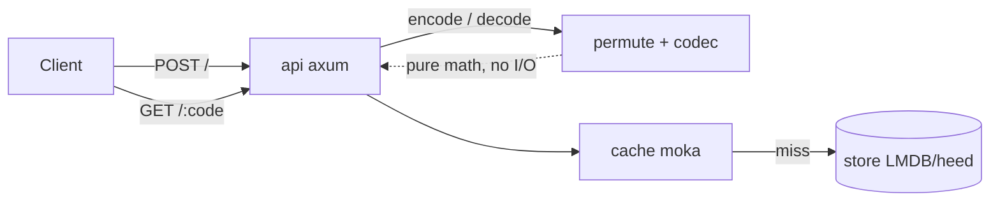
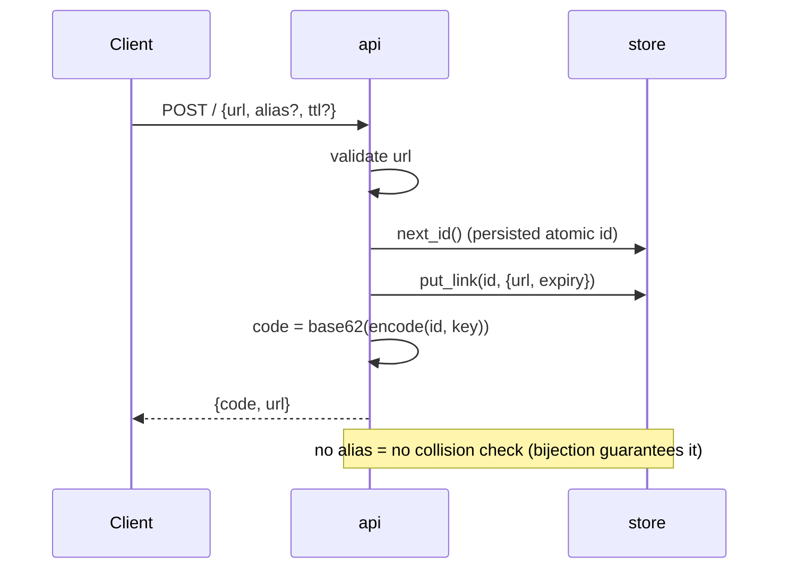
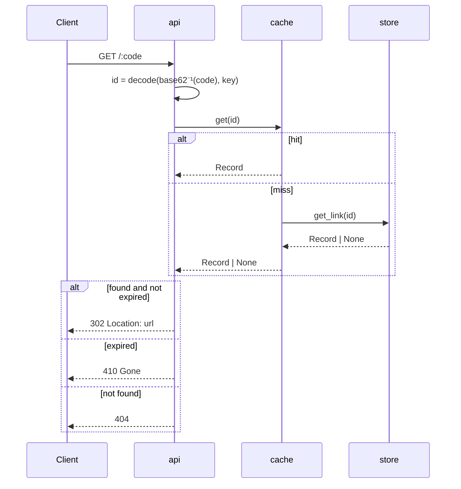
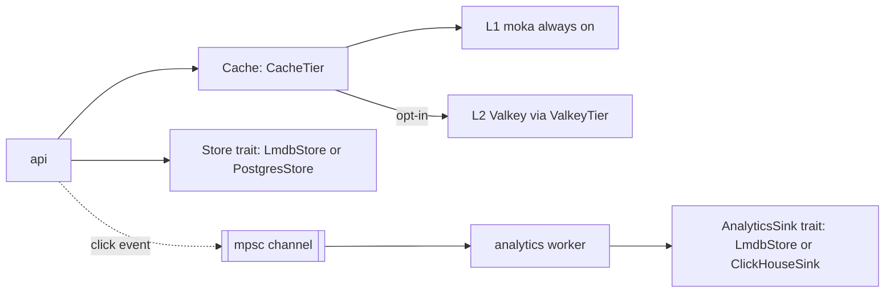

[English](ARCHITECTURE.md) · **Português**

# Arquitetura

Este documento explica como o quark funciona pra alguém que nunca viu o código. Ele não assume nenhum contexto prévio além de "é um encurtador de URL". Para a justificativa de design e o histórico de decisões, veja [`docs/specs/2026-07-12-quark-design.md`](specs/2026-07-12-quark-design.md); para o pitch e os números de benchmark, veja o [README](../README.PT_BR.md).

## Visão geral

O quark é um único binário Rust feito de um punhado de módulos pequenos e de propósito único. Dois deles — `permute` e `codec` — não fazem I/O nenhum; são funções puras sobre inteiros. Todo o resto existe para mover bytes entre a rede e o banco de dados da forma mais barata possível.



| Módulo | Responsabilidade | Depende de |
|---|---|---|
| `permute` | A bijeção entre id e código: uma rede Feistel com função de round ARX. `encode(u64) -> u64`, `decode(u64) -> u64`. Sem estado, sem I/O. | — (núcleo puro) |
| `codec` | Integer ↔ string base62 de 7 caracteres, URL-safe. | — |
| `store` | Persistência mmap'd: `id: u64 -> {url, expiry, created}`; um mapa `alias -> id` separado; um contador de id persistido. | `heed` (bindings do LMDB) |
| `cache` | Um LRU concorrente e quente `id -> Record` na frente do store, pra que um redirect quente nunca toque o LMDB. | `moka` |
| `api` | Superfície HTTP: `POST /` cria, `GET /:code` redireciona, `GET /:code/stats`, `GET/POST/DELETE /admin/blocklist`, `GET /health`. | `axum` |
| `analytics` | Captura de cliques fora do caminho de redirect (fire-and-forget), worker de batch em background, agregados + últimos N eventos; a trait `AnalyticsSink` e suas implementações LMDB/ClickHouse. | `tokio` mpsc |
| `abuse` | Proteção do `POST /`: rate limit por IP (`RateLimiter`), blocklist de destino (`Blocklist`, domínio+subdomínio, cacheada), e helpers puros pra guarda de host interno / auto-loop. Nunca toca o caminho de redirect. | `redis` (opt-in) |
| `calibrate` | Harness offline de avalanche/SAC que mede a difusão do `permute` através de diferentes contagens de round e escolhe `ROUNDS`. Não faz parte do serviço em execução. | `permute` (uma cópia da sua matemática, mantida livre de dependências) |

`permute` e `calibrate` são o diferencial; todo o resto é engenharia padrão, substituível (LMDB poderia se tornar `redb`, moka poderia se tornar qualquer outro cache, axum poderia se tornar qualquer coisa que fale HTTP).

## Fluxo de criação



Passo a passo: a API valida que a URL é `http(s)://`, depois pede ao store o próximo id — um contador persistido no LMDB pra sobreviver a restarts. Ela escreve o registro chaveado por esse id inteiro bruto, depois computa o código público passando o id pelo `permute::encode` e codificando o resultado em base62. Note o que está *faltando*: não existe uma checagem de "esse código já existe?". Como `encode` é uma bijeção, dois ids diferentes nunca podem produzir o mesmo código — eliminando uma classe inteira de bugs de colisão a nível de tipo, em vez de a nível de runtime.

Aliases customizados são um caminho deliberadamente separado: eles ainda alocam um id e um registro reais (pra que a lógica de redirect não precise de dois caminhos de código), mas passam por uma tabela `aliases: alias -> id` que *precisa* de uma checagem de unicidade, porque um humano escolheu a string e dois humanos podem escolher a mesma. Esse é o **único** lugar em todo o sistema que faz uma checagem de colisão, e é opt-in.

Antes de tudo isso, `create` executa as guardas de abuso — e só o `create`, nunca o redirect. Em ordem, mais barato primeiro: um **rate limit** por IP (`429` se excedido), validação de URL (`400`), extração do host de destino (`400` se sem host), uma **guarda interno/loop** (`403` para IPs privados/loopback/`localhost` ou o próprio host da instância — nunca resolve DNS), e uma checagem de **blocklist** (`403` pra um domínio ou subdomínio listado). Tudo isso é opt-in ou seguro por default e vive no módulo `abuse`; veja *Proteção contra abuso* abaixo.

### Aliases

Como `redirect` resolve um código numérico base62 primeiro (veja abaixo), um alias customizado não pode ser, ele mesmo, uma string base62 válida de 7 caracteres na faixa `0..=MAX_ID` — tal alias seria decodificado como um id numérico e ficaria permanentemente inalcançável. `create` checa isso com o próprio parser do codec antes de alocar um id, rejeitando a colisão com `400 Bad Request` em vez de sombrear silenciosamente um código numérico.

## Fluxo de redirect



O quark primeiro tenta interpretar o segmento do path como um código numérico base62 e passá-lo pelo `permute::decode`. Se esse parse falhar (tamanho errado, caractere inválido, ou o valor decodificado fora da faixa válida de id), ele cai pra uma busca de alias. Isso significa que o caminho quente — códigos numéricos, que é a esmagadora maioria do tráfego num encurtador read-heavy — nunca toca a tabela `aliases`: é aritmética pura pra obter o id, depois uma busca no cache. Só num cache miss é que ele cai pra uma leitura mmap no LMDB, que por si só é apenas uma busca na tabela de páginas no caso comum (o SO mantém as páginas quentes residentes). A expiração é checada de forma lazy, no momento da leitura, contra o relógio de parede — nenhuma varredura em background é necessária para a corretude, só pra eventualmente liberar espaço.

## A permutação Feistel/ARX

O truque central: o quark precisa de uma função `f: [0, 2^N) -> [0, 2^N)` que seja uma *bijeção* — todo id mapeia pra exatamente um código e vice-versa, sem colisões — e que também *pareça* aleatória o suficiente pra que os códigos não sejam adivinháveis a partir de ids próximos. Uma **rede Feistel** te dá a bijeção de graça, estruturalmente, independente do que a função de mistura dentro dela faça. Esse é o truque clássico por trás de cifras de bloco (DES, e esquemas de criptografia que preservam formato em geral): divida a entrada em duas metades `L | R`, e repetidamente faça:


Por que isso é *sempre* invertível, não importa o que `round_fn` calcule: dado o output `(new_L, new_R)`, o `R` anterior é simplesmente `new_L` (ele passou intocado), e o `L` anterior é `new_R xor round_fn(new_L, ...)` — você recalcula o mesmo output do `round_fn` e o remove com xor, já que `x xor y xor y == x`. `decode` roda exatamente isso, round por round, em ordem reversa. A própria função de round nunca precisa ser invertível nem bem-comportada pra isso valer — é isso que torna seguro fazer a função de round *barata*.

O `round_fn` do quark é ARX (add-rotate-xor): uma soma com subchave, depois uma sequência pequena e fixa de mistura rotate-xor, mascarada pra meia-largura. Sem hashing, sem S-boxes, sem primitiva criptográfica — só operações inteiras que a CPU faz em um ou dois ciclos cada. Esse é exatamente o lado do "custo" do trade-off: rounds baratos significam que o quark pode se dar ao luxo de rodar mais deles do que um esquema naive precisaria, se a difusão exigisse, sem pagar o custo de centenas de ciclos de algo como HMAC-SHA256 por round.

A questão que resta — *quantos rounds* — é respondida empiricamente, não assumida. `cargo run --bin calibrate` varre `ROUNDS` de 1 a 12 e mede o **efeito avalanche**: para cada bit de entrada, flipa-o, roda a permutação, e mede que fração dos 40 bits de saída mudou. Se flipar o bit `i` previsivelmente sempre flipa o mesmo punhado de bits de saída, um atacante consegue raciocinar sobre o mapeamento. Se flipa ~50% dos bits de saída, em média, não importa qual bit você flipe, o output é estatisticamente indistinguível de ruído visto de fora — esse é o Strict Avalanche Criterion (SAC).

```
rounds | avalanche_medio | cobertura(/40)
   1   |     0.1381      |    1
   2   |     0.3622      |   21
   3   |     0.4866      |   40
   4   |     0.5000      |   40   ← ROUNDS escolhido (difusão fecha)
 5..12  |     0.5000      |   40
```

`avalanche_medio` é a fração média de bits de saída flipados através de todos os flips de bit de entrada e todas as entradas amostradas; `cobertura` é o pior caso, entre todos os 40 bits de entrada, de quantos bits de saída distintos aquele único bit já foi observado influenciando — ela captura pontos cegos estruturais que uma média isolada poderia escondar (ex.: um bit que nunca alcança o byte mais alto). No round 4, ambas as métricas saturam: o avalanche bate exatamente `0.5000` e a cobertura é total `40/40`. O round 3 está perto mas não chega lá (`0.4866`). Os rounds 5–12 medem de forma idêntica ao round 4 — a difusão já fechou, então não há nada a mais a ganhar adicionando mais rounds, só latência a perder. `ROUNDS = 4` é fixado como uma constante em tempo de compilação em `src/permute.rs`, derivada diretamente dessa medição em vez de escolhida por convenção ou "só por segurança".

## Backends plugáveis

Três costuras — `Store`, `CacheTier`, `AnalyticsSink` — separam a *forma* do caminho da requisição de *qual backend concreto* a implementa. Tudo documentado acima (LMDB, moka, o sink embutido) é a implementação default por trás dessas traits, não a única. Cada backend é opt-in, selecionado no startup puramente por qual variável de ambiente está definida — sem feature flags de build, sem branching de código além do `open_backends`/da checagem de `QUARK_VALKEY_URL` em `main.rs`.



- **`Store`** (`src/store/mod.rs`): `next_id`, `get_link`, `put_link`, `get_alias`, `put_alias_and_link` — todos `async`, então uma implementação com rede (Postgres) não custa nada estruturalmente mais que a embutida. `open_backends` em `src/store/mod.rs` escolhe `PostgresStore` quando `QUARK_DATABASE_URL` está definida, senão `LmdbStore`; `PostgresStore` implementa a sequência de id atomicamente no próprio banco de dados (não um contador local), o que é o que torna seguro rodar mais de uma instância do quark contra o mesmo Postgres.
- **`CacheTier`** (`src/cache/mod.rs`): `get`/`set` pra um L2 fora do processo. `ValkeyTier` (`src/cache/valkey.rs`) é a única implementação hoje, ligada em `main.rs` quando `QUARK_VALKEY_URL` está definida. `Cache` (`src/cache/mod.rs`) sempre mantém o mapa L1 `moka` na frente de qualquer `CacheTier`; o tier só é consultado em caso de miss no L1. Um `Breaker` (atomics, sem locks) abre depois de `BREAKER_THRESHOLD` falhas consecutivas do tier e permanece aberto por `BREAKER_COOLDOWN_SECS`, e toda operação L2 é envolvida num `L2_OP_TIMEOUT` (100ms) — então um Valkey que só está lento, não fora do ar, ainda assim não consegue travar um redirect além desse limite. Qualquer erro de tier (timeout, conexão, deserialização) é engolido num `TierError`, registrado pelo breaker, e tratado como miss: quem chama sempre cai pro store, o erro nunca aparece pra fora.
- **`AnalyticsSink`** (`src/analytics/mod.rs`): consome `ClickEvent`s de um canal `mpsc` via um worker em background (`spawn_worker`), desacoplando completamente a resposta do redirect da persistência de analytics — um redirect retorna seu 302 antes do clique ser gravado de forma durável. `open_backends` dá a cada store seu próprio sink embutido (o `LmdbStore` do LMDB também implementa `AnalyticsSink`; assim como o `PostgresStore`) e o sobrescreve com `ClickHouseSink` (`src/analytics/clickhouse.rs`) quando `QUARK_CLICKHOUSE_URL` está definida. ClickHouse é analytics-only por construção — nada em `Store` é implementado para ele — porque o volume de eventos de clique é esperado pra superar em muito o volume de criação de links, e quer um motor de append/agregação OLAP, não o store transacional.

Store e AnalyticsSink são escolhidos independentemente um do outro (veja o comentário de documentação em `open_backends`): o store segue `QUARK_DATABASE_URL`, e o sink segue `QUARK_CLICKHOUSE_URL` se definida, senão cai pro que quer que o store escolhido forneça como seu sink embutido. Isso é o que permite que um deployment misture, digamos, um store Postgres com analytics ClickHouse, ou Postgres pros dois, ou LMDB puro pros dois — o mesmo binário, sem rebuild, só variáveis de ambiente.

## Proteção contra abuso

Tudo aqui roda **só no `POST /`** — o redirect e os caminhos de leitura permanecem intocados, então os números medidos do caminho quente continuam valendo. Dois botões e uma guarda sempre ativa, tudo no módulo `abuse`:

- **Rate limit** (`RateLimiter`, opt-in via `QUARK_RATELIMIT_PER_MIN`): uma janela fixa de 60s por IP de cliente. Em memória por réplica por default (um `HashMap` limpo uma vez por janela pra não crescer sem limite); quando `QUARK_VALKEY_URL` está definida ele usa `INCR`/`EXPIRE` do Valkey pra um limite **global** entre réplicas. Fail-open: qualquer erro do Valkey deixa a requisição passar — um cache quebrado nunca bloqueia a criação de link. O IP do cliente vem de um header configurável (`QUARK_REAL_IP_HEADER`, default `CF-Connecting-IP`) com fallback pro endereço do socket; como o header é confiado, só habilite o limite atrás de um proxy que o sobrescreve.
- **Blocklist de destino** (`Blocklist`, ligada por conteúdo): o conjunto de domínios bloqueados vive no `Store` (pra que uma futura UI admin possa editá-lo — é *dado*, não configuração), gerenciado via `GET/POST/DELETE /admin/blocklist` sob `QUARK_ADMIN_TOKEN`. O matching é domínio + subdomínio, case-insensitive. Leituras passam por um cache de snapshot — o conjunto inteiro em memória (L1), atualizado num TTL (`QUARK_BLOCKLIST_TTL`), opcionalmente apoiado por Valkey (L2) pra que as réplicas compartilhem a fonte; uma escrita admin o invalida. A propagação entre réplicas é eventual (≤ TTL).
- **Guarda interno/loop** (ligada por default, `QUARK_BLOCK_PRIVATE=0` desabilita): rejeita destinos cujo host é um literal de IP privado/loopback/link-local (v4 e v6, incluindo mapeados IPv4 como `::ffff:127.0.0.1`), `localhost`, ou o próprio host da instância (anti-loop, via o header `Host` ou `QUARK_PUBLIC_HOST`). Ela **nunca resolve DNS** — isso seria lento e um vetor de SSRF em si mesmo — então ela só decide sobre IPs literais e nomes óbvios.

## Modelo de dados (LMDB)

Seis bancos de dados nomeados dentro de um único ambiente LMDB (`heed::Env`, `max_dbs = 6`), abertos uma vez, mmap'd pela vida do processo:

- **`links`**: chave = `u64` big-endian (o id bruto) → valor = `{ url: String, expiry: Option<u64>, created: u64 }` serializado em JSON. Este é o único lugar onde os bytes de URL vivem. Chavear por um inteiro de largura fixa em vez do código string significa nenhum índice de string de tamanho variável — as páginas da B-tree ficam mais compactas, e nunca há necessidade de armazenar ou indexar o próprio código base62, já que ele é sempre recalculado a partir do id.
- **`aliases`**: chave = `String` (o alias escolhido pelo humano) → valor = `u64` (o id pra onde ele aponta). Só tocada por criações de alias customizado e por redirects cujo segmento de path não decodificou como um código numérico válido.
- **`meta`**: atualmente uma chave, `"next_id"` → `u64`, o contador de id incrementado atomicamente, persistido pra que restarts não reusem ids. No modo de particionamento `QUARK_NODE_ID` isso guarda o contador local do nó (veja `docs/SCALING.PT_BR.md`).
- **`stats`** / **`events`**: o `AnalyticsSink` embutido — agregados por id e os últimos N eventos de clique brutos (ambos JSON). Escritos só pelo worker de analytics em background, nunca no caminho de resposta do redirect.
- **`blocked`**: a blocklist de destino — chave = `String` (um domínio bloqueado), valor vazio. Lida pra um snapshot em memória; escrita só via os endpoints `/admin/blocklist`.

## Por que essas escolhas

- **LMDB via `heed`, não um formato de arquivo do zero ou um banco de dados mais pesado**: LMDB é uma B-tree apoiada em mmap — leituras são hits no page-cache com (no caso já cacheado pelo SO) essencialmente nenhum overhead de syscall, e não há motor de query separado nem round trip de rede entre o processo e seus dados. Pra uma carga de trabalho que é ~200:1 leitura:escrita, uma leitura mmap no caminho quente está bem perto do mais rápido que se consegue sem inventar um formato de disco customizado. `redb` (Rust puro, sem FFI) é mencionado na spec como candidato a benchmark pra mais tarde, mas o LMDB foi medido como o caminho de leitura mais rápido pra esse caso de uso.
- **`moka` como um cache na frente do store, não só confiar no page cache do SO diretamente**: moka dá um mapa `id -> Record` tipado, concorrente e com capacidade limitada, então um hit nunca chega nem na etapa de deserialização — sem parse de JSON, sem transação LMDB, só uma busca em hash retornando um `Record` já materializado. É uma segunda camada, mais barata, em cima do que o SO já está fazendo pras páginas mmap'd por baixo.
- **Códigos calculados, nunca armazenados**: essa é a decisão que sustenta o design inteiro. Como `encode`/`decode` são uma bijeção, o código é uma função pura do id e da chave da instância — não há tabela `code -> id` pra construir, manter consistente, ou indexar. O único tipo de chave do store é `u64`. Isso também é o que torna o caminho de criação livre de checagem de colisão: a unicidade é uma propriedade matemática da permutação, não algo forçado por uma busca em runtime.
- **Uma rede Feistel com um round ARX em vez de uma cifra de verdade**: veja a seção acima — a bijeção vem de graça da estrutura da rede; o custo vive inteiramente na função de round, que foi deliberadamente mantida como operações inteiras baratas e com a contagem de rounds mantida no mínimo medido, em vez de reusar uma primitiva criptográfica que seria segura mas muito mais lenta por operação.
