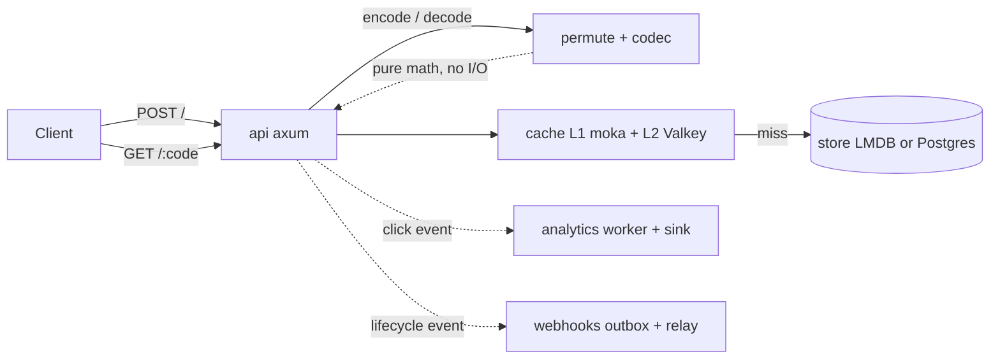
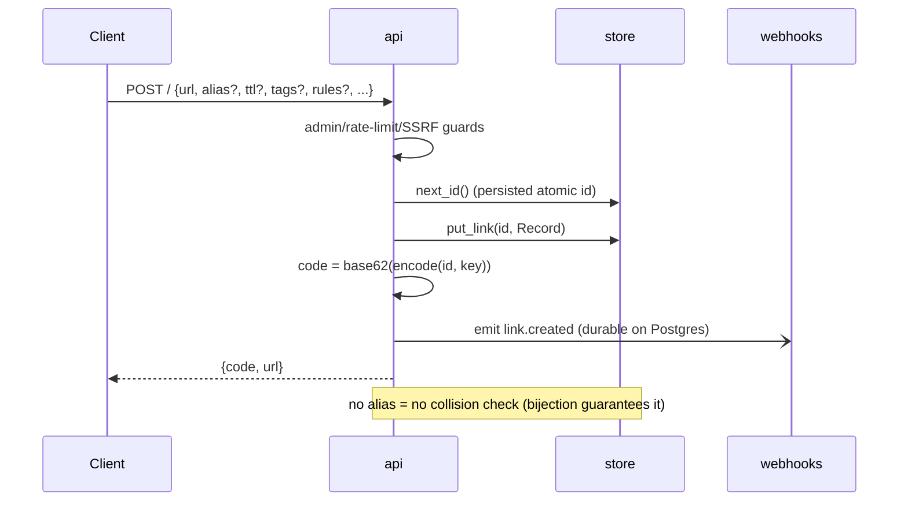
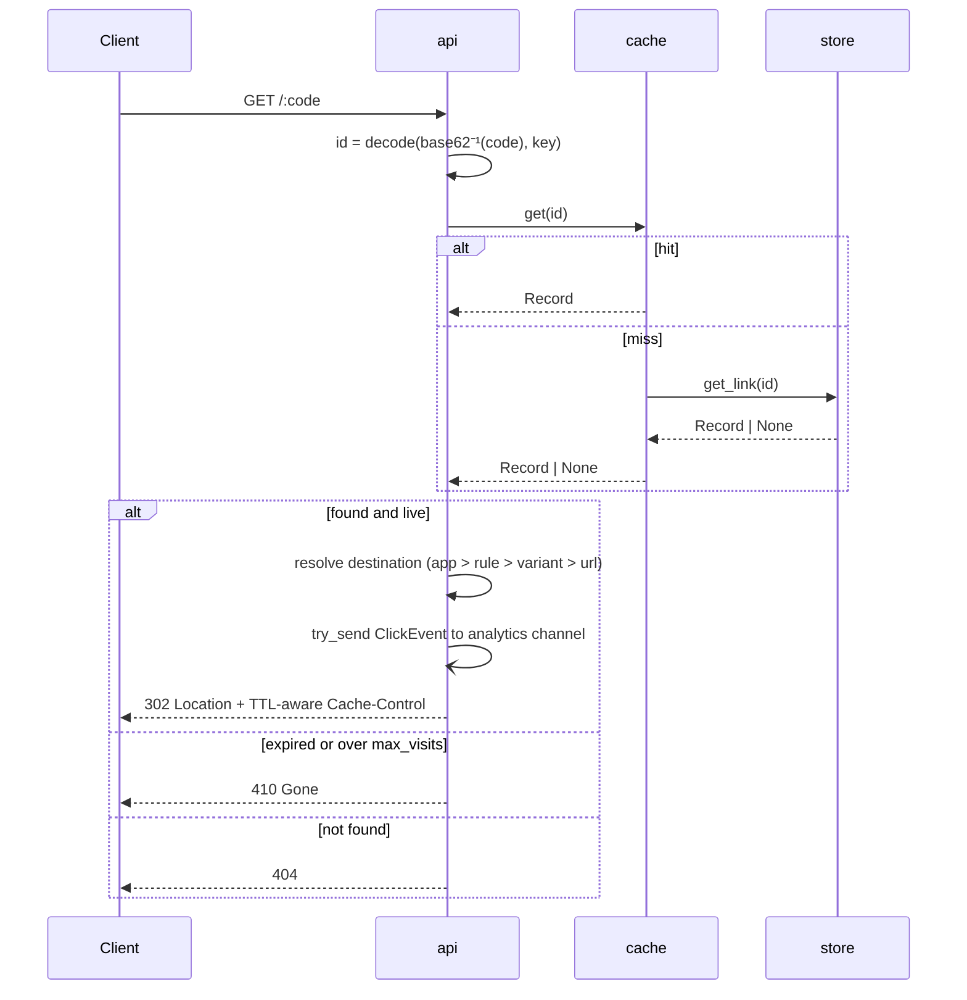
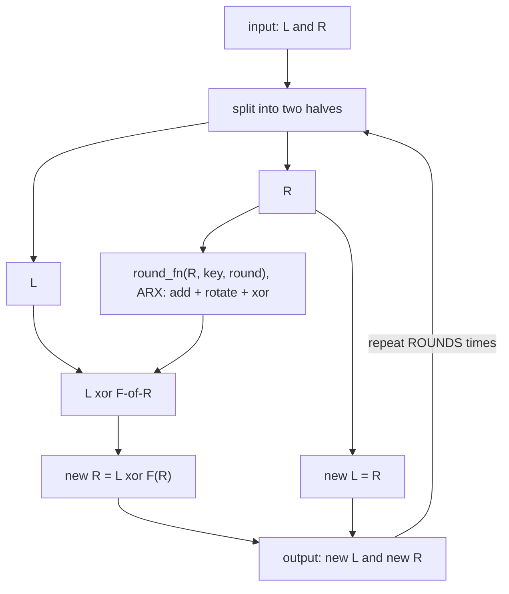
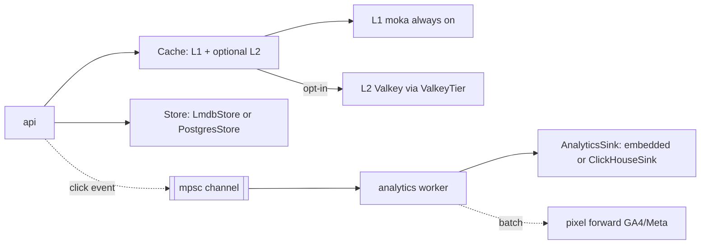

**English** · [Português](ARCHITECTURE.PT_BR.md)

# Architecture

This document explains how quark works to someone who has never seen the code. It assumes no prior context beyond "it's a URL shortener." For the design rationale and decision log, see [`docs/specs/2026-07-12-quark-design.md`](specs/2026-07-12-quark-design.md); for the pitch and benchmark numbers, see the [README](../README.md). For the full HTTP surface see [API](API.md), for every setting see [CONFIGURATION](CONFIGURATION.md), and for the multi-node story see [SCALING](SCALING.md).

## Overview

quark is a single Rust binary made of a handful of small, single-purpose modules. Two of them (`permute` and `codec`) do no I/O at all; they're pure functions over integers. Everything else exists to move bytes between the network and the database as cheaply as possible. Storage, cache, and analytics sit behind traits, so the same binary runs as a zero-dependency single node or against Postgres, Valkey, and ClickHouse, chosen at startup by which env vars are set.



| Module | Responsibility | Depends on |
|---|---|---|
| `permute` | The bijection between id and code: a balanced Feistel network with an ARX round function. `encode(u64) -> u64`, `decode(u64) -> u64`, 40-bit domain, 4 rounds. No state, no I/O. | (pure core) |
| `codec` | Integer to 7-character base62 string, URL-safe, and back. | (pure core) |
| `store` | Persistence behind the `Store` trait: links keyed by `u64`, aliases, webhooks, tokens, pixels, well-known docs, visits, the webhook outbox. Backends: `lmdb.rs` (embedded default) and `postgres.rs` (shared). | `heed` (LMDB), `sqlx` (Postgres) |
| `cache` | L1 concurrent `id -> Record` map in front of the store, with an optional L2 tier and a circuit breaker. | `moka`, `redis` (opt-in L2) |
| `analytics` | Click capture off the redirect (fire-and-forget), a background batch worker, aggregates plus last-N events; the `AnalyticsSink` trait and its embedded and ClickHouse impls. Also drives conversion forwarding. | `tokio` mpsc, `clickhouse` (opt-in) |
| `pixel` | Server-side conversion forwarding to GA4 and Meta CAPI from the analytics worker, with per-click dedup ids. | `reqwest` |
| `webhooks` | Signed outgoing HTTP events (Standard Webhooks) plus chat channels; `delivery.rs` holds the in-memory best-effort worker and the durable Postgres outbox relay. | `reqwest`, `hmac`, `sha2` |
| `auth` | Named API tokens and scopes; token generation and SHA-256 hashing. | `sha2` |
| `import` | CSV/JSON bulk-import parsing for `POST /admin/import`. | `csv`, `serde_json` |
| `abuse` | `POST /` guards: per-IP rate limit and pure internal-host / self-loop helpers. Never on the redirect path. | `redis` (opt-in) |
| `invalidate` | Cross-node cache invalidation over a Valkey pub/sub channel. No-op when single-node. | `redis` |
| `cluster` | Startup preflight that fails a strict multi-node deployment missing its shared-state deps. Pure decision, unit-tested. | (pure) |
| `calibrate` | Offline avalanche/SAC harness that measures diffusion of `permute` and picks `ROUNDS`. Not part of the running service. | `permute` (a copy of its math) |

`permute` and `calibrate` are the differentiator; everything else is standard, swappable engineering (LMDB could become `redb`, moka could become any other cache, axum could become anything that speaks HTTP). The HTTP handlers and the router live in `src/api/`, a directory module split by area (`links`, `guard`, `oidc_login`, `tenants`, `domains`, `webhooks_api`, `router`, ...); request/response types are serde structs inline in the submodule that uses them.

## Create flow



The API validates the URL is `http(s)://`, runs the abuse guards, then asks the store for the next id, a counter persisted so restarts don't reuse ids. It writes the `Record` keyed by that raw integer id, then computes the public code by running the id through `permute::encode` and base62-encoding the result. Note what's missing: there is no "does this code already exist?" check. Because `encode` is a bijection, two different ids can never produce the same code, so collision-checking is designed out at the type level rather than the runtime level.

Custom aliases are a deliberately separate path: they still allocate a real id and record (so redirect logic doesn't need two code paths), but they route through an `aliases: alias -> id` table that does need a uniqueness check, because a human picked the string and two humans can pick the same one. That is the one place in the whole system that does a collision check, and it's opt-in.

The abuse guards run on `create`, and only `create`, never the redirect. In order, cheapest first: a per-IP rate limit (`429` if over), URL validation (`400`), destination-host extraction (`400` if hostless), and the internal/loop guard (`403` for private/loopback/`localhost` IPs or the instance's own host, never resolves DNS). Rules, variants, and app destinations run through the same SSRF checks so a rule cannot smuggle an internal host past the main-URL guard. See *Abuse protection* below.

### The Record

Every link is one `Record` (`src/store/mod.rs`), stored as JSON in LMDB or across columns in Postgres:

| Field | Type | Meaning |
|---|---|---|
| `url` | `String` | The default destination. |
| `expiry` | `Option<u64>` | TTL expiry, unix seconds. |
| `created` | `u64` | Creation time. |
| `tags` | `Vec<String>` | Normalized tags (trimmed, lowercased, deduped, capped at 20). |
| `max_visits` | `Option<u32>` | Visit cap; `None` is unlimited. |
| `rules` | `Vec<Rule>` | Geo/device redirect rules, first match wins. |
| `variants` | `Vec<Variant>` | Weighted A/B destinations. |
| `app_ios` | `Option<String>` | iOS deep-link destination. |
| `app_android` | `Option<String>` | Android deep-link destination. |
| `folder` | `Option<String>` | One folder the link belongs to (trimmed, capped at 48 chars, case preserved). An exclusive counterpart to the free-form `tags`. |

`Rule` is `{field: country|device, values: [...], to: url}`; `Variant` is `{url, weight}`. Every field after `created` is `#[serde(default)]`, so an old record deserializes forward without a migration. The visit counter is stored separately from the `Record` (its own key in LMDB, a column in Postgres) so a click bumps a counter without rewriting the whole record.

### Aliases

Because `redirect` resolves a numeric base62 code first, a custom alias must not itself be a valid 7-char base62 string in range `0..=MAX_ID`: such an alias would decode as a numeric id and be permanently unreachable. `create` checks this with the codec's own parser before allocating an id, rejecting the collision with `400 Bad Request` rather than silently shadowing a numeric code.

## Redirect flow



quark first tries to parse the path segment as a base62 numeric code and run it through `permute::decode`. If that parse fails (wrong length, invalid character, or the decoded value is out of range), it falls back to an alias lookup. So the hot path (numeric codes, the overwhelming majority of traffic in a read-heavy shortener) never touches the `aliases` table: pure arithmetic to get the id, then one cache lookup. Only on a cache miss does it fall through to an LMDB mmap read (a page-table lookup in the common case) or a Postgres query. Expiry is checked lazily at read time; there is no background sweeper.

### Destination precedence

Once a live record is loaded, the destination is resolved by composing three targeting mechanisms in priority order:

1. **Device-aware app deep-link.** A visitor on iOS or Android, when the link sets a matching `app_ios` / `app_android`, is the most specific intent and wins. Platform is a substring check on the User-Agent (`iPhone`/`iPad`/`iPod`, or `Android`).
2. **Geo/device rule.** Otherwise the first matching `Rule` (country from `cf-ipcountry`, device from the User-Agent) supplies the destination. See [REDIRECT-RULES](REDIRECT-RULES.md).
3. **A/B variant.** Otherwise, if the link has variants, one weighted pick (a single `getrandom` draw, no store write) chooses a variant, and its index is recorded on the click. See [AB-TESTING](AB-TESTING.md).

A link with none of these (the common case) redirects to `rec.url` directly, moving the string out with no allocation. Before that, if `max_visits` is set the redirect bumps the visit counter and returns `410 Gone` once the cap is passed. The `link.clicked` and `link.expired` webhook events are emitted only when a subscription wants them, gated by a cached atomic flag so the hot path pays nothing otherwise.

## The Feistel/ARX permutation

The core trick: quark needs a function `f: [0, 2^40) -> [0, 2^40)` that is a bijection (every id maps to exactly one code and back, no collisions) and that also looks random enough that codes aren't guessable from nearby ids. A Feistel network gives the bijection for free, structurally, regardless of the mixing function inside it. Split the input into two halves `L | R` and repeatedly do:



Why this is always invertible, whatever `round_fn` computes: given `(new_L, new_R)`, the previous `R` is just `new_L` (passed through untouched), and the previous `L` is `new_R xor round_fn(new_L, ...)`, recomputing the same round output and xoring it away (`x xor y xor y == x`). `decode` runs this in reverse, round by round. The round function never needs to be invertible or well-behaved, which is what makes it safe to make it cheap.

quark's `round_fn` is ARX (add-rotate-xor): a subkey add, then a small fixed sequence of rotate-xor mixing, masked to the half-width. No hashing, no S-boxes: just integer ops the CPU does in a cycle or two. Cheap rounds mean quark can afford to run as many as diffusion needs without paying a hash per round.

How many rounds is answered empirically. `cargo run --bin calibrate` sweeps `ROUNDS` from 1 to 12 and measures the avalanche effect: flip one input bit, run the permutation, measure what fraction of the 40 output bits changed. If flipping bit `i` predictably flips the same handful, an attacker can reason about the mapping; if it flips about 50% no matter which bit, the output is statistically like noise from the outside (the Strict Avalanche Criterion).

```
rounds | avalanche_medio | cobertura(/40)
   1   |     0.1381      |    1
   2   |     0.3622      |   21
   3   |     0.4866      |   40
   4   |     0.5000      |   40   ← ROUNDS escolhido (difusão fecha)
 5..12  |     0.5000      |   40
```

`avalanche_medio` is the average fraction of output bits flipped; `cobertura` is the worst case, over all 40 input bits, of how many distinct output bits one bit has ever influenced, catching a structural blind spot an average would hide. At round 4 both saturate: avalanche exactly `0.5000`, coverage full `40/40`. Round 3 is close (`0.4866`) but not there; rounds 5 to 12 measure identically. `ROUNDS = 4` is fixed as a compile-time constant in `src/permute.rs`, derived from this measurement rather than picked "to be safe."

## Pluggable backends

Three seams (`Store`, `CacheTier`, `AnalyticsSink`) separate the request path's shape from which concrete backend implements it. Everything above (LMDB, moka, the embedded sink) is the default behind these traits. Each backend is opt-in, selected at startup purely by which env var is set: no build-time feature flags, no branching beyond `open_backends` and the `QUARK_VALKEY_URL` check in `main.rs`.



- **`Store`** (`src/store/mod.rs`): `next_id`, `get_link`, `put_link`, `get_alias`, `put_alias_and_link`, plus webhook, token, pixel, well-known, visit, and outbox methods, all `async`. `open_backends` picks `PostgresStore` when `QUARK_DATABASE_URL` is set, else `LmdbStore`. `PostgresStore` implements the id sequence atomically in the database (four `nextval` sequences), which is what makes it safe to run more than one quark against the same Postgres.
- **`CacheTier`** (`src/cache/mod.rs`): `get`/`set`/`invalidate` for an out-of-process L2. `ValkeyTier` (`src/cache/valkey.rs`) is the only implementation, wired when `QUARK_VALKEY_URL` is set. `Cache` always keeps the L1 moka map (60s TTL) in front of any tier; the tier (3600s TTL) is consulted only on an L1 miss. A `Breaker` (lock-free atomics) opens after 5 consecutive tier failures and stays open 30s, and every L2 op is wrapped in a 100ms timeout, so a slow Valkey can't stall a redirect. Any tier error is swallowed and treated as a miss; the caller always falls through to the store.
- **`AnalyticsSink`** (`src/analytics/mod.rs`): consumes `ClickEvent`s off an mpsc channel via a background worker (`spawn_worker`), decoupling the 302 from analytics persistence. `open_backends` gives every store its own embedded sink (both `LmdbStore` and `PostgresStore` implement `AnalyticsSink`) and overrides it with `ClickHouseSink` when `QUARK_CLICKHOUSE_URL` is set. ClickHouse is analytics-only by construction (nothing in `Store` is implemented for it) because click volume dwarfs link-create volume and wants an OLAP append/aggregate engine.

Store and AnalyticsSink are chosen independently: the store follows `QUARK_DATABASE_URL`, the sink follows `QUARK_CLICKHOUSE_URL` if set, otherwise the chosen store's embedded sink. That lets a deployment mix a Postgres store with ClickHouse analytics, Postgres for both, or plain LMDB for both, all from the same binary.

## Abuse protection

Everything here runs only on `POST /`. Two knobs and one always-on guard, all in the `abuse` module:

- **Rate limit** (`RateLimiter`, opt-in via `QUARK_RATELIMIT_PER_MIN`): a fixed 60s window per client IP. In-memory per replica by default (a `HashMap` swept once per window); with `QUARK_VALKEY_URL` it uses Valkey `INCR`/`EXPIRE` for a global limit. Fail-open. The same limiter also enforces per-API-token quotas. The client IP comes from `QUARK_REAL_IP_HEADER` (default `cf-connecting-ip`) with a socket fallback, so only enable it behind a proxy that overwrites the header.
- **Internal/loop guard** (default on, `QUARK_BLOCK_PRIVATE=0` disables): rejects a private/loopback/link-local IP literal (v4 and v6, including IPv4-mapped), `localhost`, or the instance's own host. It never resolves DNS.

## Data model

### LMDB

Ten named databases inside one LMDB environment (`heed::Env`, `max_dbs = 10`, a 64 GiB map), opened once and mmap'd for the process lifetime:

| Database | Key to value |
|---|---|
| `links` | `u64` big-endian to JSON `Record` (the only place URL bytes live) |
| `aliases` | alias `String` to `u64` id |
| `meta` | counter names (`next_id`, `next_webhook_id`, `next_api_token_id`, `next_pixel_id`) to `u64` |
| `stats` / `events` | per-id `Aggregates` and last-N raw `ClickEvent`s (the embedded sink) |
| `visits` | `u64` id to `u64` visit count |
| `webhooks` | `u64` id to JSON subscription |
| `api_tokens` | `u64` id to JSON token |
| `pixels` | `u64` id to JSON pixel config |
| `wellknown` | document name to body |

Keying by a fixed-width integer instead of the string code means no variable-length string index, so B-tree pages pack tighter and the base62 code is never stored (always recomputed from the id). The webhook outbox methods are no-ops on LMDB (it is single-node; durable delivery needs Postgres), and `search_links` returns `Unsupported` (client-side search only).

### Postgres

The same data across twelve tables plus four id sequences, created idempotently under an advisory lock. Beyond the direct analogues (`links`, `aliases`, `webhooks`, `api_tokens`, `pixels`, `wellknown_documents`), the shared backend adds:

- **Atomic analytics** in `click_counters` (one row per id, dimension, and bucket, incremented with `INSERT ... ON CONFLICT DO UPDATE SET count = count + n`), `stats_meta` (first/last timestamp), and `click_events` (append-only, one row per click). This replaces an earlier read-modify-write of an aggregate blob under a per-link advisory lock, so a hot link no longer serializes on the sink.
- **A durable webhook outbox** in `webhook_deliveries` (delivery key, subscription, payload, attempts, next-attempt time, dead flag), drained by a leased relay.

The legacy `stats` and `events` tables are kept but no longer read or written. See [SCALING](SCALING.md) for how each subsystem behaves across the two backends.

## Scale-hardening layer

On top of the pluggable backends, a thin layer makes a multi-node Postgres+Valkey deployment behave correctly rather than silently degrade. Each piece is a no-op or a local default on a single node.

- **Cross-node invalidation** (`src/invalidate.rs`): an admin edit or delete publishes a tiny message (`link:<id>`) on a Valkey pub/sub channel; every node subscribes and drops the matching L1 entry locally, never re-publishing (no loop). The publish is bounded by a 100ms timeout and is fail-open. Without Valkey it is a no-op and staleness is bounded by the 60s TTLs instead.
- **Atomic analytics counters** (Postgres sink): the atomic `click_counters` increments above, so two nodes flushing the same hot link both land their counts with no lost update and no lock. Ingestion stays at-most-once by design (a click is `try_send` to a bounded channel and dropped when full).
- **Durable webhook outbox and relay** (`src/webhooks/delivery.rs`): on Postgres, the lifecycle events (`link.created/updated/deleted`) are written to `webhook_deliveries` and delivered at-least-once by a relay that claims due rows with `SELECT ... FOR UPDATE SKIP LOCKED` (disjoint per node), with persisted exponential backoff, a dead-letter flag after 8 attempts, and a stable idempotency key. `link.clicked` and `link.expired` stay best-effort in-memory by design, since they fire on the redirect hot path. See [WEBHOOKS](WEBHOOKS.md).
- **Cluster preflight** (`src/cluster.rs`): with `QUARK_STRICT_CLUSTER` set, quark refuses to start unless both `QUARK_DATABASE_URL` and `QUARK_VALKEY_URL` are present, turning a silent misconfiguration into a startup error.

## Why these choices

- **LMDB via `heed`**: a mmap-backed B-tree where reads are page-cache hits with essentially no syscall overhead, and no separate query engine on the hot path. For a workload that's roughly 200:1 read:write, an mmap read is close to as fast as this gets without a custom on-disk format.
- **`moka` in front of the store, not just the OS page cache**: a typed, concurrent, capacity-bounded `id -> Record` map, so a hit skips the JSON parse and the LMDB transaction entirely and returns an already-materialized `Record`.
- **Codes computed, never stored**: because `encode`/`decode` are a bijection, the code is a pure function of the id and the key, so there is no `code -> id` table to build or keep consistent, and the create path needs no collision check.
- **A Feistel network with an ARX round instead of a real cipher**: the bijection is free from the network structure; the cost lives in the round function, kept to cheap integer ops and the measured minimum round count rather than reusing a slower cryptographic primitive.
