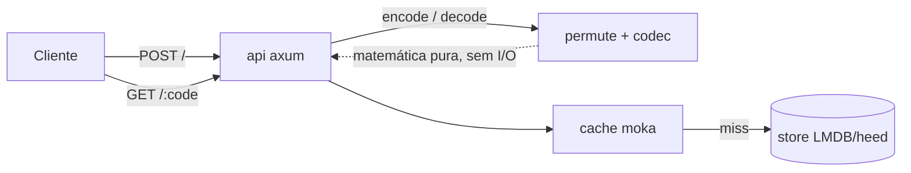
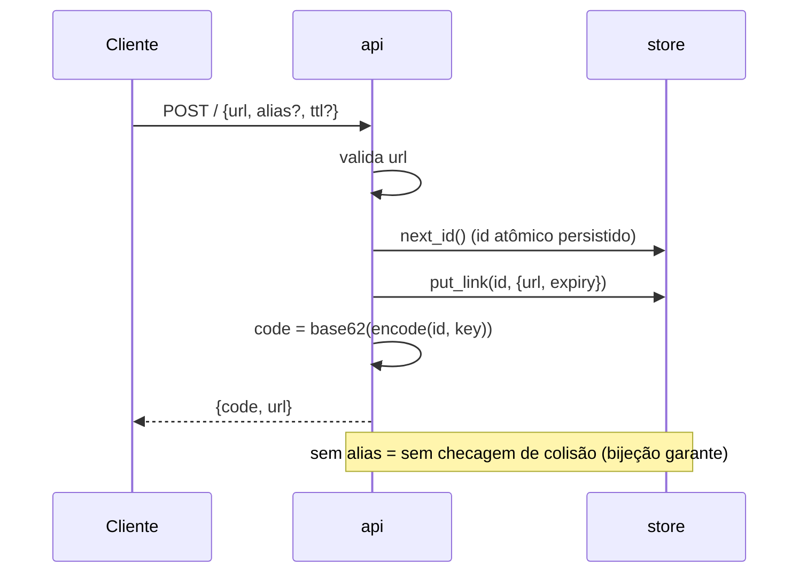
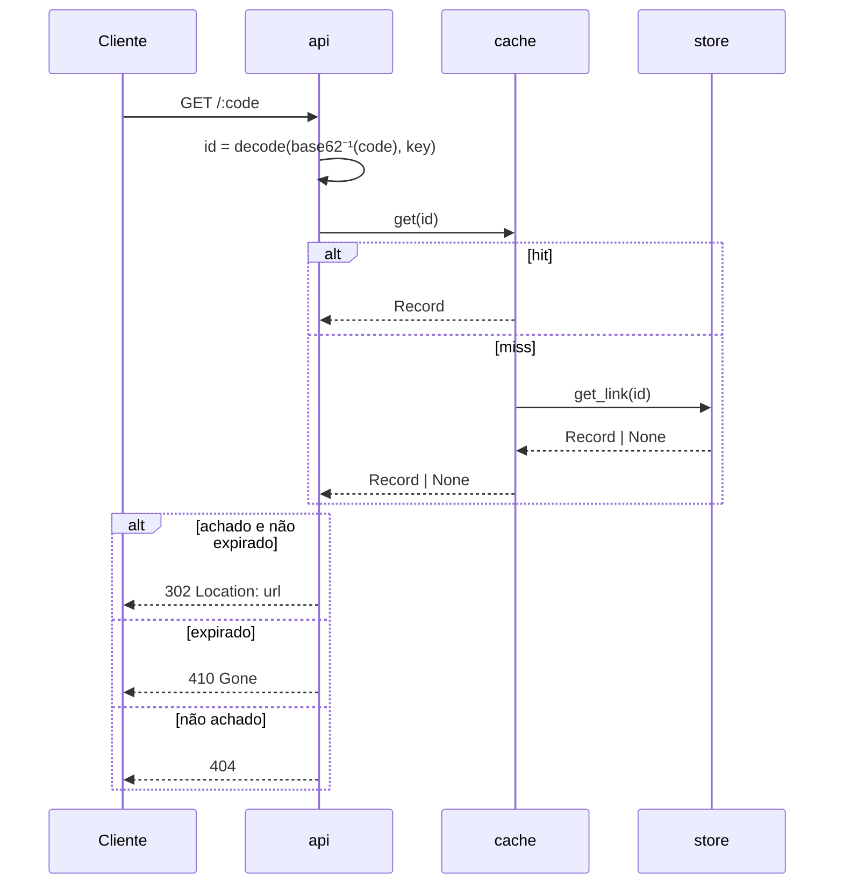
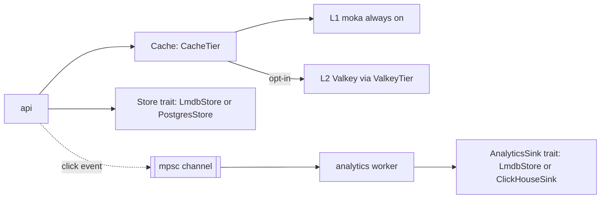

# Architecture

This document explains how quark works to someone who has never seen the code. It assumes no prior context beyond "it's a URL shortener." For the design rationale and decision log, see [`docs/specs/2026-07-12-quark-design.md`](specs/2026-07-12-quark-design.md); for the pitch and benchmark numbers, see the [README](../README.md).

## Overview

quark is a single Rust binary made of a handful of small, single-purpose modules. Two of them — `permute` and `codec` — do no I/O at all; they're pure functions over integers. Everything else exists to move bytes between the network and the database as cheaply as possible.



| Module | Responsibility | Depends on |
|---|---|---|
| `permute` | The bijection between id and code: a Feistel network with an ARX round function. `encode(u64) -> u64`, `decode(u64) -> u64`. No state, no I/O. | — (pure core) |
| `codec` | Integer ↔ 7-character base62 string, URL-safe. | — |
| `store` | mmap'd persistence: `id: u64 -> {url, expiry, created}`; a separate `alias -> id` map; a persisted id counter. | `heed` (LMDB bindings) |
| `cache` | A concurrent hot LRU `id -> Record` in front of the store, so a hot redirect never touches LMDB. | `moka` |
| `api` | HTTP surface: `POST /` creates, `GET /:code` redirects, `GET /:code/stats`, `GET/POST/DELETE /admin/blocklist`, `GET /health`. | `axum` |
| `analytics` | Click capture off the redirect (fire-and-forget), background batch worker, aggregates + last-N events; the `AnalyticsSink` trait and its LMDB/ClickHouse impls. | `tokio` mpsc |
| `abuse` | `POST /` protection: per-IP rate limit (`RateLimiter`), destination blocklist (`Blocklist`, domain+subdomain, cached), and pure helpers for internal-host / self-loop guard. Never touches the redirect path. | `redis` (opt-in) |
| `calibrate` | Offline avalanche/SAC harness that measures diffusion of `permute` across round counts and picks `ROUNDS`. Not part of the running service. | `permute` (a copy of its math, kept dependency-free) |

`permute` and `calibrate` are the differentiator; everything else is standard, swappable engineering (LMDB could become `redb`, moka could become any other cache, axum could become anything that speaks HTTP).

## Create flow



Walking through it: the API validates the URL is `http(s)://`, then asks the store for the next id — a counter persisted in LMDB so it survives restarts. It writes the record keyed by that raw integer id, then computes the public code by running the id through `permute::encode` and base62-encoding the result. Note what's *missing*: there is no "does this code already exist?" check. Because `encode` is a bijection, two different ids can never produce the same code — collision-checking a whole class of bugs out of existence at the type level rather than the runtime level.

Custom aliases are a deliberately separate path: they still allocate a real id and record (so redirect logic doesn't need two code paths), but they route through an `aliases: alias -> id` table that *does* need a uniqueness check, because a human picked the string and two humans can pick the same one. That's the **one** place in the whole system that does a collision check, and it's opt-in.

Before any of that, `create` runs the abuse guards — and only `create`, never the redirect. In order, cheapest first: a per-IP **rate limit** (`429` if over), URL validation (`400`), destination-host extraction (`400` if hostless), an **internal/loop guard** (`403` for private/loopback/`localhost` IPs or the instance's own host — never resolves DNS), and a **blocklist** check (`403` for a listed domain or subdomain). All of it is opt-in or default-safe and lives in the `abuse` module; see *Abuse protection* below.

### Aliases

Because `redirect` resolves a numeric base62 code first (see below), a custom alias must not itself be a valid 7-char base62 string in range `0..=MAX_ID` — such an alias would decode as a numeric id and be permanently unreachable. `create` checks this with the codec's own parser before allocating an id, rejecting the collision with `400 Bad Request` rather than silently shadowing a numeric code.

## Redirect flow



quark first tries to parse the path segment as a base62 numeric code and run it through `permute::decode`. If that parse fails (wrong length, invalid character, or the decoded value is out of the valid id range), it falls back to an alias lookup. This means the hot path — numeric codes, which is the overwhelming majority of traffic in a read-heavy shortener — never touches the `aliases` table at all: it's pure arithmetic to get the id, then one cache lookup. Only on a cache miss does it fall through to an LMDB mmap read, which is itself just a page-table lookup in the common case (the OS keeps hot pages resident). Expiry is checked lazily, at read time, against the wall clock — no background sweep is required for correctness, only for eventually reclaiming space.

## The Feistel/ARX permutation

The core trick: quark needs a function `f: [0, 2^N) -> [0, 2^N)` that is a *bijection* — every id maps to exactly one code and vice versa, with no collisions — and that also *looks* random enough that codes aren't guessable from nearby ids. A **Feistel network** gives you the bijection for free, structurally, regardless of what the mixing function inside it does. That's the classical trick behind block ciphers (DES, and format-preserving encryption schemes generally): split the input into two halves `L | R`, and repeatedly do:


Why this is *always* invertible, no matter what `round_fn` computes: given the output `(new_L, new_R)`, the previous `R` is just `new_L` (it was passed through untouched), and the previous `L` is `new_R xor round_fn(new_L, ...)` — you recompute the same `round_fn` output and xor it away, since `x xor y xor y == x`. `decode` runs exactly this, round by round, in reverse order. The round function itself never needs to be invertible or even well-behaved for this to hold — that's what makes it safe to make the round function *cheap*.

quark's `round_fn` is ARX (add-rotate-xor): a subkey add, then a small fixed sequence of rotate-xor mixing, masked to the half-width. No hashing, no S-boxes, no cryptographic primitive — just integer ops the CPU does in a cycle or two each. This is exactly the "cost" side of the tradeoff: cheap rounds mean quark can afford to run more of them than a naive scheme would need, if diffusion required it, without paying the multi-hundred-cycle cost of something like HMAC-SHA256 per round.

The remaining question — *how many rounds* — is answered empirically, not assumed. `cargo run --bin calibrate` sweeps `ROUNDS` from 1 to 12 and measures the **avalanche effect**: for every single input bit, flip it, run the permutation, and measure what fraction of the 40 output bits changed. If flipping bit `i` predictably always flips the same handful of output bits, an attacker can reason about the mapping. If it flips ~50% of output bits, on average, no matter which bit you flip, the output is statistically indistinguishable from noise from the outside — that's the Strict Avalanche Criterion (SAC).

```
rounds | avalanche_medio | cobertura(/40)
   1   |     0.1381      |    1
   2   |     0.3622      |   21
   3   |     0.4866      |   40
   4   |     0.5000      |   40   ← ROUNDS escolhido (difusão fecha)
 5..12  |     0.5000      |   40
```

`avalanche_medio` is the average fraction of output bits flipped across all input-bit flips and all sampled inputs; `cobertura` is the worst case, over all 40 input bits, of how many distinct output bits that one bit has ever been observed to influence — it catches structural blind spots that an average alone could hide (e.g. one bit that never reaches the top byte). At round 4, both metrics saturate: avalanche hits exactly `0.5000` and coverage is full `40/40`. Round 3 is close but not there (`0.4866`). Rounds 5–12 measure identically to round 4 — the diffusion has already closed, so there is nothing left to buy by adding more rounds, only latency to lose. `ROUNDS = 4` is fixed as a compile-time constant in `src/permute.rs`, derived directly from this measurement rather than picked by convention or "just to be safe."

## Pluggable backends

Three seams — `Store`, `CacheTier`, `AnalyticsSink` — separate the request path's *shape* from *which concrete backend* implements it. Everything documented above (LMDB, moka, the embedded sink) is the default implementation behind these traits, not the only one. Each backend is opt-in, selected at startup purely by which env var is set — no build-time feature flags, no code branching beyond `open_backends`/the `QUARK_VALKEY_URL` check in `main.rs`.



- **`Store`** (`src/store/mod.rs`): `next_id`, `get_link`, `put_link`, `get_alias`, `put_alias_and_link` — all `async`, so a network-backed impl (Postgres) costs nothing structurally over the embedded one. `open_backends` in `src/store/mod.rs` picks `PostgresStore` when `QUARK_DATABASE_URL` is set, else `LmdbStore`; `PostgresStore` implements the id sequence atomically in the database itself (not a local counter), which is what makes it safe to run more than one quark instance against the same Postgres.
- **`CacheTier`** (`src/cache/mod.rs`): `get`/`set` for an out-of-process L2. `ValkeyTier` (`src/cache/valkey.rs`) is the only implementation today, wired in `main.rs` when `QUARK_VALKEY_URL` is set. `Cache` (`src/cache/mod.rs`) always keeps the L1 `moka` map in front of any `CacheTier`; the tier is consulted only on an L1 miss. A `Breaker` (atomics, no locks) opens after `BREAKER_THRESHOLD` consecutive tier failures and stays open for `BREAKER_COOLDOWN_SECS`, and every L2 op is wrapped in a `L2_OP_TIMEOUT` (100ms) — so a Valkey that's merely slow, not down, still can't stall a redirect past that bound. Any tier error (timeout, connection, deserialize) is swallowed into a `TierError`, recorded by the breaker, and treated as a miss: the caller always falls through to the store, never surfaces the error.
- **`AnalyticsSink`** (`src/analytics/mod.rs`): consumes `ClickEvent`s off an `mpsc` channel via a background worker (`spawn_worker`), decoupling the redirect response from analytics persistence entirely — a redirect returns its 302 before the click is durably recorded. `open_backends` gives every store its own embedded sink (LMDB's `LmdbStore` also implements `AnalyticsSink`; so does `PostgresStore`) and overrides it with `ClickHouseSink` (`src/analytics/clickhouse.rs`) when `QUARK_CLICKHOUSE_URL` is set. ClickHouse is analytics-only by construction — nothing in `Store` is implemented for it — because click-event volume is expected to dwarf link-create volume and wants an OLAP append/aggregate engine, not the transactional store.

Store and AnalyticsSink are chosen independently of each other (see the doc comment on `open_backends`): the store follows `QUARK_DATABASE_URL`, and the sink follows `QUARK_CLICKHOUSE_URL` if set, otherwise falls back to whatever the chosen store provides as its embedded sink. This is what lets a deployment mix, say, a Postgres store with ClickHouse analytics, or Postgres for both, or plain LMDB for both — the same binary, no rebuild, just env vars.

## Abuse protection

Everything here runs **only on `POST /`** — the redirect and read paths are untouched, so the measured hot-path numbers still hold. Two knobs and one always-on guard, all in the `abuse` module:

- **Rate limit** (`RateLimiter`, opt-in via `QUARK_RATELIMIT_PER_MIN`): a fixed 60s window per client IP. In-memory per replica by default (a `HashMap` pruned once per window so it can't grow without bound); when `QUARK_VALKEY_URL` is set it uses Valkey `INCR`/`EXPIRE` for a **global** limit across replicas. Fail-open: any Valkey error lets the request through — a broken cache never blocks link creation. The client IP comes from a configurable header (`QUARK_REAL_IP_HEADER`, default `CF-Connecting-IP`) with a socket-address fallback; because the header is trusted, only enable the limit behind a proxy that overwrites it.
- **Destination blocklist** (`Blocklist`, on by content): the set of blocked domains lives in the `Store` (so a future admin UI can edit it — it is *data*, not config), managed via `GET/POST/DELETE /admin/blocklist` under `QUARK_ADMIN_TOKEN`. Matching is domain + subdomain, case-insensitive. Reads go through a snapshot cache — the whole set in memory (L1), refreshed on a TTL (`QUARK_BLOCKLIST_TTL`), optionally backed by Valkey (L2) so replicas share the source; an admin write invalidates it. Propagation across replicas is eventual (≤ TTL).
- **Internal/loop guard** (default on, `QUARK_BLOCK_PRIVATE=0` disables): rejects destinations whose host is a private/loopback/link-local IP literal (v4 and v6, including IPv4-mapped like `::ffff:127.0.0.1`), `localhost`, or the instance's own host (anti-loop, via the `Host` header or `QUARK_PUBLIC_HOST`). It **never resolves DNS** — that would be slow and an SSRF vector in itself — so it only decides on literal IPs and obvious names.

## Data model (LMDB)

Six named databases inside one LMDB environment (`heed::Env`, `max_dbs = 6`), opened once, mmap'd for the process lifetime:

- **`links`**: key = `u64` big-endian (the raw id) → value = JSON-serialized `{ url: String, expiry: Option<u64>, created: u64 }`. This is the only place URL bytes live. Keying by a fixed-width integer instead of the string code means no variable-length string index — B-tree pages pack tighter, and there's no need to ever store or index the base62 code itself, since it's always recomputed from the id.
- **`aliases`**: key = `String` (the human-chosen alias) → value = `u64` (the id it points to). Only touched by custom-alias creates and by redirects whose path segment didn't decode as a valid numeric code.
- **`meta`**: currently one key, `"next_id"` → `u64`, the atomically-incremented id counter, persisted so restarts don't reuse ids. In the `QUARK_NODE_ID` partitioning mode this holds the node-local counter (see `docs/SCALING.md`).
- **`stats`** / **`events`**: the embedded `AnalyticsSink` — per-id aggregates and the last-N raw click events (both JSON). Written only by the background analytics worker, never on the redirect response path.
- **`blocked`**: the destination blocklist — key = `String` (a blocked domain), value empty. Read into an in-memory snapshot; written only via the `/admin/blocklist` endpoints.

## Why these choices

- **LMDB via `heed`, not a from-scratch file format or a heavier database**: LMDB is a mmap-backed B-tree — reads are page-cache hits with (in the OS-cached case) essentially no syscall overhead, and there's no separate query engine or network round trip between the process and its data. For a workload that's ~200:1 read:write, an mmap read on the hot path is close to as fast as this gets without inventing a custom on-disk format. `redb` (pure Rust, no FFI) is noted in the spec as a benchmark candidate for later, but LMDB was measured as the faster read path for this use case.
- **`moka` as a cache in front of the store, not just relying on the OS page cache directly**: moka gives a typed, concurrent, capacity-bounded `id -> Record` map so a hit never even reaches the deserialization step — no JSON parse, no LMDB transaction, just a hash lookup returning an already-materialized `Record`. It's a second, cheaper layer on top of what the OS is already doing for the mmap'd pages underneath.
- **Codes computed, never stored**: this is the load-bearing decision the whole design hangs off. Because `encode`/`decode` are a bijection, the code is a pure function of the id and the instance key — there is no `code -> id` table to build, keep consistent, or index. The store's only key type is `u64`. This is also what makes the create path collision-check-free: uniqueness is a mathematical property of the permutation, not something enforced by a runtime lookup.
- **A Feistel network with an ARX round instead of a real cipher**: see the section above — the bijection is free from the network structure; the cost lives entirely in the round function, which was deliberately kept to cheap integer ops and the round count kept to the measured minimum, rather than reusing a cryptographic primitive that would be secure but far slower per operation.
