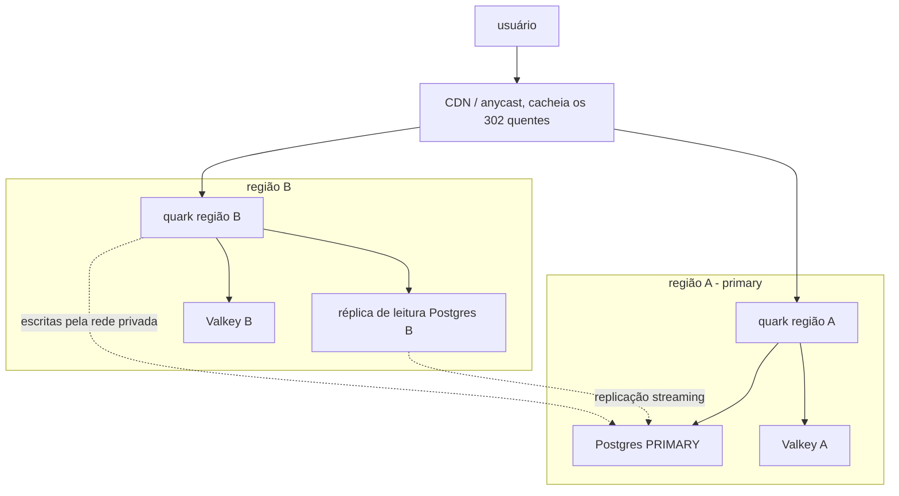

[English](DEPLOY-MULTIREGION.md) · **Português**

# Deploy multi-região (redirects perto do usuário, sem VPN)

Este guia roda o quark em várias regiões pra o redirect responder perto do
usuário, com todas as escritas indo pra um único Postgres primary e as leituras
vindo de uma réplica local. É **agnóstico de provedor**: o quark é um binário
Docker único dirigido por variáveis de ambiente, então nada aqui é específico de
uma plataforma. O Fly.io aparece como exemplo concreto no fim porque monta as
peças pra você, mas o mesmo formato roda em Hetzner, AWS, Railway, bare metal ou
onde você conseguir rodar um contêiner e um Postgres replicado.

Pro deploy single-região, veja [DEPLOY](DEPLOY.PT_BR.md). Pro modelo de escala e
o read/write split em que isto se apoia, veja [SCALING](SCALING.PT_BR.md).

## O formato



- **Leituras** (o hot path do redirect, listagens, stats) batem na réplica de
  leitura local da região, então um clique nunca sai da região.
- **Escritas** (criar/editar/apagar link, contadores de visita, analytics,
  workers de fundo) vão pro primary único pela rede privada.
- **Cache** é um Valkey por região (L2) na frente de cada réplica; a invalidação
  pub/sub do quark mantém o cache de cada região correto dentro da janela
  limitada em [SCALING](SCALING.PT_BR.md#janelas-de-consistencia-entre-nos).
- **Uma CDN** (Cloudflare ou similar) fica na frente pra DNS anycast, TLS perto
  do usuário e cache dos 302 dos links quentes, e esconde a origem (substituindo
  a VPN de graça).

## O que cada região roda

Toda região roda a mesma imagem do quark com:

| Variável | Valor | Por região? |
|---|---|---|
| `QUARK_DATABASE_URL` | o Postgres **primary**, endereço privado | igual em todas |
| `QUARK_REPLICA_DATABASE_URL` | o endereço privado da réplica de leitura **local** | sim, uma por região |
| `QUARK_VALKEY_URL` | o Valkey local | sim, um por região |
| `QUARK_KEY` | a chave da permutação | igual em todas (uma chave diferente remapeia todo código) |
| `QUARK_SIGNING_KEY` | segredo de assinatura de cookie/sessão | igual em todas (compartilhado pra sessões e cookies de unlock validarem em qualquer região) |

A região primary pode deixar `QUARK_REPLICA_DATABASE_URL` sem setar (lê o primary
direto) ou apontar pra uma réplica local também. Qualquer região sem réplica lê o
primary, o que ainda funciona, só com um hop cross-região em cache miss.

## A camada de dados (qualquer provedor)

1. **Um Postgres primary** na sua região principal. Todas as instâncias do quark
   escrevem aqui.
2. **Uma réplica de leitura streaming em cada outra região**, mantida atual pela
   replicação física/lógica do Postgres. O quark nunca escreve numa réplica; só
   lê. O lag de replicação costuma ser sub-segundo (veja a nota de consistência).
3. **Uma rede privada** entre as regiões pra os links do banco não serem
   públicos: uma VPC/rede privada num hyperscaler, WireGuard, ou a malha nativa
   da plataforma. Coloque firewall no primary pra aceitar só os endereços
   privados. É isso que deixa você tirar a VPN: a origem só é alcançada
   privadamente e pela CDN.
4. **Um Valkey por região** pro cache L2, rate limit e pub/sub de invalidação.

## Consistência

A replicação é assíncrona. Um link recém-criado pode levar o lag de replicação
pra resolver numa região distante, e as contagens de analytics ficam atrás pelo
lag. Os dois são limitados (em geral bem abaixo de um segundo) e casam com o
modelo de agregação eventual do quark. Leituras que precisam estar frescas (uma
sessão recém-logada, um token de API recém-criado) são servidas do primary de
propósito, então login e auth de token nunca ficam velhos. Veja
[SCALING](SCALING.PT_BR.md#leituras-multi-regiao-o-read-write-split).

## Exemplo prático: Fly.io

O Fly monta o roteamento anycast, as máquinas por região, uma malha privada
(6PN) e Postgres gerenciado, então é o caminho mais curto pra esse formato. É um
exemplo, não um requisito.

1. Copie `fly.toml.example` pra `fly.toml`; ajuste `app` e `primary_region`.
2. Crie o Postgres primary na região principal e uma réplica de leitura em cada
   outra região (Fly Postgres ou um Postgres gerenciado externo, ambos servem).
3. Set os secrets (nunca commite):
   ```
   fly secrets set QUARK_KEY=<u64 decimal> QUARK_SIGNING_KEY=<base64 32+ bytes> \
     QUARK_DATABASE_URL=<URL privada do primary> QUARK_VALKEY_URL=<URL do valkey>
   ```
   Set `QUARK_REPLICA_DATABASE_URL` por região com a réplica local (o Fly deixa
   escopar config por máquina/região).
4. Faça o deploy e ponha máquinas onde estão seus cliques:
   ```
   fly deploy
   fly scale count 3 --region gru,iad,fra
   ```
5. Ponha o Cloudflare na frente pra DNS, TLS e cache dos links quentes, e coloque
   firewall na origem pra aceitar só a CDN.

O anycast roteia cada clique pra região mais perto; essa região responde da sua
réplica local e do Valkey. As escritas cruzam a malha privada até o primary. O
6PN do Fly mantém o link do banco privado sem VPN. Pra sair do Fly depois, a
única coisa que muda é essa config de deploy e a escolha de rede privada; a
imagem do quark e as variáveis de ambiente são idênticas.
