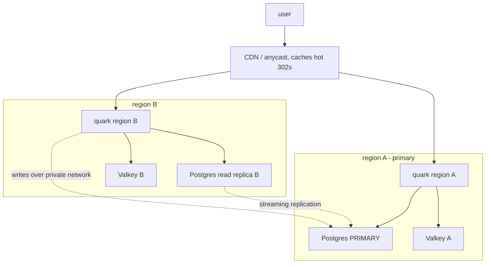

**English** · [Português](DEPLOY-MULTIREGION.PT_BR.md)

# Multi-region deployment (near-user redirects, no VPN)

This guide runs quark in several regions so the redirect answers near the user,
with all writes going to one Postgres primary and reads coming from a local
replica. It is **provider-neutral**: quark is a single Docker binary driven by
environment variables, so nothing here is specific to one platform. Fly.io is
used as a concrete worked example at the end because it assembles the pieces for
you, but the same shape runs on Hetzner, AWS, Railway, bare metal, or anywhere
you can run a container and a replicated Postgres.

For the single-region deploy, see [DEPLOY](DEPLOY.md). For the scaling model and
the read/write split this builds on, see [SCALING](SCALING.md).

## The shape



- **Reads** (the redirect hot path, listings, stats) hit the region's local
  Postgres read replica, so a click never leaves the region.
- **Writes** (create/edit/delete a link, visit counters, analytics, background
  workers) go to the single primary over the private network.
- **Cache** is a per-region Valkey (L2) in front of each replica; quark's pub/sub
  invalidation keeps every region's cache correct within the bounded window in
  [SCALING](SCALING.md#cross-node-consistency-windows).
- **A CDN** (Cloudflare or similar) sits in front for anycast DNS, TLS near the
  user, and caching of the hot-link 302s, and it hides the origin (replacing the
  VPN for free).

## What each region runs

Every region runs the same quark image with:

| Variable | Value | Per-region? |
|---|---|---|
| `QUARK_DATABASE_URL` | the Postgres **primary**, private address | same everywhere |
| `QUARK_REPLICA_DATABASE_URL` | the **local** read replica's private address | yes, one per region |
| `QUARK_VALKEY_URL` | the local Valkey | yes, one per region |
| `QUARK_KEY` | the permutation key | same everywhere (a different key remaps every code) |
| `QUARK_SIGNING_KEY` | cookie/session signing secret | same everywhere (shared so sessions and unlock cookies validate on any region) |

The primary region can leave `QUARK_REPLICA_DATABASE_URL` unset (it reads the
primary directly) or point it at a local replica too. Any region without a
replica set reads the primary, which still works, just with a cross-region hop on
cache misses.

## The data layer (any provider)

1. **One Postgres primary** in your main region. All quark instances write here.
2. **A streaming read replica in each other region**, kept current by Postgres
   physical/logical replication. quark never writes to a replica; it only reads.
   Replication lag is typically sub-second (see the consistency note below).
3. **A private network** between the regions so the DB links are not public: a
   VPC/private network on a hyperscaler, WireGuard, or the platform's built-in
   mesh. Firewall the primary to accept only the private addresses. This is what
   lets you drop the VPN: the origin is reached only privately and through the
   CDN.
4. **A Valkey per region** for the L2 cache, rate limit, and invalidation pub/sub.

## Consistency

Replication is asynchronous. A newly created link may take the replication lag to
resolve in a distant region, and analytics counts trail by the lag. Both are
bounded (usually well under a second) and match quark's eventually-aggregated
model. Reads that must be fresh (a just-logged-in session, a just-minted API
token) are served from the primary on purpose, so login and token auth are never
stale. See [SCALING](SCALING.md#multi-region-reads-the-readwrite-split).

## Worked example: Fly.io

Fly assembles anycast routing, per-region machines, a private mesh (6PN), and
managed Postgres, so it is the shortest path to this shape. It is an example, not
a requirement.

1. Copy `fly.toml.example` to `fly.toml`; set `app` and `primary_region`.
2. Create the Postgres primary in the primary region and a read replica in each
   other region (Fly Postgres or an external managed Postgres both work).
3. Set the secrets (never commit them):
   ```
   fly secrets set QUARK_KEY=<decimal u64> QUARK_SIGNING_KEY=<base64 32+ bytes> \
     QUARK_DATABASE_URL=<primary private URL> QUARK_VALKEY_URL=<valkey URL>
   ```
   Set `QUARK_REPLICA_DATABASE_URL` per region to the local replica (Fly lets you
   scope config per machine/region).
4. Deploy and place machines where your clicks are:
   ```
   fly deploy
   fly scale count 3 --region gru,iad,fra
   ```
5. Put Cloudflare in front for DNS, TLS, and hot-link caching, and firewall the
   origin to the CDN.

Anycast routes each click to the nearest region; that region answers from its
local replica and Valkey. Writes cross the private mesh to the primary. Fly's 6PN
keeps the DB link private with no VPN. To move off Fly later, the only things
that change are this deploy config and the private-networking choice; the quark
image and its env vars are identical.
