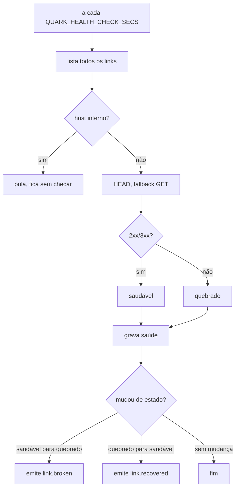

[English](LINK-HEALTH.md) · **Português**

# Monitoramento de link quebrado

O quark pode checar periodicamente se o destino de cada link ainda responde e
sinalizar os que quebraram. Você encurtou um destino meses atrás, ele caiu, e em
vez de uma reclamação de usuário você recebe uma notificação.

O checker vem desligado por padrão. Ele só roda quando você seta
`QUARK_HEALTH_CHECK_SECS` (o número de segundos entre varreduras), então nenhum
HTTP de fundo é feito sem você pedir.

## O que faz

A cada varredura, o checker percorre todos os links e sonda cada destino com uma
requisição `HEAD` (caindo pra `GET` se o servidor recusar HEAD). Uma resposta
`2xx` ou `3xx` conta como saudável; `4xx`, `5xx`, timeout ou falha de conexão
conta como quebrado. Ele não segue redirect: um `3xx` só quer dizer que o
servidor está vivo, e não seguir evita ser levado a um endereço interno.

Destinos em hosts internos ou de loopback nunca são sondados.

O resultado é guardado por link. No painel, uma bolinha em cada link mostra o
status (verde acessível, vermelho quebrado); um filtro "só quebrados" estreita a
lista. A API expõe isso como um objeto `health` em cada linha de link e um filtro
`?health=broken` (veja [API](API.PT_BR.md)).

Quando um link muda de estado, o quark emite um webhook: `link.broken` quando um
link saudável cai, `link.recovered` quando ele volta. Assine esses eventos em
[Webhooks](WEBHOOKS.PT_BR.md) (ou mande pro Slack/Discord/Telegram) pra ser
notificado. Um destino quebrado na primeira vez que é checado dispara
`link.broken` uma vez.

## Configuração

| Variável | Efeito |
|---|---|
| `QUARK_HEALTH_CHECK_SECS` | Segundos entre varreduras. Sem setar, desliga o checker. Valores abaixo de 60 são elevados pra 60. |

Num deploy com várias instâncias é seguro setar `QUARK_HEALTH_CHECK_SECS` em
todas as réplicas. Um lease (uma linha `health_lease` no Postgres) garante que só
um nó varre por vez; o holder renova durante a varredura, e se ele morrer outra
réplica assume dentro do TTL do lease. No backend single-node LMDB o lease é
sempre concedido.

## Limites

- Uma sonda por varredura por link; uma falha transitória vira o link pra
  quebrado e a próxima varredura recupera (as duas transições emitem seu evento).
- A cadência é global; não há intervalo por link nem opt-out.
- Eventos de saúde são best-effort in-memory, como `link.clicked`/`link.expired`.
- A sonda resolve o host do destino e se recusa a contatar endereços internos,
  de loopback ou link-local (incluindo IPv6 IPv4-mapeado), então um nome público
  apontando pra um IP interno não é sondado (guard de SSRF). Essa checagem e a
  requisição de fato resolvem o DNS de forma independente, então um nome que
  troca entre um IP público e um interno nessa janela (DNS rebinding) não está
  100% fechado; a exposição é um booleano cego (um endpoint interno responde?),
  a mesma postura por-hostname usada no resto do quark. Fixar o IP resolvido é
  uma blindagem planejada.
- O filtro "só quebrados" é aplicado por página. Numa conta com muitos links
  onde os quebrados são raros, "Carregar mais" pode buscar páginas sem nenhum
  link quebrado antes de chegar neles; siga carregando pra paginar.
