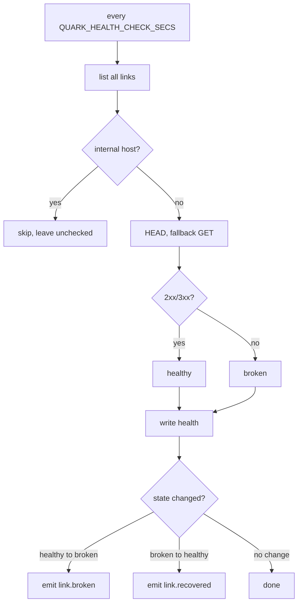

**English** · [Português](LINK-HEALTH.PT_BR.md)

# Broken-link monitoring

quark can periodically check whether each link's destination still responds and
flag the ones that broke. You shortened a destination months ago, it went down,
and instead of a user complaint you get a notification.

The checker is off by default. It runs only when you set
`QUARK_HEALTH_CHECK_SECS` (the number of seconds between sweeps), so no
background HTTP is ever made unless you ask for it.

## What it does

Every sweep, the checker walks all links and probes each destination with a
`HEAD` request (falling back to `GET` if the server rejects HEAD). A `2xx` or
`3xx` response counts as healthy; a `4xx`, `5xx`, timeout, or connection failure
counts as broken. It does not follow redirects: a `3xx` just means the server is
alive, and not following avoids being bounced toward an internal address.

Destinations on internal or loopback hosts are never probed.

The result is stored per link. In the panel, a small dot on each link shows its
status (green reachable, red broken); a "broken only" filter narrows the list.
The API exposes it as a `health` object on each link row and a `?health=broken`
filter (see [API](API.md)).

When a link changes state, quark emits a webhook: `link.broken` when a healthy
link goes down, `link.recovered` when it comes back. Subscribe to those events
in [Webhooks](WEBHOOKS.md) (or route them to Slack/Discord/Telegram) to be
notified. A destination that is broken the first time it is ever checked fires
`link.broken` once.

## Configuration

| Variable | Effect |
|---|---|
| `QUARK_HEALTH_CHECK_SECS` | Seconds between sweeps. Unset disables the checker. Values below 60 are clamped up to 60. |

In a multi-instance deployment the checker has no cross-node coordination yet,
so set `QUARK_HEALTH_CHECK_SECS` on **exactly one** instance. If every replica
had it set, each would probe every destination and a single break could fire the
webhook once per replica. A shared-lease sweeper that lets every node keep the
env is a planned refinement.

## Limits

- One probe per sweep per link; a transient failure flips a link to broken and
  the next sweep recovers it (both transitions emit their event).
- The cadence is global; there is no per-link interval or opt-out.
- Health events are best-effort in-memory, like `link.clicked`/`link.expired`.
- The checker runs on one instance (see Configuration); a cross-node lease is a
  later refinement.
- The probe resolves the destination host and refuses to contact internal,
  loopback, or link-local addresses, so a public name pointing at an internal IP
  is not probed (SSRF guard).
- The "broken only" filter is applied per page. On an account with many links
  where broken ones are rare, "Load more" may fetch pages that contain no broken
  links yet before reaching them; keep loading to page through.
