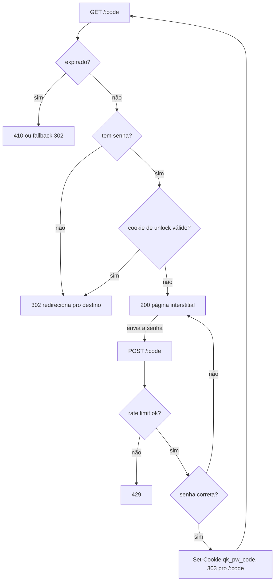

[English](LINK-PASSWORD.md) · **Português**

# Links protegidos por senha

Um link pode ser protegido por senha. Quem abre vê uma pagininha pedindo a senha
em vez de ser redirecionado. Digite a senha certa e o quark leva a pessoa ao
destino; pelas próximas 12 horas aquele navegador pula o prompt.

É um portão leve pra compartilhar um link com quem sabe um segredo combinado.
Não é um sistema de contas, e a senha do link é tão forte quanto a que você
escolher.

## Como funciona

A senha nunca é armazenada. O quark guarda só um hash [argon2id](https://en.wikipedia.org/wiki/Argon2)
dela (com salt aleatório por link), então o valor guardado não dá pra reverter
na senha. Conferir uma senha enviada é compará-la contra esse hash.

Quando a senha está certa, o quark seta um cookie assinado (`qk_pw_<code>`)
restrito àquele link. O cookie carrega uma expiração e uma assinatura
HMAC-SHA256 feita com a chave do servidor, então não dá pra forjar nem reusar
pra outro link ou depois de expirar. Enquanto o cookie vale (12 horas) o
visitante é redirecionado direto, sem ver o prompt de novo.

O caminho quente do redirect não paga nada por links sem senha: um link sem
senha segue exatamente o mesmo caminho de sempre. O argon2 só roda quando alguém
envia o formulário, e esse envio é rate-limited por IP.

Com a senha correta o quark redireciona de volta pro `GET /:code` com o cookie
setado, em vez de ir direto pro destino. Assim o caminho normal de redirect faz
a resolução de destino (deep-link / regras geo / variantes A/B), o incremento de
visitas e o registro do clique uma vez só — o passo de unlock só abre o portão.

## Definindo uma senha

No painel, os diálogos de criar e editar link têm um campo opcional **Senha**.
Num link já protegido, o diálogo de editar mostra uma caixa **Remover proteção
por senha**. Um ícone de cadeado marca os links protegidos na lista.

Pela API (veja [API](API.PT_BR.md)):

- Criar: `POST /` com um campo `password`.
- Trocar ou definir: `PATCH /admin/links/:code` com um `password` não-vazio.
- Remover: `PATCH` com `password` em `null` ou string vazia.

A API nunca devolve o hash. As linhas de link expõem só `has_password: true|false`.

## Notas e limites

- O interstitial é uma única página HTML self-contained (sem assets externos);
  é mostrado em inglês ou português conforme o `Accept-Language` da requisição.
- O cookie de unlock é `HttpOnly` e `SameSite=Lax`, e é marcado `Secure` quando a
  requisição chega por HTTPS (via `X-Forwarded-Proto`, já que o quark roda atrás
  de um proxy que termina o TLS).
- A senha só é checada no redirect direto. Se um link tem senha e expiração, a
  expiração ganha: um link expirado nunca mostra o prompt.
