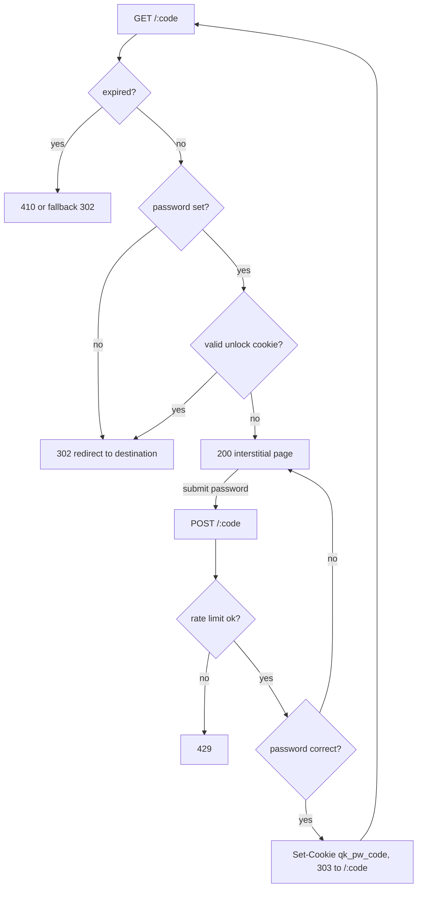

**English** · [Português](LINK-PASSWORD.PT_BR.md)

# Password-protected links

A link can be protected with a password. A visitor who opens it sees a small
page asking for the password instead of being redirected. Enter the right
password and quark sends them on to the destination; for the next 12 hours that
browser skips the prompt.

This is a lightweight gate for sharing a link with people who know a shared
secret. It is not a user-account system, and a link password is only as strong
as the password you choose.

## How it works

The password is never stored. quark keeps only an [argon2id](https://en.wikipedia.org/wiki/Argon2)
hash of it (with a per-link random salt), so the stored value cannot be reversed
into the password. Checking a submitted password compares it against that hash.

When the password is correct, quark sets a signed cookie (`qk_pw_<code>`) scoped
to that one link. The cookie carries an expiry and an HMAC-SHA256 signature made
with the server key, so it cannot be forged or reused for another link or after
it lapses. While the cookie is valid (12 hours) the visitor is redirected
straight through without seeing the prompt again.

The redirect hot path pays nothing for unprotected links: a link with no
password takes exactly the same path it always did. The argon2 check runs only
when someone submits the form, and that submission is rate-limited per IP.

On a correct password quark redirects back to `GET /:code` with the cookie set,
rather than redirecting to the destination directly. That way the normal
redirect path does the destination resolution (deep-link / geo rules / A/B
variants), the visit-count bump, and click recording exactly once — the unlock
step only opens the gate.

## Setting a password

In the panel, the create and edit link dialogs have an optional **Password**
field. On an already-protected link the edit dialog shows a **Remove password
protection** checkbox. A lock icon marks protected links in the list.

Over the API (see [API](API.md)):

- Create: `POST /` with a `password` field.
- Change or set: `PATCH /admin/links/:code` with a non-empty `password`.
- Remove: `PATCH` with `password` set to `null` or an empty string.

The API never returns the hash. Link rows expose only `has_password: true|false`.

## Notes and limits

- The interstitial is a single self-contained HTML page (no external assets); it
  is shown in English or Portuguese based on the request's `Accept-Language`.
- The unlock cookie is `HttpOnly` and `SameSite=Lax`, and is marked `Secure` when
  the request arrives over HTTPS (via `X-Forwarded-Proto`, since quark runs
  behind a TLS-terminating proxy).
- A password is checked only for the direct redirect. If a link has both a
  password and an expiry, expiry wins: an expired link never shows the prompt.
