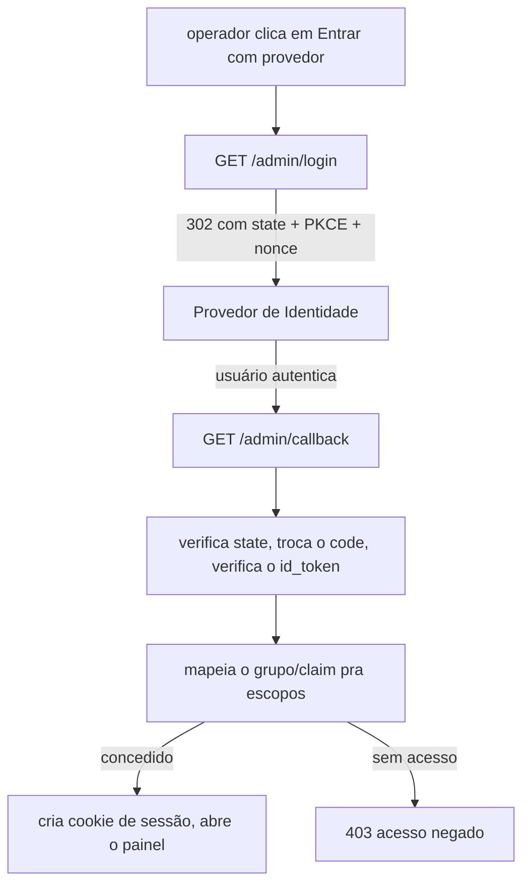

[English](OIDC-LOGIN.md) · **Português**

# Login com seu provedor de identidade (OIDC)

Por padrão o painel é aberto com o `QUARK_ADMIN_TOKEN` compartilhado. Você também
pode deixar os operadores entrarem com o próprio provedor de identidade (Google,
GitHub, Authelia, Keycloak, ou qualquer provedor OpenID Connect padrão), pra que
as contas sejam reais, nomeadas e revogáveis, e o quark nunca guarde senha.

É opt-in: OIDC fica totalmente desligado até você setar `QUARK_OIDC_ISSUER`. O
token de admin continua funcionando como break-glass, mesmo com OIDC ligado.

## Como funciona

O quark roda o fluxo OIDC padrão Authorization Code com PKCE. Ele nunca vê a
senha; o provedor autentica o usuário e devolve um token assinado que o quark
verifica.

A autorização é **default-closed**: um usuário válido do provedor só tem acesso
se um grupo/claim configurado casar. O grupo admin concede acesso total; um grupo
somente-leitura opcional concede leitura de links + analytics; o resto é negado.

A sessão é um cookie opaco, server-side, revogável (`HttpOnly`, `Secure` em
HTTPS), válido por 12 horas. O logout revoga. É `SameSite=Lax` na mesma origem e
`SameSite=None` em HTTPS pra um painel split-origin poder enviá-lo; as requisições
de escrita do painel ainda carregam um header customizado `x-quark-csrf` que o
servidor exige, o que bloqueia a forja cross-site dessas requisições.

## Configuração

Set essas variáveis em toda instância que serve a API do painel. OIDC liga quando
`QUARK_OIDC_ISSUER` está presente.

| Variável | Função |
|---|---|
| `QUARK_OIDC_ISSUER` | URL do issuer do provedor. Liga o OIDC. |
| `QUARK_OIDC_CLIENT_ID` | Client id do OAuth. |
| `QUARK_OIDC_CLIENT_SECRET` | Client secret do OAuth. |
| `QUARK_OIDC_REDIRECT_URL` | O callback desta instância, `https://<host-quark>/admin/callback`. Registre o mesmo valor no provedor. |
| `QUARK_OIDC_SCOPES` | Escopos pedidos (default `openid profile email`). |
| `QUARK_OIDC_ADMIN_CLAIM` | Claim inspecionado pra autorização (default `groups`). |
| `QUARK_OIDC_ADMIN_VALUE` | Valor nesse claim que concede acesso total (ex. `quark-admins`). |
| `QUARK_OIDC_READONLY_VALUE` | Valor opcional que concede somente-leitura (leitura de links + analytics). |
| `QUARK_OIDC_POST_LOGIN_URL` | Pra onde mandar o navegador depois do login (default `/`). Set com a URL do painel quando ele fica numa origem diferente da API. |

O cookie de sessão é assinado com `QUARK_SIGNING_KEY` (o mesmo segredo dos cookies
de senha de link); set e compartilhe entre réplicas pra um deploy multi-instância
estável.

Faça o deploy do painel e da API na **mesma origem** (um proxy que serve o painel
e roteia `/admin/*` pro quark). É o setup recomendado: o cookie de sessão é
first-party, sempre enviado, e o `QUARK_OIDC_POST_LOGIN_URL` pode ficar `/`.

Um painel split-origin de verdade (painel e API em hosts diferentes) é frágil: o
cookie de sessão vira um cookie third-party, que os navegadores atuais bloqueiam
por padrão (Safari ITP, Firefox, phase-out do Chrome), então o login entra em loop
silencioso mesmo com a sessão válida no servidor. Se precisar mesmo do split-origin,
set `QUARK_CORS_ORIGINS` com a origem do painel (o quark então permite CORS com
credenciais) e `QUARK_OIDC_POST_LOGIN_URL` com a URL do painel, e conte que usuários
que bloqueiam cookies third-party não vão conseguir manter o login. Prefira o proxy
de mesma origem.

## Setup por provedor

Em todo provedor, registre o redirect URI exatamente como
`https://<host-quark>/admin/callback`, peça os escopos `openid profile email`, e
prepare um claim de grupo/role pra `QUARK_OIDC_ADMIN_CLAIM` /
`QUARK_OIDC_ADMIN_VALUE` autorizarem.

### Google

1. Google Cloud Console, APIs e Serviços, Credenciais, crie um OAuth 2.0 Client
   ID do tipo "Aplicativo Web".
2. Adicione o redirect URI acima.
3. `QUARK_OIDC_ISSUER=https://accounts.google.com`, client id/secret do console.
   O Google não emite claim de grupo por padrão, então restrinja a uma conta com
   `QUARK_OIDC_ADMIN_CLAIM=email` e `QUARK_OIDC_ADMIN_VALUE=voce@exemplo.com` (ou
   use grupos do Workspace).

### GitHub

O GitHub é OAuth2 (não OIDC completo). Use por um broker que fale OIDC (Authelia,
Keycloak, Dex) apontado pro GitHub, ou uma ponte GitHub-OIDC. Restrinja pelo
claim de org/time que o broker expõe.

### Authelia

1. Adicione o quark como cliente OIDC na config da Authelia com o redirect URI
   acima e escopos `openid profile email groups`.
2. `QUARK_OIDC_ISSUER=https://auth.<seu-dominio>`, o client id/secret que você
   definiu.
3. `QUARK_OIDC_ADMIN_CLAIM=groups`, `QUARK_OIDC_ADMIN_VALUE=quark-admins` (um
   grupo que você atribui aos admins na Authelia).

### Keycloak

1. Crie um client (Client authentication ligado, standard flow) no seu realm;
   set o redirect URI acima.
2. Adicione um mapper "Group Membership" (ou realm-roles) no claim `groups`.
3. `QUARK_OIDC_ISSUER=https://<keycloak>/realms/<realm>`, client id/secret das
   Credenciais, `QUARK_OIDC_ADMIN_CLAIM=groups`,
   `QUARK_OIDC_ADMIN_VALUE=/quark-admins` (paths de grupo no Keycloak começam com `/`).

## Notas e limites

- Break-glass: `QUARK_ADMIN_TOKEN` sempre autentica como acesso total, então um
  IdP quebrado nunca te tranca do lado de fora.
- Estágio 2 (um store embutido de usuário/senha) não foi construído de
  propósito; traga o seu provedor.
- O JWKS é buscado no startup e atualizado automaticamente quando o provedor
  rotaciona as chaves de assinatura.
- Sessões expiram em 12 horas; sessões expiradas são coletadas.
