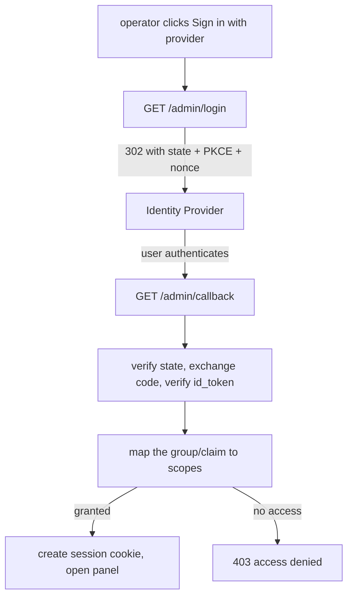

**English** · [Português](OIDC-LOGIN.PT_BR.md)

# Login with your identity provider (OIDC)

By default the panel is opened with the shared `QUARK_ADMIN_TOKEN`. You can also
let operators sign in with their own identity provider (Google, GitHub,
Authelia, Keycloak, or any standard OpenID Connect provider), so accounts are
real, named, and revocable and quark never stores a password.

This is opt-in: OIDC is fully off until you set `QUARK_OIDC_ISSUER`. The admin
token always keeps working as a break-glass, even with OIDC enabled.

## How it works

quark runs the standard OIDC Authorization Code flow with PKCE. It never sees a
password; the provider authenticates the user and returns a signed token that
quark verifies.



Authorization is **default-closed**: a valid provider user gets access only if a
configured group/claim matches. The admin group grants full access; an optional
read-only group grants links-read plus analytics; anyone else is denied.

The session is an opaque, server-side, revocable cookie (`HttpOnly`, `Secure`
over HTTPS), valid for 12 hours. Logout revokes it. It is `SameSite=Lax`
same-origin and `SameSite=None` over HTTPS so a split-origin panel can send it;
state-changing panel requests also carry a custom `x-quark-csrf` header the
server requires, which blocks cross-site forgery of those requests.

## Configuration

Set these on every instance that serves the panel API. OIDC turns on when
`QUARK_OIDC_ISSUER` is present.

| Variable | Purpose |
|---|---|
| `QUARK_OIDC_ISSUER` | Provider issuer URL. Enables OIDC. |
| `QUARK_OIDC_CLIENT_ID` | OAuth client id. |
| `QUARK_OIDC_CLIENT_SECRET` | OAuth client secret. |
| `QUARK_OIDC_REDIRECT_URL` | This instance's callback, `https://<quark-host>/admin/callback`. Register the same value at the provider. |
| `QUARK_OIDC_SCOPES` | Scopes requested (default `openid profile email`). |
| `QUARK_OIDC_ADMIN_CLAIM` | Claim inspected for authorization (default `groups`). |
| `QUARK_OIDC_ADMIN_VALUE` | Value in that claim granting full access (e.g. `quark-admins`). |
| `QUARK_OIDC_READONLY_VALUE` | Optional value granting read-only (links-read + analytics). |
| `QUARK_OIDC_POST_LOGIN_URL` | Where to send the browser after login (default `/`). Set to the panel URL when the panel is on a different origin than the API. |
| `QUARK_OIDC_BUTTON_LABEL` | Optional label for the panel's OIDC login button (e.g. `Sign in with Google`). Falls back to the panel's built-in label when unset. Display only, never affects authorization. |

The session cookie is signed with `QUARK_SIGNING_KEY` (the same secret used for
link-password cookies); set it and share it across replicas for a stable
multi-instance deployment.

Deploy the panel and the API **same-origin** (one proxy that serves the panel and
routes `/admin/*` to quark). This is the recommended setup: the session cookie is
first-party, always sent, and `QUARK_OIDC_POST_LOGIN_URL` can stay `/`.

A true split-origin panel (panel and API on different hostnames) is fragile: the
session cookie is then a third-party cookie, which current browsers block by
default (Safari ITP, Firefox, Chrome's phase-out), so login silently loops even
though the server session is valid. If you must run split-origin, set
`QUARK_CORS_ORIGINS` to the panel origin (quark then allows credentialed CORS) and
`QUARK_OIDC_POST_LOGIN_URL` to the panel URL, and expect users who block
third-party cookies to be unable to stay logged in. Prefer the same-origin proxy.

## Provider setup

In every provider, register the redirect URI exactly as
`https://<quark-host>/admin/callback`, request the `openid profile email`
scopes, and arrange for a group/role claim so `QUARK_OIDC_ADMIN_CLAIM` /
`QUARK_OIDC_ADMIN_VALUE` can authorize.

### Google

Google is a standard OIDC provider, so the existing flow works with no code
changes. There is no separate Google SDK; you point quark at Google's issuer.

1. In the Google Cloud Console, go to APIs and Services, Credentials, and create
   an OAuth 2.0 Client ID of type "Web application".
2. Under "Authorized redirect URIs", add your `QUARK_OIDC_REDIRECT_URL` exactly
   (`https://<quark-host>/admin/callback`). Copy the generated client id and
   client secret.
3. Configure the env:

   ```
   QUARK_OIDC_ISSUER=https://accounts.google.com
   QUARK_OIDC_CLIENT_ID=<client id>
   QUARK_OIDC_CLIENT_SECRET=<client secret>
   QUARK_OIDC_REDIRECT_URL=https://<quark-host>/admin/callback
   QUARK_OIDC_SCOPES=openid email profile
   ```

**Authorization.** Google does not emit a `groups` claim, so the shipped default
(`QUARK_OIDC_ADMIN_CLAIM=groups`) matches nothing and denies everyone, which is
the intended default-closed behavior. Pick one of the two claims Google does
emit:

- Single admin, any Google account: gate on the email claim.

  ```
  QUARK_OIDC_ADMIN_CLAIM=email
  QUARK_OIDC_ADMIN_VALUE=you@example.com
  ```

- A whole Google Workspace: gate on the hosted-domain claim (`hd`, present only
  for Workspace accounts), so anyone in your domain is an admin.

  ```
  QUARK_OIDC_ADMIN_CLAIM=hd
  QUARK_OIDC_ADMIN_VALUE=your-workspace-domain.com
  ```

Either way authorization stays default-closed: an account that matches neither
gets no access. To label the panel button "Sign in with Google", set
`QUARK_OIDC_BUTTON_LABEL="Sign in with Google"`.

### GitHub

GitHub is OAuth2 (not full OIDC). Use it through a broker that speaks OIDC
(Authelia, Keycloak, Dex) pointed at GitHub, or with a GitHub-OIDC bridge. Gate
on the org/team claim the broker exposes.

### Authelia

1. Add quark as an OIDC client in Authelia's configuration with the redirect URI
   above and scopes `openid profile email groups`.
2. `QUARK_OIDC_ISSUER=https://auth.<your-domain>`, the client id/secret you set.
3. `QUARK_OIDC_ADMIN_CLAIM=groups`, `QUARK_OIDC_ADMIN_VALUE=quark-admins` (a
   group you assign to admins in Authelia).

### Keycloak

1. Create a client (Client authentication on, standard flow) in your realm; set
   the redirect URI above.
2. Add a "Group Membership" (or realm-roles) mapper on the `groups` claim.
3. `QUARK_OIDC_ISSUER=https://<keycloak>/realms/<realm>`, client id/secret from
   Credentials, `QUARK_OIDC_ADMIN_CLAIM=groups`,
   `QUARK_OIDC_ADMIN_VALUE=/quark-admins` (Keycloak group paths start with `/`).

## Notes and limits

- Break-glass: `QUARK_ADMIN_TOKEN` always authenticates as full access, so a
  broken IdP never locks you out.
- Stage 2 (a built-in username/password store) is intentionally not built; bring
  your own provider.
- The JWKS is fetched at startup and refreshed automatically when the provider
  rotates signing keys.
- Sessions expire after 12 hours; expired sessions are garbage-collected.
