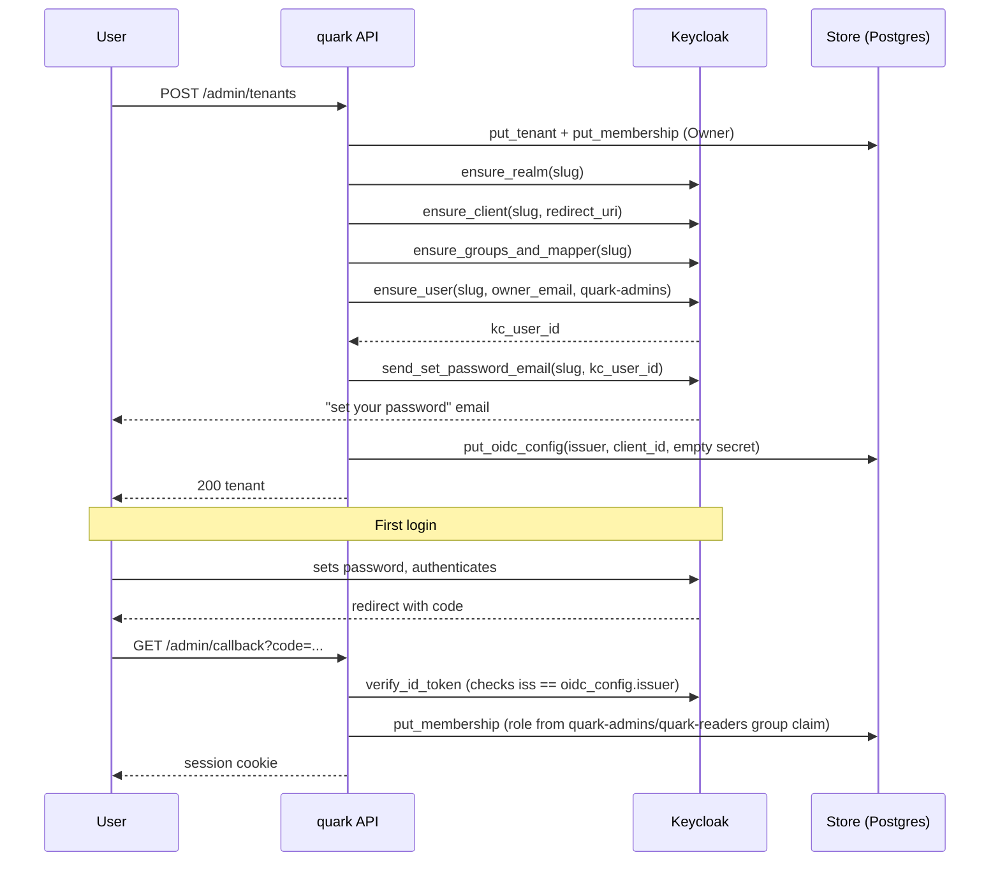

# Keycloak-hosted auth: production runbook (multi-tenancy P2e)

This covers what an operator needs to stand up Keycloak as the identity provider for quark cloud: deploying it, wiring the admin service account, setting env vars, and configuring SMTP for the invite emails Keycloak sends on quark's behalf.

Real end-to-end validation against a live Keycloak instance is deferred to LUC-49. Everything below is verified against `MockKeycloakAdmin`/`FailingKeycloakAdmin` in `tests/workspace_it.rs` and `tests/invites_it.rs`, not against a running Keycloak server.

## What gets provisioned, and when

Every tenant gets its own Keycloak realm, named after the tenant's slug. `admin_tenants_create` (`src/api.rs`) provisions it inline, best-effort: if any step fails, the tenant is still created and the boot backfill (`backfill_keycloak_provisioning`, run once at startup) retries any tenant missing an `oidc_config` row.

Each step is idempotent on the real client (a `409` from Keycloak counts as success), so replaying provisioning for an already-provisioned tenant is safe.

## Prerequisites before turning this on

### 1. Deploy Keycloak

Run Keycloak somewhere quark's backend can reach it. The existing infra docs (`docs/DEPLOY.md`, `docs/DEPLOY-MULTIREGION.md`) cover Fly as the reference platform; a Keycloak deployment there is a normal container app with a Postgres backing store, same shape as any other Fly service.

### 2. Match `KC_HOSTNAME` to `QUARK_KEYCLOAK_BASE_URL`

This is the prerequisite most likely to bite. Keycloak stamps its own `KC_HOSTNAME` into the `iss` (issuer) claim of every token it signs. `verify_id_token` (`src/oidc.rs`) rejects any token whose issuer doesn't match `oidc_config.issuer`, which quark derives from `QUARK_KEYCLOAK_BASE_URL` as `{base}/realms/{slug}`.

If `KC_HOSTNAME` and `QUARK_KEYCLOAK_BASE_URL` disagree, even by scheme (`http` vs `https`) or a trailing detail, every login fails with an issuer mismatch. Set both to the same externally-reachable URL, protocol included.

### 3. Create the admin service-account client

quark's admin API calls (create realm, create client, create groups, create users, trigger the set-password email) run as a Keycloak service account, not as a human admin. In the target Keycloak instance:

- Create a confidential client (client credentials grant).
- Grant it `create-realm` on the master realm's `realm-management` role, plus `manage-realm`, `manage-clients`, `manage-users`, and `manage-users` on realms it provisions (the `admin-cli`/`master-realm` service-account role model in Keycloak's docs covers the exact role assignment).
- Note the client ID and secret; they become `QUARK_KEYCLOAK_ADMIN_CLIENT_ID` and `QUARK_KEYCLOAK_ADMIN_CLIENT_SECRET`.

### 4. Set the env vars

| Variable | Value |
|---|---|
| `QUARK_KEYCLOAK_BASE_URL` | The externally-reachable Keycloak URL, matching `KC_HOSTNAME` exactly |
| `QUARK_KEYCLOAK_ADMIN_CLIENT_ID` | The service-account client ID from step 3 |
| `QUARK_KEYCLOAK_ADMIN_CLIENT_SECRET` | The service-account client secret from step 3 |
| `QUARK_KEYCLOAK_SMTP_HOST` | SMTP relay host (see below) |
| `QUARK_KEYCLOAK_SMTP_PORT` | SMTP relay port |
| `QUARK_KEYCLOAK_SMTP_USER` | SMTP auth user |
| `QUARK_KEYCLOAK_SMTP_PASSWORD` | SMTP auth password |
| `QUARK_KEYCLOAK_SMTP_FROM` | From-address for invite/set-password emails |
| `QUARK_KEYCLOAK_SMTP_STARTTLS` | `true`/`false` |

Leaving `QUARK_KEYCLOAK_BASE_URL` unset keeps Keycloak disabled entirely (`src/main.rs` logs `keycloak admin: disabled`); tenant creation and invites then behave exactly as they did before P2e (model A, no Keycloak calls at all).

### 5. SMTP for the invite/set-password emails

Keycloak, not quark, sends the "set your password" email when a tenant owner or invited member is provisioned (`ensure_user` + `send_set_password_email` in `src/keycloak/client.rs`). This SMTP config is Keycloak's realm-level SMTP settings, applied through `ensure_realm`.

Two providers work out of the box:

**SendGrid**

| Setting | Value |
|---|---|
| `QUARK_KEYCLOAK_SMTP_HOST` | `smtp.sendgrid.net` |
| `QUARK_KEYCLOAK_SMTP_PORT` | `587` |
| `QUARK_KEYCLOAK_SMTP_USER` | `apikey` (literal string, not your SendGrid username) |
| `QUARK_KEYCLOAK_SMTP_PASSWORD` | your SendGrid API key |
| `QUARK_KEYCLOAK_SMTP_STARTTLS` | `true` |

**Resend**

| Setting | Value |
|---|---|
| `QUARK_KEYCLOAK_SMTP_HOST` | `smtp.resend.com` |
| `QUARK_KEYCLOAK_SMTP_PORT` | `465` |
| `QUARK_KEYCLOAK_SMTP_USER` | `resend` (literal string) |
| `QUARK_KEYCLOAK_SMTP_PASSWORD` | your Resend API key |
| `QUARK_KEYCLOAK_SMTP_STARTTLS` | `false` (465 is implicit TLS, not STARTTLS) |

Both providers use the API key as the password; there's no separate SMTP credential to generate.

## Known gap: backfilled tenants and the Owner

`backfill_keycloak_provisioning` calls `provision_tenant_keycloak` with `owner_user_id: None` for every tenant it provisions on boot. That's deliberate: the backfill has no request context to know who should become the Keycloak-side Owner, so it provisions the realm, client, and groups but skips `ensure_user`/`send_set_password_email` entirely.

Practically: a tenant created before Keycloak was configured gets its realm and groups set up by the backfill, but its Owner has no Keycloak user yet and won't be able to log in through Keycloak until someone is added to `quark-admins` by hand (through the Keycloak admin console, or a follow-up manual `ensure_user` call). This is tracked as LUC-56. Until it's fixed, treat any pre-existing tenant as needing a manual first-user step after enabling Keycloak.

## Deferred: real end-to-end validation

Every test backing this runbook uses `MockKeycloakAdmin` or a hand-written failing mock; no test in this repo talks to an actual Keycloak server. Before relying on this in production, run the full flow against a real instance at least once: create a tenant, receive the set-password email, log in, and confirm the group claim maps to the right role. That validation pass is LUC-49.
