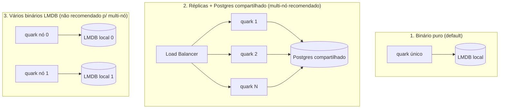

[English](SCALING.md) · **Português**

# Escala horizontal do quark

O quark escala horizontalmente **compartilhando o storage** entre réplicas. Há
três formatos de deploy, com limites diferentes: escolha pelo que você precisa.

## Os três formatos

| Formato | Storage | Multi-nó | Observação |
|---|---|---|---|
| **1. Binário puro** | LMDB embutido | Não (1 nó) | Recurso mínimo; capacidade ~1,1 trilhão de links |
| **2. Réplicas + Postgres** | Postgres compartilhado | **Sim** | Caminho recomendado; qualquer réplica serve qualquer link |
| **3. Vários LMDB** | LMDB local por nó | Não p/ leitura | Cada nó só tem os dados que ele criou (ver limites abaixo) |

## A matriz honesta de escala

Nem todo subsistema escala do mesmo jeito. Um deploy "multi-nó" que compartilha
só o store, sem o Valkey, ainda fica degradado: o rate limit vira N vezes o
valor configurado e a coordenação de cache/blocklist atrasa. O que cada
subsistema faz de verdade em cada formato:

| Subsistema | Single-node (LMDB) | Multi-nó (Postgres + Valkey + ClickHouse) |
|---|---|---|
| Redirect (hot path) | ok, um nó | código computado + tier de cache, qualquer réplica serve qualquer link |
| Alocação de ID | contador por nó + prefixo node_id (precisa de node_id único) | `quark_id_seq` compartilhada, coordenada entre réplicas |
| Rate limit | em memória, por nó (correto num nó só) | contador atômico global no Valkey |
| Blocklist | snapshot + TTL por nó | snapshot compartilhado + L2 Valkey, invalidação por pub/sub |
| Cache | L1 por nó (correto: o store não é compartilhado) | L1 por nó + L2 compartilhado, invalidação por pub/sub |
| Agregação de analytics | RMW de blob por nó (subcontagem entre nós) | ClickHouse append-only + agregação na leitura (Postgres é correto mas vira hotspot por link) |

**Single-node (default):** LMDB com cache e rate-limit em memória é correto e
não precisa de dependência externa. É o formato de binário puro.

**Multi-nó:** exige Postgres (store compartilhado) mais Valkey (rate-limit
compartilhado e invalidação de cache/blocklist entre nós) e ClickHouse é
recomendado pra analytics (append-only e escalável; o caminho de analytics no
Postgres é correto mas vira um hotspot de escrita por link).

## Como escalar de verdade (formato 2)

Suba N cópias do binário atrás de um load balancer, todas com a mesma
`QUARK_KEY` e a mesma `QUARK_DATABASE_URL` apontando pro Postgres compartilhado:

- **IDs únicos**: a sequência `quark_id_seq` do Postgres é atômica e cluster-wide;
  réplicas concorrentes nunca geram o mesmo id. A largura da permutação é de 40
  bits, então o teto global é de 2^40 links (cerca de 1,1 trilhão) no cluster
  inteiro.
- **Dados compartilhados**: todas leem/escrevem as mesmas tabelas; não há
  afinidade de sessão (o load balancer pode ser round-robin simples).
- **Rate-limit e invalidação compartilhados**: aponte todas as réplicas pro
  mesmo Valkey (`QUARK_VALKEY_URL`). Sem ele, cada réplica mantém o próprio
  contador em memória e o rate limit efetivo vira N vezes o configurado, e as
  mudanças de cache/blocklist só propagam no TTL por nó.
- **Falhe rápido se a intenção era clusterizar**: defina `QUARK_STRICT_CLUSTER=1`
  em todas as réplicas e o quark se recusa a subir sem que `QUARK_DATABASE_URL`
  e `QUARK_VALKEY_URL` estejam presentes. Qualquer valor não-vazio liga a trava.
  Isso transforma uma má-configuração silenciosa (rate limit N×, caches velhos,
  arquivos LMDB por nó) num erro de startup. Deploys single-node deixam a
  variável sem definir e não são afetados.

## Janelas de consistência entre nós

Dois subsistemas são eventualmente consistentes entre réplicas, ambos limitados
e ambos fechados pelo canal de invalidação pub/sub do Valkey:

- **Cache** (`patch`/`delete`): sem o pub/sub, o L1 de outra réplica pode servir
  um link velho até o TTL por nó expirar (60s por default). O canal de
  invalidação publica em toda mutação e cada réplica limpa o L1 ao receber, então
  a janela cai de até 60s pra quase instantâneo. O TTL fica como backstop se uma
  réplica perder a mensagem.
- **Blocklist**: sem o pub/sub, uma entrada recém-bloqueada propaga no TTL do
  snapshot (`QUARK_BLOCKLIST_TTL`, 60s por default). O mesmo canal deixa isso
  quase instantâneo, com o TTL como backstop.

## `QUARK_NODE_ID`: particionamento defensivo do LMDB

O espaço de código do quark tem 40 bits. Quando `QUARK_NODE_ID` está **definido**
(0–255), os 8 bits altos passam a identificar o nó e os 32 baixos são o contador
local daquele nó:

| Bits de nó | Bits locais | Máx. de nós | Links por nó |
|---|---|---|---|
| 8 | 32 | 256 | ~4,3 bilhões |

- **Ausente (default)**: comportamento normal, contador usa os 40 bits inteiros
  (~1,1 trilhão de links). É o modo single-node.
- **Regra tudo-ou-nada**: ou **todos** os nós rodam sem `QUARK_NODE_ID` (= 1 nó),
  ou **todos** rodam com um `QUARK_NODE_ID` **distinto**. Nunca misture um nó sem
  node-id (faixa cheia) com nós particionados: os espaços se sobrepõem.
- **A unicidade é responsabilidade sua**: o id PRECISA ser único por réplica (o
  ordinal de um StatefulSet é uma fonte natural). O quark não detecta duplicata;
  dois nós com o mesmo id reusam o mesmo espaço de códigos em silêncio e colidem.
- `QUARK_NODE_ID` inválido (fora de 0–255) derruba o processo no startup.
- `QUARK_NODE_ID` é **só do LMDB**. No backend Postgres ele é ignorado (a
  sequência compartilhada cuida da alocação) e o quark loga que foi ignorado. O
  caminho Postgres tem um único teto global de 2^40 links, não um por nó.

## Limite honesto do formato 3

`QUARK_NODE_ID` garante que dois nós LMDB **não gerem o mesmo código**, mas
**não** faz um nó servir os links do outro. Cada LMDB é local: um redirect que
cai no nó errado dá 404, porque aquele nó não tem o dado. Ou seja, o node-id é um
**guard-rail contra colisão**, não um modo multi-nó de verdade.

**Por design, um binário puro (LMDB, sem banco) é single-node**: isso é uma
restrição consciente do sistema, não uma limitação a ser removida. **Para
multi-nó, use o formato 2 (Postgres compartilhado).**
