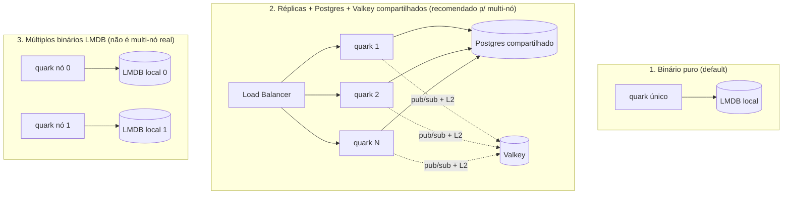

[English](SCALING.md) · **Português**

# Escala horizontal no quark

O quark escala horizontalmente compartilhando armazenamento entre réplicas. São
três formatos de deploy, com limites diferentes: escolha o que casa com o que
você precisa. A auditoria subsistema por subsistema por trás desta página, com
evidência `arquivo:linha`, está em
[`docs/research/2026-07-14-scale-audit.md`](research/2026-07-14-scale-audit.md).

## Os três formatos

| Formato | Armazenamento | Multi-nó | Nota |
|---|---|---|---|
| **1. Binário puro** | LMDB embutido | Não (1 nó) | Footprint mínimo; até 2^40 links |
| **2. Réplicas + Postgres + Valkey** | Postgres + Valkey compartilhados | Sim | Caminho recomendado; qualquer réplica serve qualquer link |
| **3. Múltiplos LMDB** | LMDB local por nó | Não para leitura | Cada nó só tem o dado que criou (veja limites abaixo) |

## A matriz honesta de escala

Nem todo subsistema escala igual. Um deploy "multi-nó" que compartilha o store
mas não o Valkey ainda está degradado: rate limits viram N vezes o valor
configurado e a coordenação de cache atrasa. Eis o que cada subsistema
de fato faz por formato de deploy.

| Subsistema | Nó único (LMDB) | Multi-nó (Postgres + Valkey + ClickHouse) |
|---|---|---|
| Redirect (caminho quente) | ok, um nó | código computado + cache tier, qualquer réplica serve qualquer link |
| Alocação de ID | contador por nó + prefixo node_id (precisa de node_id único) | `quark_id_seq` compartilhado, coordenado entre réplicas |
| Rate limit | em memória, por nó (correto num nó) | contador global atômico no Valkey |
| Cache | L1 por nó (correto: o store não é compartilhado) | L1 por nó + L2 compartilhado, invalidação quase instantânea via pub/sub |
| Agregação de analytics | read-modify-write de blob por nó (correto num nó) | contadores atômicos no Postgres (`INSERT ... ON CONFLICT`), ou ClickHouse append-only + agregação na leitura |
| Ingestão de clique | canal limitado, `try_send` descarta no cheio (at-most-once por design) | igual em todo backend |
| Entrega de webhook: ciclo de vida | canal best-effort em memória (sem outbox no LMDB) | outbox durável no Postgres + relay com lease, at-least-once |
| Entrega de webhook: clicked/expired | best-effort em memória (caminho quente) | best-effort em memória por design (caminho quente) |

**Nó único (default):** LMDB com o cache, rate-limit e analytics em blob em
memória é correto e não precisa de dependência externa. É o formato binário
puro.

**Multi-nó:** exige Postgres (store compartilhado) mais Valkey (rate-limit
compartilhado e invalidação de cache cross-node). ClickHouse é
recomendado para analytics em alto volume; o caminho de analytics no Postgres
também é correto em escala porque usa incrementos atômicos por contador, não um
read-modify-write por link.

## Como escalar de fato (formato 2)

Suba N cópias do binário atrás de um load balancer, todas com o mesmo
`QUARK_KEY`, o mesmo `QUARK_DATABASE_URL` apontando para o Postgres
compartilhado e o mesmo `QUARK_VALKEY_URL`:

- **Ids únicos**: a sequência `quark_id_seq` do Postgres é atômica e global ao
  cluster, então réplicas concorrentes nunca geram o mesmo id. A largura da
  permutação é 40 bits, então o teto global é 2^40 links (cerca de 1,1 trilhão)
  no cluster todo.
- **Dado compartilhado**: cada réplica lê/escreve nas mesmas tabelas; não precisa
  de afinidade de sessão (o load balancer pode ser round-robin simples).
- **Rate-limit e invalidação compartilhados**: aponte cada réplica para o mesmo
  Valkey. Sem ele, cada réplica mantém seu contador em memória e o rate limit
  efetivo vira N vezes o configurado, e mudanças de cache só propagam
  no TTL por nó.
- **Falhe rápido se a intenção era clusterizar**: seta `QUARK_STRICT_CLUSTER=1`
  em cada réplica e o quark se recusa a subir a menos que `QUARK_DATABASE_URL` e
  `QUARK_VALKEY_URL` estejam presentes. Qualquer valor não vazio liga. Transforma
  uma configuração errada silenciosa (rate limits N vezes, caches velhos,
  arquivos LMDB por nó) em erro de startup. Deploys de nó único deixam sem setar
  e não são afetados.

## Janelas de consistência cross-node

O cache é eventualmente consistente entre réplicas, limitado e fechado pelo canal
pub/sub de invalidação do Valkey (`quark:invalidate`, em `src/invalidate.rs`):

- **Cache** (`patch`/`delete`): sem pub/sub, o L1 de outra réplica pode servir um
  link velho até seu TTL por nó expirar (60s). Cada mutação de admin publica
  `link:<id>` e cada réplica derruba essa entrada L1 ao receber, então a janela
  cai de até 60s para quase instantânea. O TTL fica de backstop se uma réplica
  perder uma mensagem. A publicação é limitada por um timeout de 100ms e é
  fail-open, então um Valkey lento nunca bloqueia a escrita de admin.

O assinante aplica cada mensagem só ao L1 local e nunca republica,
então não há loop cross-node.

## A ingestão de analytics é at-most-once

Um clique é entregue ao worker de analytics por um canal limitado em processo
(`try_send`, capacidade 10.000). Num pico que enche o canal o redirect descarta
o evento em vez de bloquear o 302. Isso é deliberado: o caminho quente do
redirect nunca pode esperar por analytics. A agregação que segue é correta
(contadores atômicos no Postgres, append no ClickHouse), mas a ingestão em si é
at-most-once, então trate contagens de clique sob picos extremos como amostradas,
não exatas.

## Entrega durável de webhook

No backend Postgres os eventos de ciclo de vida (`link.created`, `link.updated`,
`link.deleted`) são duráveis. Cada um dispara uma linha por assinatura ativa que
casa no outbox `webhook_deliveries`, e um relay com lease os entrega
at-least-once:

- O relay reivindica um lote de linhas devidas com
  `SELECT ... FOR UPDATE SKIP LOCKED`, então N réplicas pegam conjuntos disjuntos
  e nunca enviam em dobro, e um endpoint lento segura só as próprias linhas.
- Retry é persistido: na falha a contagem de tentativas sobe e a próxima
  tentativa é empurrada com backoff exponencial mais jitter, sobrevivendo a um
  restart. Após 8 tentativas a linha é marcada dead (dead-letter) e para de ser
  reivindicada.
- Idempotência: o header `webhook-id` é a chave de entrega estável da linha
  (`<event_id>.<subscription_id>`), idêntica em toda tentativa e nó.

`link.clicked` e `link.expired` ficam best-effort em todo backend, porque
disparam no caminho quente do redirect e uma escrita síncrona no outbox ali
mataria o propósito. No backend LMDB não há outbox nenhum; todo evento, ciclo de
vida incluso, vai pelo canal best-effort em memória. Veja
[WEBHOOKS](WEBHOOKS.PT_BR.md) para o modelo de entrega completo.

**A inserção é atômica com a mutação.** As linhas do outbox entram na mesma
transação da mutação do link que gerou o evento. O handler lê as assinaturas
ativas que casam (fora da transação) e passa as linhas de entrega para a camada
de store, que comita a mudança do link e os inserts do outbox juntos. Ou os
dois entram ou nenhum, então um crash não perde mais um evento entre a gravação
do link e a inserção no outbox.

## `QUARK_NODE_ID`: particionamento defensivo do LMDB

O espaço de códigos do quark é 40 bits. Com `QUARK_NODE_ID` setado (0-255), os 8
bits do topo identificam o nó e os 32 de baixo viram o contador local do nó:

| Bits de nó | Bits locais | Máx. de nós | Links por nó |
|---|---|---|---|
| 8 | 32 | 256 | ~4,3 bilhões |

- **Sem setar (default)**: comportamento normal, o contador usa os 40 bits cheios
  (~1,1 trilhão de links). É o modo nó único.
- **Regra tudo-ou-nada**: ou todo nó roda sem `QUARK_NODE_ID` (= 1 nó), ou todo
  nó roda com um `QUARK_NODE_ID` distinto. Nunca misture um nó não particionado
  (faixa cheia) com particionados: os espaços se sobrepõem.
- **Unicidade é com você**: o id TEM que ser único por réplica (um ordinal de
  StatefulSet é uma fonte natural). O quark não detecta duplicata; dois nós com o
  mesmo id reusam em silêncio o mesmo espaço de código e colidem.
- Um `QUARK_NODE_ID` inválido (fora de 0-255) aborta o processo no startup.
- `QUARK_NODE_ID` é só LMDB. No backend Postgres é ignorado (a sequência
  compartilhada aloca) e o quark loga que foi ignorado. O caminho Postgres tem um
  único teto global de 2^40 links, não um por nó.

## O limite honesto do formato 3

`QUARK_NODE_ID` garante que dois nós LMDB não gerem o mesmo código, mas não faz
um nó servir os links de outro. Cada LMDB é local: um redirect que cai no nó
errado retorna 404, porque aquele nó não tem o dado. Em outras palavras, node-id
é uma guarda contra colisão, não um modo multi-nó real.

Por design, um binário puro (LMDB, sem banco) é nó único: isso é uma restrição
deliberada do sistema, não uma limitação a remover. Para multi-nó, use o formato
2 (Postgres + Valkey compartilhados).
