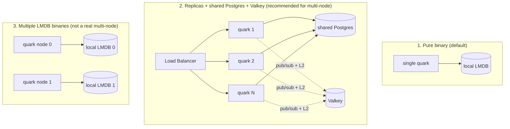

**English** · [Português](SCALING.PT_BR.md)

# Horizontal scaling in quark

quark scales horizontally by sharing storage across replicas. There are three
deployment shapes, with different limits: pick the one that matches what you
need. The subsystem-by-subsystem audit behind this page, with `file:line`
evidence, is [`docs/research/2026-07-14-scale-audit.md`](research/2026-07-14-scale-audit.md).

## The three shapes

| Shape | Storage | Multi-node | Note |
|---|---|---|---|
| **1. Pure binary** | Embedded LMDB | No (1 node) | Minimal footprint; up to 2^40 links |
| **2. Replicas + Postgres + Valkey** | Shared Postgres + Valkey | Yes | Recommended path; any replica serves any link |
| **3. Multiple LMDB** | Local LMDB per node | Not for reads | Each node only has the data it created (see limits below) |

## The honest scale matrix

Not every subsystem scales the same way. A "multi-node" deployment that shares
the store but not Valkey is still degraded: rate limits become N-times the
configured value, and cache/blocklist coordination lags. Here is what each
subsystem actually does per deployment shape.

| Subsystem | Single-node (LMDB) | Multi-node (Postgres + Valkey + ClickHouse) |
|---|---|---|
| Redirect (hot path) | fine, one node | computed code + cache tier, any replica serves any link |
| ID allocation | per-node counter + node_id prefix (needs a unique node_id) | shared `quark_id_seq`, coordinated across replicas |
| Rate limit | in-memory, per node (correct on one node) | atomic global counter in Valkey |
| Blocklist | per-node snapshot + TTL | shared snapshot + Valkey L2, near-instant via pub/sub |
| Cache | per-node L1 (correct: store is not shared) | per-node L1 + shared L2, near-instant invalidation via pub/sub |
| Analytics aggregation | per-node blob read-modify-write (correct on one node) | atomic Postgres counters (`INSERT ... ON CONFLICT`), or ClickHouse append-only + aggregate-on-read |
| Click ingestion | bounded channel, `try_send` drops when full (at-most-once by design) | same on every backend |
| Webhook delivery: lifecycle | in-memory best-effort channel (no outbox on LMDB) | durable Postgres outbox + leased relay, at-least-once |
| Webhook delivery: clicked/expired | in-memory best-effort (hot path) | in-memory best-effort by design (hot path) |

**Single-node (default):** LMDB with the in-memory cache, rate-limit, and blob
analytics is correct and needs no external dependency. This is the pure-binary
shape.

**Multi-node:** requires Postgres (shared store) plus Valkey (shared rate-limit
and cross-node cache/blocklist invalidation). ClickHouse is recommended for
analytics at high volume; the Postgres analytics path is also correct at scale
because it uses atomic per-counter increments, not a per-link read-modify-write.

## How to actually scale (shape 2)

Bring up N copies of the binary behind a load balancer, all with the same
`QUARK_KEY`, the same `QUARK_DATABASE_URL` pointing at the shared Postgres, and
the same `QUARK_VALKEY_URL`:

- **Unique ids**: Postgres's `quark_id_seq` sequence is atomic and cluster-wide,
  so concurrent replicas never generate the same id. The permute width is 40
  bits, so the global ceiling is 2^40 links (about 1.1 trillion) across the
  whole cluster.
- **Shared data**: every replica reads/writes the same tables; no session
  affinity is needed (the load balancer can be plain round-robin).
- **Shared rate-limit and invalidation**: point every replica at the same
  Valkey. Without it, each replica keeps its own in-memory counter and the
  effective rate limit becomes N-times the configured value, and cache/blocklist
  changes propagate only on the per-node TTL.
- **Fail fast if you meant to cluster**: set `QUARK_STRICT_CLUSTER=1` on every
  replica and quark refuses to start unless both `QUARK_DATABASE_URL` and
  `QUARK_VALKEY_URL` are present. Any non-empty value turns it on. This turns a
  silent misconfiguration (N-times rate limits, stale caches, per-node LMDB
  files) into a startup error. Single-node deployments leave it unset and are
  unaffected.

## Cross-node consistency windows

Two subsystems are eventually consistent between replicas, both bounded and both
closed by the Valkey pub/sub invalidation channel (`quark:invalidate`, in
`src/invalidate.rs`):

- **Cache** (`patch`/`delete`): without pub/sub, another replica's L1 can serve
  a stale link until its per-node TTL expires (60s). Each admin mutation
  publishes `link:<id>` and every replica drops that L1 entry on receipt, so the
  window drops from up to 60s to near-instant. The TTL stays as the backstop if
  a replica misses a message. The publish is bounded by a 100ms timeout and is
  fail-open, so a slow Valkey never blocks the admin write.
- **Blocklist**: without pub/sub, a newly blocked entry propagates on the
  snapshot TTL (`QUARK_BLOCKLIST_TTL`, default 60s). The same channel publishes
  `blocklist` and every replica reloads its snapshot, making it near-instant with
  the TTL as the backstop.

The subscriber applies each message to the local L1/snapshot only and never
re-publishes, so there is no cross-node loop.

## Analytics ingestion is at-most-once

A click is handed to the analytics worker through a bounded in-process channel
(`try_send`, 10,000 capacity). Under a burst that fills the channel the redirect
drops the event rather than block the 302. This is deliberate: the redirect hot
path must never wait on analytics. The aggregation that follows is correct
(atomic counters on Postgres, append on ClickHouse), but the ingestion itself is
at-most-once, so treat click counts under extreme peaks as sampled, not exact.

## Durable webhook delivery

On the Postgres backend the lifecycle events (`link.created`, `link.updated`,
`link.deleted`) are durable. Each fires one row per matching active subscription
into the `webhook_deliveries` outbox, and a leased relay worker delivers them
at-least-once:

- The relay claims a batch of due rows with `SELECT ... FOR UPDATE SKIP LOCKED`,
  so N replicas each take a disjoint set and never double-send, and a slow
  endpoint holds up only its own rows.
- Retry is persisted: on failure the attempt count is bumped and the
  next-attempt time is pushed out with exponential backoff plus jitter, surviving
  a restart. After 8 attempts the row is flagged dead (dead-letter) and stops
  being claimed.
- Idempotency: the `webhook-id` header is the row's stable delivery key
  (`<event_id>.<subscription_id>`), identical across every attempt and node.

`link.clicked` and `link.expired` stay best-effort on every backend, because
they fire on the redirect hot path and a synchronous outbox write there would
defeat its purpose. On the LMDB backend there is no outbox at all; every event,
lifecycle included, rides the in-memory best-effort channel. See
[WEBHOOKS](WEBHOOKS.md) for the full delivery model.

**One residual gap.** The outbox row is inserted right after the link mutation
commits, not inside the same transaction (the storage layer does not otherwise
know about webhooks). A crash in the narrow window between the link commit and
the outbox insert loses that one event. Folding the insert into the same
transaction is a planned follow-up. This is far smaller than the in-memory gap it
replaces.

## `QUARK_NODE_ID`: defensive LMDB partitioning

quark's code space is 40 bits. When `QUARK_NODE_ID` is set (0-255), the top 8
bits identify the node and the low 32 bits become that node's local counter:

| Node bits | Local bits | Max nodes | Links per node |
|---|---|---|---|
| 8 | 32 | 256 | ~4.3 billion |

- **Unset (default)**: normal behavior, the counter uses the full 40 bits (~1.1
  trillion links). This is single-node mode.
- **All-or-nothing rule**: either every node runs without `QUARK_NODE_ID` (= 1
  node), or every node runs with a distinct `QUARK_NODE_ID`. Never mix an
  un-partitioned node (full range) with partitioned ones: the spaces overlap.
- **Uniqueness is on you**: the id MUST be unique per replica (a StatefulSet
  ordinal is a natural source). quark cannot detect a duplicate; two nodes with
  the same id silently reuse the same code space and collide.
- An invalid `QUARK_NODE_ID` (outside 0-255) crashes the process at startup.
- `QUARK_NODE_ID` is LMDB-only. On the Postgres backend it is ignored (the
  shared sequence handles allocation) and quark logs that it was ignored. The
  Postgres path has a single global ceiling of 2^40 links, not a per-node one.

## The honest limit of shape 3

`QUARK_NODE_ID` guarantees that two LMDB nodes will not generate the same code,
but it does not make one node serve another node's links. Each LMDB is local: a
redirect that lands on the wrong node returns 404, because that node does not
have the data. In other words, node-id is a collision guard-rail, not a real
multi-node mode.

By design, a pure binary (LMDB, no database) is single-node: this is a
deliberate constraint of the system, not a limitation to be removed. For
multi-node, use shape 2 (shared Postgres + Valkey).
