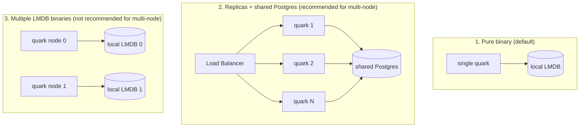

**English** · [Português](SCALING.PT_BR.md)

# Horizontal scaling in quark

quark scales horizontally by **sharing storage** across replicas. There are
three deployment shapes, with different limits: pick the one that matches
what you need.

## The three shapes

| Shape | Storage | Multi-node | Note |
|---|---|---|---|
| **1. Pure binary** | Embedded LMDB | No (1 node) | Minimal footprint; ~1.1 trillion links of capacity |
| **2. Replicas + Postgres** | Shared Postgres | **Yes** | Recommended path; any replica serves any link |
| **3. Multiple LMDB** | Local LMDB per node | Not for reads | Each node only has the data it created (see limits below) |

## How to actually scale (shape 2)

Bring up N copies of the binary behind a load balancer, all with the same
`QUARK_KEY` and the same `QUARK_DATABASE_URL` pointing at the shared Postgres:

- **Unique ids**: Postgres's `quark_id_seq` sequence is atomic and cluster-wide;
  concurrent replicas never generate the same id.
- **Shared data**: every replica reads/writes the same tables; there's no
  session affinity needed (the load balancer can be plain round-robin).
- **Optional cache**: a shared Valkey (`QUARK_VALKEY_URL`) as L2 cuts down
  repeated reads against Postgres.

## `QUARK_NODE_ID`: defensive LMDB partitioning

quark's code space is 40 bits. When `QUARK_NODE_ID` is **set** (0–255), the
top 8 bits identify the node and the low 32 bits become that node's local
counter:

| Node bits | Local bits | Max nodes | Links per node |
|---|---|---|---|
| 8 | 32 | 256 | ~4.3 billion |

- **Unset (default)**: normal behavior, the counter uses the full 40 bits
  (~1.1 trillion links). This is single-node mode.
- **All-or-nothing rule**: either **every** node runs without `QUARK_NODE_ID`
  (= 1 node), or **every** node runs with a **distinct** `QUARK_NODE_ID`.
  Never mix an un-partitioned node (full range) with partitioned ones: the
  spaces overlap.
- An invalid `QUARK_NODE_ID` (outside 0–255) crashes the process at startup.

## The honest limit of shape 3

`QUARK_NODE_ID` guarantees that two LMDB nodes **won't generate the same
code**, but it does **not** make one node serve another node's links. Each
LMDB is local: a redirect that lands on the wrong node returns 404, because
that node doesn't have the data. In other words, node-id is a
**collision guard-rail**, not a real multi-node mode.

**By design, a pure binary (LMDB, no database) is single-node**: this is a
deliberate constraint of the system, not a limitation to be removed. **For
multi-node, use shape 2 (shared Postgres).**
