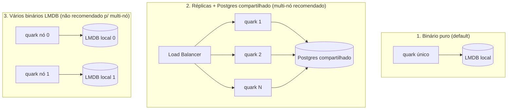

# Escala horizontal do quark

O quark escala horizontalmente **compartilhando o storage** entre réplicas. Há
três formatos de deploy, com limites diferentes — escolha pelo que você precisa.

## Os três formatos

| Formato | Storage | Multi-nó | Observação |
|---|---|---|---|
| **1. Binário puro** | LMDB embutido | Não (1 nó) | Recurso mínimo; capacidade ~1,1 trilhão de links |
| **2. Réplicas + Postgres** | Postgres compartilhado | **Sim** | Caminho recomendado; qualquer réplica serve qualquer link |
| **3. Vários LMDB** | LMDB local por nó | Não p/ leitura | Cada nó só tem os dados que ele criou (ver limites abaixo) |

## Como escalar de verdade (formato 2)

Suba N cópias do binário atrás de um load balancer, todas com a mesma
`QUARK_KEY` e a mesma `QUARK_DATABASE_URL` apontando pro Postgres compartilhado:

- **IDs únicos**: a sequência `quark_id_seq` do Postgres é atômica e cluster-wide;
  réplicas concorrentes nunca geram o mesmo id.
- **Dados compartilhados**: todas leem/escrevem as mesmas tabelas; não há
  afinidade de sessão (o load balancer pode ser round-robin simples).
- **Cache opcional**: um Valkey compartilhado (`QUARK_VALKEY_URL`) como L2 corta
  leituras repetidas no Postgres.

## `QUARK_NODE_ID` — particionamento defensivo do LMDB

O espaço de código do quark tem 40 bits. Quando `QUARK_NODE_ID` está **definido**
(0–255), os 8 bits altos passam a identificar o nó e os 32 baixos são o contador
local daquele nó:

| Bits de nó | Bits locais | Máx. de nós | Links por nó |
|---|---|---|---|
| 8 | 32 | 256 | ~4,3 bilhões |

- **Ausente (default)**: comportamento normal, contador usa os 40 bits inteiros
  (~1,1 trilhão de links). É o modo single-node.
- **Regra tudo-ou-nada**: ou **todos** os nós rodam sem `QUARK_NODE_ID` (= 1 nó),
  ou **todos** rodam com um `QUARK_NODE_ID` **distinto**. Nunca misture um nó sem
  node-id (faixa cheia) com nós particionados — os espaços se sobrepõem.
- `QUARK_NODE_ID` inválido (fora de 0–255) derruba o processo no startup.

## Limite honesto do formato 3

`QUARK_NODE_ID` garante que dois nós LMDB **não gerem o mesmo código** — mas
**não** faz um nó servir os links do outro. Cada LMDB é local: um redirect que
cai no nó errado dá 404, porque aquele nó não tem o dado. Ou seja, o node-id é um
**guard-rail contra colisão**, não um modo multi-nó de verdade.

**Por design, um binário puro (LMDB, sem banco) é single-node** — isso é uma
restrição consciente do sistema, não uma limitação a ser removida. **Para
multi-nó, use o formato 2 (Postgres compartilhado).**

> Existe uma nota teórica (não planejada): como o `QUARK_NODE_ID` fica nos bits
> altos do id, um nó poderia decodificar o código, descobrir o nó dono e fazer
> proxy do redirect pra ele ("shared-nothing", sem banco). Fica só como
> curiosidade — não está no roadmap; a restrição single-node do binário puro é
> deliberada e o Postgres já resolve o multi-nó.
