[English](SHEETS.md) · **Português**

# Sincronização com o Google Sheets

O quark consegue espelhar todo o seu catálogo de links numa planilha do Google
que é sua. Você conecta uma conta Google uma vez pelo painel e o quark mantém a
planilha atualizada com uma linha por link: o short code, a short URL, o destino,
quando foi criado, a contagem de cliques, as tags e a pasta. A sincronização roda
sob demanda pela página de Extensões e, se quiser, num intervalo agendado.

É opt-in: o conector fica desligado até você setar as três credenciais
`QUARK_SHEETS_*` abaixo. Enquanto está desligado, o card do Google Sheets na
página de Extensões cai de volta no caminho por webhook, igual antes.

## O que é sincronizado

O quark cria uma planilha (na primeira sincronização) e reescreve a primeira aba
a cada sincronização. O layout é uma linha de cabeçalho mais uma linha por link:

| code | short_url | destination | created | visits | tags | folder |
|---|---|---|---|---|---|---|
| `a1b2c3` | `https://s.example/a1b2c3` | `https://exemplo.com/promo` | epoch em segundos | contagem de cliques | `lancamento, promo` | `marketing` |

A planilha é um espelho, não uma sincronização de mão dupla: o quark escreve,
nunca lê as suas edições de volta. Renomeie o arquivo ou mova pra onde quiser no
Drive; o quark continua escrevendo no mesmo arquivo pelo id.

## O escopo `drive.file`, e por quê

O único escopo do Drive que o quark pede é
`https://www.googleapis.com/auth/drive.file`. Esse escopo só dá acesso aos
arquivos que o próprio app cria. O quark consegue ler e escrever a única planilha
que criou pra você e nada mais no seu Drive. Ele não vê, não lista e não toca em
nenhum dos seus outros arquivos. É o escopo mais estreito que ainda deixa o quark
ser dono da planilha e atualizá-la. O quark também pede os escopos básicos
`openid email` pra mostrar qual conta Google está conectada; ele guarda só o email.

## Como funciona

```mermaid
flowchart TD
    subgraph Conectar
      A[operador clica em Conectar o Google Sheets] --> B[GET /admin/integrations/sheets/connect]
      B -->|retorna a URL de consentimento com um state assinado| P[o painel navega o browser pro Google]
      P --> G[consentimento do Google, escopo openid email drive.file]
      G -->|code| C[GET /admin/integrations/sheets/callback]
      C --> X[verifica o state assinado, troca o code por tokens]
      X --> S[guarda o refresh token no servidor, salva o email]
    end
    subgraph Sincronizar
      Y[Sincronizar agora, ou a tarefa agendada] --> R[renova o access token]
      R --> Z{a planilha existe?}
      Z -->|não| N[cria a planilha]
      Z -->|sim| U[reusa o id]
      N --> W[escreve o cabeçalho mais uma linha por link]
      U --> W
      W --> T[registra o horário e o status da última sincronização]
    end
```

O connect usa o fluxo OAuth Authorization Code padrão do Google com acesso
offline, então o Google devolve um refresh token de vida longa. O quark guarda
esse refresh token no servidor e o usa pra gerar um access token de curta duração
a cada sincronização. O endpoint de connect devolve a URL de consentimento como
JSON (em vez de redirecionar) pra que um operador autenticado por token consiga
iniciar o fluxo; o painel então manda o browser pro Google. O `state` enviado ao
Google é assinado por HMAC com a chave do servidor, então o callback o verifica
direto (sem cookie), o que mantém o fluxo funcionando mesmo quando o painel e a
API estão em origens diferentes.

## Sincronização sob demanda e agendada

- **Sob demanda:** o botão "Sincronizar agora" na página de Extensões roda uma
  sincronização e reporta o resultado (sucesso, ou o detalhe do erro).
- **Agendada:** sete `QUARK_SHEETS_SYNC_SECS` pra sincronizar num intervalo. O
  intervalo tem piso de 60 segundos. Num deploy com várias réplicas a
  sincronização agendada é coordenada por lease no Postgres, então só uma réplica
  roda a cada tick. Um deploy de binário único (LMDB) sempre roda.

## O refresh token

O refresh token é a credencial de vida longa. O quark guarda ele no servidor,
nunca devolve em nenhuma resposta da API e nunca loga. O endpoint de status
reporta só se você está conectado, o email conectado, o link da planilha e o
horário e o estado da última sincronização. Pra revogar o acesso, clique em
Desconectar (que descarta a conexão guardada) ou remova o acesso do quark nas
permissões da sua Conta Google.

## Configuração

Sete estas variáveis em toda instância que serve a API do painel. O conector só
liga quando o client id, o secret e a redirect URL estão todos presentes.

| Variável | Para quê |
|---|---|
| `QUARK_SHEETS_CLIENT_ID` | Client id do OAuth. Liga o conector (junto com as duas abaixo). |
| `QUARK_SHEETS_CLIENT_SECRET` | Client secret do OAuth. |
| `QUARK_SHEETS_REDIRECT_URL` | O callback desta instância, `https://<quark-host>/admin/integrations/sheets/callback`. Registre o mesmo valor no Google. |
| `QUARK_SHEETS_SYNC_SECS` | Opcional. Intervalo da sincronização agendada em segundos (piso de 60). Sem setar significa só sob demanda. |

O cookie de state é assinado com `QUARK_SIGNING_KEY` (o mesmo secret da sessão
OIDC e dos cookies de senha de link); sete ele e compartilhe entre as réplicas.

## Setup único no Google Cloud

1. No Google Cloud Console, crie (ou escolha) um projeto.
2. APIs e serviços, Biblioteca: ative a **Google Sheets API** e a **Google Drive
   API**.
3. APIs e serviços, Tela de consentimento OAuth: configure e adicione o escopo
   `https://www.googleapis.com/auth/drive.file` (os escopos básicos `openid` e
   `email` já vêm por padrão). Enquanto o app está em teste, adicione a sua conta
   Google como usuário de teste.
4. APIs e serviços, Credenciais: crie um ID do cliente OAuth 2.0 do tipo
   "Aplicativo da Web". Em URIs de redirecionamento autorizados, adicione
   exatamente `https://<quark-host>/admin/integrations/sheets/callback`.
5. Copie o client id e o secret pra `QUARK_SHEETS_CLIENT_ID` /
   `QUARK_SHEETS_CLIENT_SECRET`, sete `QUARK_SHEETS_REDIRECT_URL` com a mesma
   redirect URI e reinicie o quark.
6. Abra o painel, vá em Extensões e clique em "Conectar o Google Sheets".

O Google exige uma redirect URI em https, então rode o quark atrás de TLS (um
host de verdade ou um túnel https) pra o connect completar.

## Notas e limites

- O caminho quente de redirect (`GET /:code`) não paga nada por esse recurso; a
  sincronização roda fora da banda.
- A planilha é reescrita por inteiro a cada sincronização, então edições manuais
  nas células sincronizadas são substituídas. Mantenha suas colunas próprias numa
  aba ou arquivo separado.
- Desconectar descarta a conexão guardada pelo quark, mas deixa a planilha no seu
  Drive.
