**English** · [Português](SHEETS.PT_BR.md)

# Google Sheets sync

quark can mirror your whole link catalog into a Google spreadsheet you own. You
connect a Google account once from the panel, and quark keeps a sheet up to date
with one row per link: the short code, the short URL, the destination, when it
was created, its click count, its tags, and its folder. Sync runs on demand from
the Extensions page and, optionally, on a schedule.

This is opt-in: the connector is off until you set the three `QUARK_SHEETS_*`
credentials below. When it is off, the Google Sheets card on the Extensions page
falls back to the webhook route, exactly as before.

## What syncs

quark creates one spreadsheet (the first time you sync) and overwrites its first
sheet on every sync. The layout is a header row plus one row per link:

| code | short_url | destination | created | visits | tags | folder |
|---|---|---|---|---|---|---|
| `a1b2c3` | `https://s.example/a1b2c3` | `https://example.com/promo` | epoch seconds | click count | `launch, promo` | `marketing` |

The sheet is a mirror, not a two-way sync: quark writes, it never reads your
edits back. Rename the file or move it wherever you like in Drive; quark keeps
writing to the same file by its id.

Each sync writes the whole catalog as one snapshot, which is capped at 100,000
links. A larger catalog fails the sync with a clear status rather than writing a
partial sheet; that scale wants a chunked export, which is not built yet.

## The `drive.file` scope, and why

The only Drive scope quark requests is
`https://www.googleapis.com/auth/drive.file`. That scope only grants access to
files the app itself creates. quark can read and write the one spreadsheet it
made for you and nothing else in your Drive. It cannot see, list, or touch any
of your other files. This is the narrowest scope that still lets quark own and
update its sheet. quark also requests the basic `openid email` scopes so it can
show which Google account is connected; it stores only the email address.

## How it works

```mermaid
flowchart TD
    subgraph Connect
      A[operator clicks Connect Google Sheets] --> B[GET /admin/integrations/sheets/connect]
      B -->|returns consent URL, sets signed state cookie| P[panel navigates browser to Google]
      P --> G[Google consent, scope openid email drive.file]
      G -->|code| C[GET /admin/integrations/sheets/callback]
      C --> X[verify state cookie matches, exchange code for tokens]
      X --> S[store refresh token server-side, save email]
    end
    subgraph Sync
      Y[Sync now, or the scheduled task] --> R[refresh access token]
      R --> Z{spreadsheet exists?}
      Z -->|no| N[create spreadsheet]
      Z -->|yes| U[reuse its id]
      N --> W[write header plus one row per link]
      U --> W
      W --> T[record last sync time and status]
    end
```

Connect uses the standard Google OAuth Authorization Code flow with offline
access, so Google returns a long-lived refresh token. quark stores that refresh
token server-side and uses it to mint a short-lived access token for each sync.
The connect endpoint returns the consent URL as JSON (rather than redirecting) so
a token-authenticated operator can start the flow; the panel then sends the
browser to Google. A random `state` goes to Google in the URL and a signed copy
is stored in a short-lived `HttpOnly` cookie; the callback requires both to
match, binding the flow to the browser that started it so a leaked `state` cannot
be replayed to inject another Google account.

## On-demand and scheduled sync

- **On demand:** the "Sync now" button on the Extensions page runs one sync and
  reports the result (success, or the error detail).
- **Scheduled:** set `QUARK_SHEETS_SYNC_SECS` to sync on an interval. The
  interval is floored to 60 seconds. On a multi-replica deployment the scheduled
  sync is lease-coordinated through Postgres, so only one replica runs each tick.
  A single-binary (LMDB) deployment always runs it.

## The refresh token

The refresh token is the long-lived credential. quark stores it server-side and
never returns it in any API response and never logs it. The status endpoint
reports only whether you are connected, the connected email, the spreadsheet
link, and the last sync time and state. To revoke access, click Disconnect (which
drops the stored connection) or remove quark's access from your Google Account
permissions.

## Configuration

Set these on every instance that serves the panel API. The connector turns on
only when the client id, secret, and redirect URL are all present.

| Variable | Purpose |
|---|---|
| `QUARK_SHEETS_CLIENT_ID` | OAuth client id. Enables the connector (with the two below). |
| `QUARK_SHEETS_CLIENT_SECRET` | OAuth client secret. |
| `QUARK_SHEETS_REDIRECT_URL` | This instance's callback, `https://<quark-host>/admin/integrations/sheets/callback`. Register the same value at Google. |
| `QUARK_SHEETS_SYNC_SECS` | Optional. Scheduled sync interval in seconds (floored to 60). Unset means on-demand only. |

The state cookie is signed with `QUARK_SIGNING_KEY` (the same secret used for the
OIDC session and link-password cookies); set it and share it across replicas.

## One-time Google Cloud setup

1. In the Google Cloud Console, create (or pick) a project.
2. APIs and Services, Library: enable the **Google Sheets API** and the **Google
   Drive API**.
3. APIs and Services, OAuth consent screen: configure it and add the scope
   `https://www.googleapis.com/auth/drive.file` (the basic `openid` and `email`
   scopes are included by default). While the app is in testing, add your Google
   account as a test user.
4. APIs and Services, Credentials: create an OAuth 2.0 Client ID of type "Web
   application". Under Authorized redirect URIs, add exactly
   `https://<quark-host>/admin/integrations/sheets/callback`.
5. Copy the client id and secret into `QUARK_SHEETS_CLIENT_ID` /
   `QUARK_SHEETS_CLIENT_SECRET`, set `QUARK_SHEETS_REDIRECT_URL` to the same
   redirect URI, and restart quark.
6. Open the panel, go to Extensions, and click "Connect Google Sheets".

Google requires an https redirect URI, so run quark behind TLS (a real host or an
https tunnel) for the connect to complete.

## Notes and limits

- The redirect hot path (`GET /:code`) pays nothing for this feature; sync runs
  out of band.
- The sheet is overwritten in full on each sync, so manual edits to synced cells
  are replaced. Keep your own columns in a separate sheet or file.
- Disconnect drops quark's stored connection but leaves the spreadsheet in your
  Drive.
