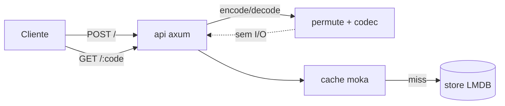
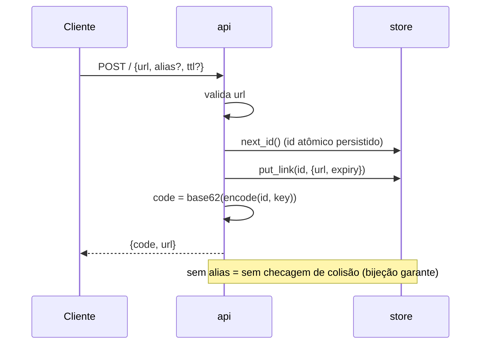

# quark Implementation Plan

> **For agentic workers:** REQUIRED SUB-SKILL: Use superpowers:subagent-driven-development (recommended) or superpowers:executing-plans to implement this plan task-by-task. Steps use checkbox (`- [ ]`) syntax for tracking.

**Goal:** Um encurtador de URL em Rust cujo código curto é uma permutação Feistel/ARX de rounds reduzidos (calibrada por medição de avalanche), com códigos calculados em vez de armazenados, servindo redirects com latência mínima e footprint minúsculo.

**Architecture:** Binário único. `permute` (bijeção Feistel/ARX id↔id) + `codec` (int↔base62) geram o código sem tocar o disco. `store` (LMDB via heed) guarda `u64 id → {url, expiry, created}` e `alias → id`. `cache` (moka) fica na frente das leituras. `api` (axum) expõe `POST /`, `GET /:code`, `GET /health`. `calibrate` (bin offline) mede o SAC da `permute` e fixa a constante de rounds.

**Tech Stack:** Rust 2021, axum + tokio, heed (LMDB), moka, criterion (benches), serde. Sem dependência de serviço externo.

## Global Constraints

- Edição Rust: **2021**; toolchain estável.
- Largura default da permutação: **40 bits** (par, dois meios de 20 bits) → **7 chars base62**. Constante configurável em um único lugar (`permute::WIDTH_BITS`).
- Alfabeto base62: `0-9A-Za-z` nessa ordem exata.
- Chave secreta da permutação vem de env var `QUARK_KEY` (u64); ausência → chave default fixa **apenas em dev**, com warning.
- Nenhum `panic!`/`unwrap()`/`expect()` no caminho de request — tudo `Result`. `unwrap` permitido só em testes e na inicialização (startup).
- Store nunca reaberto por request; abre uma vez no startup e é compartilhado (`Arc`).
- Todo commit deve compilar (`cargo build`) e passar `cargo test`.
- **Documentação a nível humano é requisito, não opcional.** O `README.md` e os docs em `docs/` devem explicar *como* e *por quê* de forma acessível (não só referência de API), e **todo fluxo/arquitetura relevante deve ter um diagrama Mermaid** (`mermaid` em bloco de código). No mínimo: diagrama de arquitetura dos componentes, sequência do fluxo de create, sequência do fluxo de redirect, e diagrama do pipeline da permutação Feistel. Diagramas devem renderizar no GitHub (sintaxe Mermaid válida).

---

### Task 1: Scaffold do projeto Cargo

**Files:**
- Create: `Cargo.toml`
- Create: `src/main.rs`
- Create: `src/lib.rs`
- Create: `.gitignore`
- Create: `rust-toolchain.toml`

**Interfaces:**
- Consumes: nada.
- Produces: crate `quark` (lib) + binário `quark`; módulos declarados (vazios) `permute`, `codec`, `store`, `cache`, `api`.

- [ ] **Step 1: Criar `.gitignore`**

```gitignore
/target
*.mdb
/data
```

- [ ] **Step 2: Criar `rust-toolchain.toml`**

```toml
[toolchain]
channel = "stable"
```

- [ ] **Step 3: Criar `Cargo.toml`**

```toml
[package]
name = "quark"
version = "0.1.0"
edition = "2021"
description = "URL shortener whose short code is a calibrated reduced-round ARX permutation"
license = "MIT"

[lib]
name = "quark"
path = "src/lib.rs"

[[bin]]
name = "quark"
path = "src/main.rs"

[dependencies]
axum = "0.7"
tokio = { version = "1", features = ["rt-multi-thread", "macros", "signal"] }
heed = "0.20"
moka = { version = "0.12", features = ["sync"] }
serde = { version = "1", features = ["derive"] }
serde_json = "1"

[dev-dependencies]
tempfile = "3"

[profile.release]
lto = true
codegen-units = 1
panic = "abort"
strip = true
```

- [ ] **Step 4: Criar `src/lib.rs`**

```rust
pub mod cache;
pub mod codec;
pub mod permute;
pub mod store;
```

Criar também os arquivos vazios `src/permute.rs`, `src/codec.rs`, `src/store.rs`, `src/cache.rs` com um comentário `// implementado nas próximas tasks` cada.

- [ ] **Step 5: Criar `src/main.rs` mínimo**

```rust
fn main() {
    println!("quark");
}
```

- [ ] **Step 6: Verificar build**

Run: `cargo build`
Expected: compila sem erros (warnings de módulo vazio são aceitáveis).

- [ ] **Step 7: Commit**

```bash
git add -A
git commit -m "chore: scaffold do projeto cargo"
```

---

### Task 2: `permute` — bijeção Feistel/ARX

**Files:**
- Modify: `src/permute.rs`
- Test: dentro de `src/permute.rs` (módulo `#[cfg(test)]`)

**Interfaces:**
- Consumes: nada.
- Produces:
  - `pub const WIDTH_BITS: u32 = 40;`
  - `pub const ROUNDS: usize = 8;` (valor provisório; a Task 4 ajusta para o número calibrado)
  - `pub const MAX_ID: u64 = (1u64 << WIDTH_BITS) - 1;`
  - `pub fn encode(id: u64, key: u64) -> u64` — permuta `id` (0..=MAX_ID) para outro valor em 0..=MAX_ID.
  - `pub fn decode(code: u64, key: u64) -> u64` — inversa exata de `encode`.

- [ ] **Step 1: Escrever os testes que falham**

```rust
#[cfg(test)]
mod tests {
    use super::*;

    #[test]
    fn round_trip_amostrado() {
        let key = 0x9E3779B97F4A7C15;
        for id in [0u64, 1, 2, 42, 1000, MAX_ID / 2, MAX_ID - 1, MAX_ID] {
            let code = encode(id, key);
            assert!(code <= MAX_ID, "code fora do range: {code}");
            assert_eq!(decode(code, key), id, "round-trip falhou para id={id}");
        }
    }

    #[test]
    fn bijetividade_em_largura_pequena() {
        // Varre um domínio pequeno inteiro e prova que encode é permutação.
        // Usa 20 bits mascarando; a estrutura Feistel é a mesma.
        let key = 0xDEADBEEFCAFEBABE;
        let n = 1u64 << 20;
        let mut visto = vec![false; n as usize];
        for id in 0..n {
            let c = feistel(id, key, 20) ;
            assert!(c < n);
            assert!(!visto[c as usize], "colisão em id={id} -> {c}");
            visto[c as usize] = true;
        }
    }

    #[test]
    fn nao_enumeravel_ids_vizinhos() {
        // ids sequenciais não produzem códigos sequenciais.
        let key = 0x0123456789ABCDEF;
        let a = encode(100, key);
        let b = encode(101, key);
        assert!(a.abs_diff(b) > 1, "códigos vizinhos são sequenciais: {a} {b}");
    }
}
```

- [ ] **Step 2: Rodar os testes e confirmar que falham**

Run: `cargo test permute`
Expected: FAIL (funções não existem).

- [ ] **Step 3: Implementar a Feistel/ARX**

```rust
//! Bijeção sobre [0, 2^WIDTH_BITS) via rede de Feistel balanceada
//! com função de round ARX. É format-preserving: encode/decode nunca
//! saem do range, nunca colidem.

pub const WIDTH_BITS: u32 = 40;
pub const ROUNDS: usize = 8; // provisório — calibrado na Task 4
pub const MAX_ID: u64 = (1u64 << WIDTH_BITS) - 1;

/// Deriva a subchave do round a partir da chave mestra e do índice.
#[inline]
fn subkey(key: u64, round: usize) -> u32 {
    // mistura simples chave+round; espalha os bits altos da chave.
    let x = key
        .rotate_left((round as u32) * 7 + 1)
        ^ (0x9E3779B97F4A7C15u64.wrapping_mul(round as u64 + 1));
    (x ^ (x >> 32)) as u32
}

/// Função de round ARX: mistura um meio (half_bits) com a subchave.
#[inline]
fn round_fn(r: u32, key: u64, round: usize, half_bits: u32) -> u32 {
    let mask = (1u32 << half_bits) - 1;
    let rk = subkey(key, round);
    let mut x = r.wrapping_add(rk);
    x ^= x.rotate_left(7);
    x = x.wrapping_add(x.rotate_left(13));
    x ^= x.rotate_left(17);
    x & mask
}

/// Feistel genérico sobre `width` bits (width par). Usado por encode e
/// pelo teste de bijetividade em largura pequena.
#[inline]
fn feistel(input: u64, key: u64, width: u32) -> u64 {
    let half = width / 2;
    let mask = (1u64 << half) - 1;
    let mut l = ((input >> half) & mask) as u32;
    let mut r = (input & mask) as u32;
    for round in 0..ROUNDS {
        let f = round_fn(r, key, round, half);
        let new_l = r;
        let new_r = l ^ f;
        l = new_l;
        r = new_r;
    }
    ((l as u64) << half) | (r as u64)
}

#[inline]
fn feistel_inv(input: u64, key: u64, width: u32) -> u64 {
    let half = width / 2;
    let mask = (1u64 << half) - 1;
    let mut l = ((input >> half) & mask) as u32;
    let mut r = (input & mask) as u32;
    for round in (0..ROUNDS).rev() {
        // inverte um round: antes tínhamos (l,r) = (r_prev, l_prev ^ f(r_prev))
        let r_prev = l;
        let f = round_fn(r_prev, key, round, half);
        let l_prev = r ^ f;
        l = l_prev;
        r = r_prev;
    }
    ((l as u64) << half) | (r as u64)
}

pub fn encode(id: u64, key: u64) -> u64 {
    debug_assert!(id <= MAX_ID);
    feistel(id, key, WIDTH_BITS)
}

pub fn decode(code: u64, key: u64) -> u64 {
    debug_assert!(code <= MAX_ID);
    feistel_inv(code, key, WIDTH_BITS)
}
```

Nota: o teste de bijetividade chama `feistel(id, key, 20)` — deixe `feistel`/`feistel_inv` visíveis ao módulo de teste (mesmo módulo, então `fn` privada já basta).

- [ ] **Step 4: Rodar os testes e confirmar que passam**

Run: `cargo test permute`
Expected: PASS (3 testes).

- [ ] **Step 5: Commit**

```bash
git add src/permute.rs
git commit -m "feat(permute): bijeção Feistel/ARX id<->código com round-trip e bijetividade testados"
```

---

### Task 3: `codec` — inteiro ↔ base62

**Files:**
- Modify: `src/codec.rs`
- Test: dentro de `src/codec.rs`

**Interfaces:**
- Consumes: `permute::WIDTH_BITS` (para o tamanho fixo do código).
- Produces:
  - `pub const CODE_LEN: usize = 7;`
  - `pub fn to_base62(n: u64) -> String` — codifica em exatamente `CODE_LEN` chars (padded com '0' à esquerda).
  - `pub fn from_base62(s: &str) -> Option<u64>` — decodifica; `None` se inválido ou fora do range.

- [ ] **Step 1: Escrever os testes que falham**

```rust
#[cfg(test)]
mod tests {
    use super::*;

    #[test]
    fn round_trip_base62() {
        for n in [0u64, 1, 61, 62, 3843, 1_000_000, (1u64 << 40) - 1] {
            let s = to_base62(n);
            assert_eq!(s.len(), CODE_LEN);
            assert_eq!(from_base62(&s), Some(n));
        }
    }

    #[test]
    fn rejeita_char_invalido() {
        assert_eq!(from_base62("!!!!!!!"), None);
    }

    #[test]
    fn rejeita_tamanho_errado() {
        assert_eq!(from_base62("abc"), None);
        assert_eq!(from_base62("aaaaaaaaaaaa"), None);
    }
}
```

- [ ] **Step 2: Rodar e confirmar falha**

Run: `cargo test codec`
Expected: FAIL (funções não existem).

- [ ] **Step 3: Implementar o codec**

```rust
const ALPHABET: &[u8; 62] = b"0123456789ABCDEFGHIJKLMNOPQRSTUVWXYZabcdefghijklmnopqrstuvwxyz";
pub const CODE_LEN: usize = 7;

pub fn to_base62(mut n: u64) -> String {
    let mut buf = [b'0'; CODE_LEN];
    let mut i = CODE_LEN;
    while n > 0 && i > 0 {
        i -= 1;
        buf[i] = ALPHABET[(n % 62) as usize];
        n /= 62;
    }
    // n==0 já fica preenchido com '0'; ordem correta pois preenchemos do fim.
    String::from_utf8(buf.to_vec()).expect("alfabeto é ASCII")
}

fn val(c: u8) -> Option<u64> {
    match c {
        b'0'..=b'9' => Some((c - b'0') as u64),
        b'A'..=b'Z' => Some((c - b'A' + 10) as u64),
        b'a'..=b'z' => Some((c - b'a' + 36) as u64),
        _ => None,
    }
}

pub fn from_base62(s: &str) -> Option<u64> {
    if s.len() != CODE_LEN {
        return None;
    }
    let mut n: u64 = 0;
    for &c in s.as_bytes() {
        let d = val(c)?;
        n = n.checked_mul(62)?.checked_add(d)?;
    }
    Some(n)
}
```

- [ ] **Step 4: Rodar e confirmar passa**

Run: `cargo test codec`
Expected: PASS (3 testes).

- [ ] **Step 5: Commit**

```bash
git add src/codec.rs
git commit -m "feat(codec): base62 de tamanho fixo com round-trip testado"
```

---

### Task 4: `calibrate` — harness de avalanche e fixação dos rounds

**Files:**
- Create: `src/bin/calibrate.rs`
- Modify: `src/permute.rs` (ajustar `ROUNDS` para o valor calibrado)

**Interfaces:**
- Consumes: `quark::permute::{encode, MAX_ID, WIDTH_BITS}`.
- Produces: binário `calibrate` que imprime a curva rounds×avalanche e o round mínimo que satisfaz o critério SAC. Ajuste manual de `permute::ROUNDS` com base no resultado.

- [ ] **Step 1: Escrever o harness**

O harness mede o SAC: para cada bit de entrada virado, qual fração dos bits de saída muda (alvo ~0.5) e se todo bit de saída é afetado por todo bit de entrada. Ele varre nº de rounds recompilando? Não — para medir por round, o harness replica a Feistel localmente com um parâmetro `rounds`.

```rust
//! Harness de avalanche/SAC para calibrar o número de rounds da permutação.
//! Porte espiritual do diffusion_sac.c do lab de SHA-256.
//! Roda offline: `cargo run --bin calibrate`.

const WIDTH: u32 = 40;
const HALF: u32 = WIDTH / 2;
const SAMPLES: u64 = 200_000;

fn subkey(key: u64, round: usize) -> u32 {
    let x = key
        .rotate_left((round as u32) * 7 + 1)
        ^ (0x9E3779B97F4A7C15u64.wrapping_mul(round as u64 + 1));
    (x ^ (x >> 32)) as u32
}

fn round_fn(r: u32, key: u64, round: usize, half_bits: u32) -> u32 {
    let mask = (1u32 << half_bits) - 1;
    let rk = subkey(key, round);
    let mut x = r.wrapping_add(rk);
    x ^= x.rotate_left(7);
    x = x.wrapping_add(x.rotate_left(13));
    x ^= x.rotate_left(17);
    x & mask
}

fn feistel_rounds(input: u64, key: u64, rounds: usize) -> u64 {
    let mask = (1u64 << HALF) - 1;
    let mut l = ((input >> HALF) & mask) as u32;
    let mut r = (input & mask) as u32;
    for round in 0..rounds {
        let f = round_fn(r, key, round, HALF);
        let nl = r;
        let nr = l ^ f;
        l = nl;
        r = nr;
    }
    ((l as u64) << HALF) | (r as u64)
}

fn main() {
    let key = 0x9E3779B97F4A7C15u64;
    println!("rounds | avalanche_medio | bits_saida_cobertos(/{WIDTH})");
    for rounds in 1..=12usize {
        let mut total_flips: u64 = 0;
        // matriz de dependência: dependency[i][j] = bit de saída j já mudou ao virar bit de entrada i?
        let mut dep = vec![0u64; WIDTH as usize]; // bitmask de saída por bit de entrada
        // gerador pseudo-aleatório simples (LCG) — determinístico, sem depender de Date/rand.
        let mut seed = 0xCAFEF00DD15EA5E5u64;
        let mut next = || {
            seed ^= seed << 13;
            seed ^= seed >> 7;
            seed ^= seed << 17;
            seed
        };
        for _ in 0..SAMPLES {
            let x = next() & MASK40;
            let base = feistel_rounds(x, key, rounds);
            for i in 0..WIDTH {
                let y = feistel_rounds(x ^ (1u64 << i), key, rounds);
                let diff = base ^ y;
                total_flips += diff.count_ones() as u64;
                dep[i as usize] |= diff;
            }
        }
        let avg = total_flips as f64 / (SAMPLES as f64 * WIDTH as f64 * WIDTH as f64);
        // cobertura: menor número de bits de saída afetados por algum bit de entrada
        let cobertos = dep.iter().map(|m| m.count_ones()).min().unwrap_or(0);
        println!("{rounds:6} | {avg:.4}          | {cobertos}");
    }
    println!("\nCritério: escolha o menor `rounds` com avalanche ~0.50 e cobertura = {WIDTH}.");
}

const MASK40: u64 = (1u64 << 40) - 1;
```

- [ ] **Step 2: Rodar o harness**

Run: `cargo run --release --bin calibrate`
Expected: uma tabela; avalanche subindo em direção a 0.50 e cobertura chegando a 40 conforme os rounds aumentam.

- [ ] **Step 3: Fixar `ROUNDS`**

Editar `src/permute.rs`: setar `pub const ROUNDS: usize = <menor round da tabela com avalanche ~0.50 e cobertura 40>`. Registrar o número escolhido e a tabela no `README.md` (Task 8).

- [ ] **Step 4: Reconfirmar os testes da permutação com o novo ROUNDS**

Run: `cargo test permute`
Expected: PASS (round-trip/bijetividade continuam válidos para qualquer ROUNDS ≥ 1).

- [ ] **Step 5: Commit**

```bash
git add src/bin/calibrate.rs src/permute.rs
git commit -m "feat(calibrate): harness de avalanche/SAC; ROUNDS fixado por medição"
```

---

### Task 5: `store` — persistência LMDB via heed

**Files:**
- Modify: `src/store.rs`
- Test: `tests/store_it.rs`

**Interfaces:**
- Consumes: nada (usa heed diretamente).
- Produces:
  - `pub struct Store { ... }`
  - `pub struct Record { pub url: String, pub expiry: Option<u64>, pub created: u64 }` (derive `Serialize, Deserialize, Clone`)
  - `pub fn open(path: &std::path::Path) -> anyhow::Result<Store>` — na verdade usar `Result<Store, StoreError>`; ver abaixo.
  - `pub fn next_id(&self) -> Result<u64, StoreError>` — aloca e persiste o próximo id atômico.
  - `pub fn put_link(&self, id: u64, rec: &Record) -> Result<(), StoreError>`
  - `pub fn get_link(&self, id: u64) -> Result<Option<Record>, StoreError>`
  - `pub fn put_alias(&self, alias: &str, id: u64) -> Result<bool, StoreError>` — `false` se o alias já existe (não sobrescreve).
  - `pub fn get_alias(&self, alias: &str) -> Result<Option<u64>, StoreError>`
  - `pub enum StoreError` (wrap de `heed::Error` + `serde_json::Error`), derivando `Debug` e implementando `std::fmt::Display` + `std::error::Error`.

- [ ] **Step 1: Escrever o teste de integração que falha**

```rust
// tests/store_it.rs
use quark::store::{Record, Store};

fn tmp() -> tempfile::TempDir {
    tempfile::tempdir().unwrap()
}

#[test]
fn put_get_link() {
    let dir = tmp();
    let store = Store::open(dir.path()).unwrap();
    let rec = Record { url: "https://example.com".into(), expiry: None, created: 100 };
    store.put_link(7, &rec).unwrap();
    let got = store.get_link(7).unwrap().unwrap();
    assert_eq!(got.url, "https://example.com");
    assert!(store.get_link(999).unwrap().is_none());
}

#[test]
fn next_id_incrementa_e_persiste() {
    let dir = tmp();
    {
        let store = Store::open(dir.path()).unwrap();
        assert_eq!(store.next_id().unwrap(), 1);
        assert_eq!(store.next_id().unwrap(), 2);
    }
    // reabrir: contador persiste
    let store = Store::open(dir.path()).unwrap();
    assert_eq!(store.next_id().unwrap(), 3);
}

#[test]
fn alias_nao_sobrescreve() {
    let dir = tmp();
    let store = Store::open(dir.path()).unwrap();
    assert!(store.put_alias("promo", 5).unwrap());
    assert!(!store.put_alias("promo", 9).unwrap());
    assert_eq!(store.get_alias("promo").unwrap(), Some(5));
    assert_eq!(store.get_alias("inexistente").unwrap(), None);
}
```

- [ ] **Step 2: Rodar e confirmar falha**

Run: `cargo test --test store_it`
Expected: FAIL (tipo `Store` não existe).

- [ ] **Step 3: Implementar o store**

```rust
use heed::types::{Bytes, Str, U64};
use heed::{byteorder::BigEndian, Database, Env, EnvOpenOptions};
use serde::{Deserialize, Serialize};
use std::path::Path;

#[derive(Debug, Clone, Serialize, Deserialize)]
pub struct Record {
    pub url: String,
    pub expiry: Option<u64>,
    pub created: u64,
}

#[derive(Debug)]
pub enum StoreError {
    Db(heed::Error),
    Serde(serde_json::Error),
}
impl std::fmt::Display for StoreError {
    fn fmt(&self, f: &mut std::fmt::Formatter<'_>) -> std::fmt::Result {
        match self {
            StoreError::Db(e) => write!(f, "db: {e}"),
            StoreError::Serde(e) => write!(f, "serde: {e}"),
        }
    }
}
impl std::error::Error for StoreError {}
impl From<heed::Error> for StoreError {
    fn from(e: heed::Error) -> Self { StoreError::Db(e) }
}
impl From<serde_json::Error> for StoreError {
    fn from(e: serde_json::Error) -> Self { StoreError::Serde(e) }
}

type BeU64 = U64<BigEndian>;

pub struct Store {
    env: Env,
    links: Database<BeU64, Bytes>,   // id -> Record (json)
    aliases: Database<Str, BeU64>,   // alias -> id
    meta: Database<Str, BeU64>,      // "next_id" -> u64
}

impl Store {
    pub fn open(path: &Path) -> Result<Store, StoreError> {
        std::fs::create_dir_all(path).map_err(heed::Error::Io)?;
        let env = unsafe {
            EnvOpenOptions::new()
                .map_size(64 * 1024 * 1024 * 1024) // 64 GiB de espaço de endereço virtual (mmap)
                .max_dbs(3)
                .open(path)?
        };
        let mut wtxn = env.write_txn()?;
        let links = env.create_database(&mut wtxn, Some("links"))?;
        let aliases = env.create_database(&mut wtxn, Some("aliases"))?;
        let meta = env.create_database(&mut wtxn, Some("meta"))?;
        wtxn.commit()?;
        Ok(Store { env, links, aliases, meta })
    }

    pub fn next_id(&self) -> Result<u64, StoreError> {
        let mut wtxn = self.env.write_txn()?;
        let cur = self.meta.get(&wtxn, "next_id")?.unwrap_or(0);
        let next = cur + 1;
        self.meta.put(&mut wtxn, "next_id", &next)?;
        wtxn.commit()?;
        Ok(next)
    }

    pub fn put_link(&self, id: u64, rec: &Record) -> Result<(), StoreError> {
        let bytes = serde_json::to_vec(rec)?;
        let mut wtxn = self.env.write_txn()?;
        self.links.put(&mut wtxn, &id, &bytes)?;
        wtxn.commit()?;
        Ok(())
    }

    pub fn get_link(&self, id: u64) -> Result<Option<Record>, StoreError> {
        let rtxn = self.env.read_txn()?;
        match self.links.get(&rtxn, &id)? {
            Some(bytes) => Ok(Some(serde_json::from_slice(bytes)?)),
            None => Ok(None),
        }
    }

    pub fn put_alias(&self, alias: &str, id: u64) -> Result<bool, StoreError> {
        let mut wtxn = self.env.write_txn()?;
        if self.aliases.get(&wtxn, alias)?.is_some() {
            return Ok(false);
        }
        self.aliases.put(&mut wtxn, alias, &id)?;
        wtxn.commit()?;
        Ok(true)
    }

    pub fn get_alias(&self, alias: &str) -> Result<Option<u64>, StoreError> {
        let rtxn = self.env.read_txn()?;
        Ok(self.aliases.get(&rtxn, alias)?)
    }
}
```

Nota de implementação: confirmar a API exata da versão do heed via `cargo doc`/context7 antes de codar — nomes como `EnvOpenOptions`, `create_database`, tipos `U64<BigEndian>` podem variar de minor. Ajustar aos tipos reais da 0.20.

- [ ] **Step 4: Rodar e confirmar passa**

Run: `cargo test --test store_it`
Expected: PASS (3 testes).

- [ ] **Step 5: Commit**

```bash
git add src/store.rs tests/store_it.rs
git commit -m "feat(store): LMDB via heed — links, aliases, contador de id persistido"
```

---

### Task 6: `cache` — camada quente moka

**Files:**
- Modify: `src/cache.rs`
- Test: dentro de `src/cache.rs`

**Interfaces:**
- Consumes: `store::{Store, Record}`.
- Produces:
  - `pub struct Cache { ... }`
  - `pub fn new(store: std::sync::Arc<Store>, capacity: u64) -> Cache`
  - `pub fn get(&self, id: u64) -> Result<Option<Record>, store::StoreError>` — consulta o cache; miss → store; popula o cache.

- [ ] **Step 1: Escrever o teste que falha**

```rust
#[cfg(test)]
mod tests {
    use super::*;
    use crate::store::{Record, Store};
    use std::sync::Arc;

    #[test]
    fn hit_e_miss() {
        let dir = tempfile::tempdir().unwrap();
        let store = Arc::new(Store::open(dir.path()).unwrap());
        store.put_link(3, &Record { url: "u".into(), expiry: None, created: 0 }).unwrap();
        let cache = Cache::new(store.clone(), 1000);
        assert_eq!(cache.get(3).unwrap().unwrap().url, "u");   // miss → popula
        assert_eq!(cache.get(3).unwrap().unwrap().url, "u");   // hit
        assert!(cache.get(404).unwrap().is_none());
    }
}
```

- [ ] **Step 2: Rodar e confirmar falha**

Run: `cargo test cache`
Expected: FAIL (`Cache` não existe).

- [ ] **Step 3: Implementar o cache**

```rust
use crate::store::{Record, Store, StoreError};
use moka::sync::Cache as Moka;
use std::sync::Arc;

pub struct Cache {
    store: Arc<Store>,
    hot: Moka<u64, Record>,
}

impl Cache {
    pub fn new(store: Arc<Store>, capacity: u64) -> Cache {
        Cache {
            store,
            hot: Moka::new(capacity),
        }
    }

    pub fn get(&self, id: u64) -> Result<Option<Record>, StoreError> {
        if let Some(rec) = self.hot.get(&id) {
            return Ok(Some(rec));
        }
        match self.store.get_link(id)? {
            Some(rec) => {
                self.hot.insert(id, rec.clone());
                Ok(Some(rec))
            }
            None => Ok(None),
        }
    }
}
```

Nota: `moka::sync::Cache` exige `Record: Clone + Send + Sync + 'static` — `Record` já é `Clone`; garantir os traits.

- [ ] **Step 4: Rodar e confirmar passa**

Run: `cargo test cache`
Expected: PASS.

- [ ] **Step 5: Commit**

```bash
git add src/cache.rs
git commit -m "feat(cache): camada quente moka na frente do store"
```

---

### Task 7: `api` — servidor HTTP axum

**Files:**
- Create: `src/api.rs`
- Modify: `src/lib.rs` (adicionar `pub mod api;`)
- Modify: `src/main.rs` (startup real)
- Test: `tests/api_it.rs`

**Interfaces:**
- Consumes: `permute`, `codec`, `cache::Cache`, `store::{Store, Record}`.
- Produces:
  - `pub struct AppState { pub cache: Cache, pub store: Arc<Store>, pub key: u64 }`
  - `pub fn router(state: Arc<AppState>) -> axum::Router`
  - Rotas: `POST /` (`{url, alias?, ttl?}` → `{code, url}`), `GET /:code` (302/404/410), `GET /health` (200 "ok").

- [ ] **Step 1: Escrever o teste de integração que falha**

```rust
// tests/api_it.rs
use axum::body::Body;
use axum::http::{Request, StatusCode};
use quark::api::{router, AppState};
use quark::cache::Cache;
use quark::store::Store;
use std::sync::Arc;
use tower::ServiceExt; // oneshot

fn app() -> axum::Router {
    let dir = Box::leak(Box::new(tempfile::tempdir().unwrap()));
    let store = Arc::new(Store::open(dir.path()).unwrap());
    let cache = Cache::new(store.clone(), 1000);
    let state = Arc::new(AppState { cache, store, key: 0x1234 });
    router(state)
}

#[tokio::test]
async fn cria_e_redireciona() {
    let app = app();
    let resp = app.clone().oneshot(
        Request::post("/").header("content-type", "application/json")
            .body(Body::from(r#"{"url":"https://example.com"}"#)).unwrap()
    ).await.unwrap();
    assert_eq!(resp.status(), StatusCode::OK);
    let bytes = axum::body::to_bytes(resp.into_body(), usize::MAX).await.unwrap();
    let v: serde_json::Value = serde_json::from_slice(&bytes).unwrap();
    let code = v["code"].as_str().unwrap().to_string();

    let resp = app.oneshot(Request::get(format!("/{code}")).body(Body::empty()).unwrap())
        .await.unwrap();
    assert_eq!(resp.status(), StatusCode::FOUND); // 302
    assert_eq!(resp.headers()["location"], "https://example.com");
}

#[tokio::test]
async fn codigo_inexistente_404() {
    let app = app();
    let resp = app.oneshot(Request::get("/0000000").body(Body::empty()).unwrap())
        .await.unwrap();
    assert_eq!(resp.status(), StatusCode::NOT_FOUND);
}
```

Adicionar `tower = "0.5"` em `[dev-dependencies]` do `Cargo.toml` para o `oneshot`.

- [ ] **Step 2: Rodar e confirmar falha**

Run: `cargo test --test api_it`
Expected: FAIL (módulo `api` não existe).

- [ ] **Step 3: Implementar a API**

```rust
use crate::cache::Cache;
use crate::store::{Record, Store};
use crate::{codec, permute};
use axum::extract::{Path, State};
use axum::http::{header, StatusCode};
use axum::response::{IntoResponse, Response};
use axum::routing::{get, post};
use axum::{Json, Router};
use serde::{Deserialize, Serialize};
use std::sync::Arc;
use std::time::{SystemTime, UNIX_EPOCH};

pub struct AppState {
    pub cache: Cache,
    pub store: Arc<Store>,
    pub key: u64,
}

#[derive(Deserialize)]
pub struct CreateReq {
    url: String,
    alias: Option<String>,
    ttl: Option<u64>, // segundos a partir de agora
}

#[derive(Serialize)]
pub struct CreateResp {
    code: String,
    url: String,
}

fn now() -> u64 {
    SystemTime::now().duration_since(UNIX_EPOCH).map(|d| d.as_secs()).unwrap_or(0)
}

fn valida_url(u: &str) -> bool {
    u.starts_with("http://") || u.starts_with("https://")
}

async fn create(
    State(st): State<Arc<AppState>>,
    Json(req): Json<CreateReq>,
) -> Response {
    if !valida_url(&req.url) {
        return (StatusCode::BAD_REQUEST, "url inválida").into_response();
    }
    let expiry = req.ttl.map(|t| now() + t);
    let rec = Record { url: req.url.clone(), expiry, created: now() };

    // aliases: caminho separado; único ponto de checagem de colisão.
    if let Some(alias) = req.alias {
        let id = match st.store.next_id() {
            Ok(id) => id,
            Err(_) => return StatusCode::SERVICE_UNAVAILABLE.into_response(),
        };
        if st.store.put_link(id, &rec).is_err() {
            return StatusCode::SERVICE_UNAVAILABLE.into_response();
        }
        match st.store.put_alias(&alias, id) {
            Ok(true) => return Json(CreateResp { code: alias, url: req.url }).into_response(),
            Ok(false) => return (StatusCode::CONFLICT, "alias em uso").into_response(),
            Err(_) => return StatusCode::SERVICE_UNAVAILABLE.into_response(),
        }
    }

    // caminho sem alias: id atômico → encode → grava. Sem checagem de colisão.
    let id = match st.store.next_id() {
        Ok(id) => id,
        Err(_) => return StatusCode::SERVICE_UNAVAILABLE.into_response(),
    };
    if id > permute::MAX_ID {
        return (StatusCode::INSUFFICIENT_STORAGE, "espaço de id esgotado").into_response();
    }
    if st.store.put_link(id, &rec).is_err() {
        return StatusCode::SERVICE_UNAVAILABLE.into_response();
    }
    let code = codec::to_base62(permute::encode(id, st.key));
    Json(CreateResp { code, url: req.url }).into_response()
}

async fn redirect(
    State(st): State<Arc<AppState>>,
    Path(code): Path<String>,
) -> Response {
    // resolve id: primeiro tenta código numérico; se falhar, tenta alias.
    let id = match codec::from_base62(&code) {
        Some(c) if c <= permute::MAX_ID => permute::decode(c, st.key),
        _ => match st.store.get_alias(&code) {
            Ok(Some(id)) => id,
            _ => return StatusCode::NOT_FOUND.into_response(),
        },
    };
    match st.cache.get(id) {
        Ok(Some(rec)) => {
            if let Some(exp) = rec.expiry {
                if now() >= exp {
                    return (StatusCode::GONE, "link expirado").into_response();
                }
            }
            (StatusCode::FOUND, [(header::LOCATION, rec.url)]).into_response()
        }
        Ok(None) => StatusCode::NOT_FOUND.into_response(),
        Err(_) => StatusCode::SERVICE_UNAVAILABLE.into_response(),
    }
}

async fn health() -> &'static str {
    "ok"
}

pub fn router(state: Arc<AppState>) -> Router {
    Router::new()
        .route("/", post(create))
        .route("/health", get(health))
        .route("/:code", get(redirect))
        .with_state(state)
}
```

Nota: quando `alias` é numérico e colide com um código base62 válido, o redirect tenta a rota numérica primeiro. Aceitável no v1 — documentar que aliases idealmente contêm um char não-base62 ou são resolvidos pela rota de alias quando o decode numérico não bate. (Melhoria de fase 2: namespace de alias com prefixo.)

- [ ] **Step 4: Atualizar `src/lib.rs` e `src/main.rs`**

`src/lib.rs`: adicionar `pub mod api;`

`src/main.rs`:

```rust
use quark::api::{router, AppState};
use quark::cache::Cache;
use quark::store::Store;
use std::sync::Arc;

#[tokio::main]
async fn main() {
    let path = std::env::var("QUARK_DATA").unwrap_or_else(|_| "./data".into());
    let key = std::env::var("QUARK_KEY")
        .ok()
        .and_then(|s| s.parse::<u64>().ok())
        .unwrap_or_else(|| {
            eprintln!("AVISO: QUARK_KEY não definido — usando chave de dev. NÃO use em produção.");
            0x9E3779B97F4A7C15
        });
    let store = Arc::new(Store::open(std::path::Path::new(&path)).expect("abrir store"));
    let cache = Cache::new(store.clone(), 100_000);
    let state = Arc::new(AppState { cache, store, key });
    let app = router(state);

    let addr = std::env::var("QUARK_ADDR").unwrap_or_else(|_| "0.0.0.0:8080".into());
    let listener = tokio::net::TcpListener::bind(&addr).await.expect("bind");
    eprintln!("quark ouvindo em {addr}");
    axum::serve(listener, app).await.expect("serve");
}
```

- [ ] **Step 5: Rodar e confirmar passa**

Run: `cargo test --test api_it`
Expected: PASS (2 testes).

- [ ] **Step 6: Smoke test manual**

Run: `QUARK_DATA=./data-smoke cargo run` em um terminal; em outro:
`curl -s -XPOST localhost:8080/ -H 'content-type: application/json' -d '{"url":"https://example.com"}'`
Expected: JSON `{"code":"...","url":"https://example.com"}`; então `curl -si localhost:8080/<code>` retorna `302` com `location: https://example.com`. Apagar `./data-smoke` depois.

- [ ] **Step 7: Commit**

```bash
git add src/api.rs src/lib.rs src/main.rs Cargo.toml
git commit -m "feat(api): axum — POST cria, GET redireciona, health; startup completo"
```

---

### Task 8: Benchmarks, documentação (Mermaid) e polimento open-source

**Files:**
- Create: `benches/permute_bench.rs`
- Modify: `Cargo.toml` (criterion + `[[bench]]`)
- Create: `README.md`
- Create: `docs/ARCHITECTURE.md`
- Create: `LICENSE` (MIT)

**Interfaces:**
- Consumes: `quark::permute`.
- Produces: benchmark do `permute` isolado; README com pitch, diagramas Mermaid, curva de avalanche (da Task 4) e números; `docs/ARCHITECTURE.md` explicando o sistema a nível humano com diagramas.

- [ ] **Step 1: Adicionar criterion ao `Cargo.toml`**

```toml
[dev-dependencies]
tempfile = "3"
tower = "0.5"
criterion = "0.5"

[[bench]]
name = "permute_bench"
harness = false
```

- [ ] **Step 2: Escrever o bench do permute**

```rust
use criterion::{black_box, criterion_group, criterion_main, Criterion};
use quark::permute::{decode, encode};

fn bench(c: &mut Criterion) {
    let key = 0x9E3779B97F4A7C15;
    c.bench_function("encode", |b| {
        let mut id = 0u64;
        b.iter(|| {
            id = id.wrapping_add(1) & quark::permute::MAX_ID;
            black_box(encode(black_box(id), key))
        })
    });
    c.bench_function("decode", |b| {
        let code = encode(12345, key);
        b.iter(|| black_box(decode(black_box(code), key)))
    });
}

criterion_group!(benches, bench);
criterion_main!(benches);
```

- [ ] **Step 3: Rodar o bench**

Run: `cargo bench --bench permute_bench`
Expected: relatório com tempo por op. Converter para ops/s e anotar no README (comparar com os ~60K ops/s do Feistly).

- [ ] **Step 4: Escrever o `README.md` (com Mermaid)**

Conteúdo obrigatório, em linguagem acessível (explicar o *porquê*, não só o *como*):
- Pitch: código = permutação ARX calibrada, não armazenada; a lacuna de mercado que fecha.
- **Diagrama de arquitetura** (Mermaid `flowchart`) mostrando request → api → cache → store, e permute/codec fora do caminho de I/O:

````markdown

````

- **Sequência do redirect** (Mermaid `sequenceDiagram`): decode do código → cache → miss → store → 302/404/410.
- Tabela de avalanche da Task 4 com o `ROUNDS` escolhido e a explicação do critério SAC.
- Números de ops/s do bench (comparar com os ~60K ops/s do Feistly).
- Como rodar (`QUARK_KEY`, `QUARK_DATA`, `QUARK_ADDR`) e exemplos de curl.
- Modelo de ameaça honesto (anti-enumeração medido, não sigilo forte).
- Link para `docs/ARCHITECTURE.md` e para o spec em `docs/specs/`. Licença MIT.

- [ ] **Step 5: Escrever `docs/ARCHITECTURE.md` (nível humano, com Mermaid)**

Documento que explica o sistema para um humano que chega sem contexto. Seções obrigatórias, cada uma com prosa acessível + diagrama Mermaid onde indicado:
- **Visão geral** dos componentes (reusar/expandir o `flowchart` de arquitetura do README).
- **Fluxo de create** — `sequenceDiagram`:

````markdown

````

- **Fluxo de redirect** — `sequenceDiagram` (decode → cache → store → 302/404/410).
- **A permutação Feistel/ARX** — `flowchart` do pipeline de um round (split L|R → round_fn ARX → swap), e explicação de *por que* é bijeção e de *como* a calibração escolheu o nº de rounds. Incluir a curva de avalanche.
- **Modelo de dados** do LMDB (DBs `links`, `aliases`, `meta`).
- **Por que essas escolhas** (LMDB mmap, moka, códigos calculados) em prosa.

Validar que todos os blocos `mermaid` têm sintaxe válida (renderizar no preview do GitHub ou em mermaid.live antes de commitar).

- [ ] **Step 6: Criar `LICENSE` MIT**

Texto padrão da licença MIT com o ano 2026 e o nome do autor.

- [ ] **Step 7: Verificação final**

Run: `cargo test && cargo build --release`
Expected: todos os testes PASS; binário release gerado. Conferir tamanho: `ls -la target/release/quark`.

- [ ] **Step 8: Commit**

```bash
git add benches/ Cargo.toml README.md docs/ARCHITECTURE.md LICENSE
git commit -m "docs+bench: README e ARCHITECTURE com diagramas Mermaid; bench do permute; licença MIT"
```

---

## Self-Review (feito pelo autor do plano)

**Cobertura do spec:**
- Núcleo criar+redirect → Tasks 5,6,7. ✓
- Aliases customizados → Task 5 (`put_alias`/`get_alias`) + Task 7 (rota). ✓
- Expiração/TTL → Task 5 (`Record.expiry`) + Task 7 (checagem lazy 410). ✓
- Permutação Feistel/ARX → Task 2. ✓
- Calibração por avalanche → Task 4. ✓
- Códigos calculados, não armazenados → Task 7 (encode/decode; store chaveado por u64). ✓
- base62 7 chars → Task 3. ✓
- LMDB/heed → Task 5. ✓
- Cache moka → Task 6. ✓
- Benchmark troféu → Task 8. ✓
- Chave por instância (`QUARK_KEY`) → Task 7 (main). ✓
- Documentação humana + Mermaid → Global Constraints + Task 8 (README com flowchart/sequence; `docs/ARCHITECTURE.md` com todos os diagramas). ✓

**Placeholders:** nenhum "TBD"/"handle edge cases" solto — cada step de código tem código real. O único valor deliberadamente diferido é `permute::ROUNDS`, que é *fixado por medição* na Task 4 (parte do design, não placeholder).

**Consistência de tipos:** `Record`, `Store`, `Cache`, `AppState`, `encode/decode`, `to_base62/from_base62` usados com as mesmas assinaturas entre as tasks. ✓

**Riscos conhecidos anotados nas tasks:** API exata do heed 0.20 (Task 5) e colisão alias-vs-código-numérico (Task 7) — ambos com nota de mitigação.
