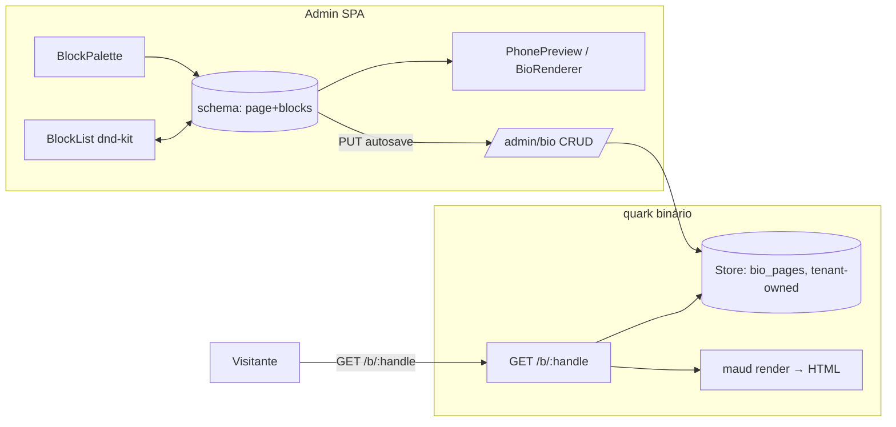

# LUC-39 — Link-in-bio builder: pesquisa e refinamento

Pesquisa de produto + arquitetura para o LUC-39 do quark. Objetivo do refinamento
pedido pelo dono: transformar o escopo atual (uma "página de bio hospedada" simples,
CRUD de lista de links) em um **builder visual com device-frame de celular e preview
ao vivo**, onde o usuário adiciona/edita/remove/reordena blocos e vê o resultado em
tempo real — no estilo Linktree/Beacons.

Documento de trabalho (scratchpad, fora do repo). Nada aqui foi implementado no quark;
tudo marcado como "novo" é proposta.

---

## Estado atual do LUC-39 (Linear) e do repo

O issue hoje (prioridade Low, Tier 2) descreve deliberadamente **sem** editor visual:
"página de bio hospedada (documento armazenado + rota HTML renderizada) listando
vários links", rota tipo `/b/:handle`, CRUD básico (título, avatar/descrição, lista
ordenável), isolado do codec Feistel e do hot path de redirect, opt-in desligado por
padrão. O próprio doc de origem (`docs/research/2026-07-14-next-features.md`, seção
2.13) marca link-in-bio como "a menos alinhada com o formato atual do quark".

O refinamento do dono sobe a ambição: sai o "lista simples de links", entra o
**builder com preview de celular ao vivo**. Isso muda o peso da task (de Low/simples
para importante/complexa) e exige embasamento — daí esta pesquisa.

Fatos do repo relevantes (lidos, read-only):
- **Único precedente de HTML server-rendered no binário:** a interstitial de senha
  (`src/api.rs`, `fn interstitial_html`, linhas ~975-1050). É uma `String` montada à
  mão com `format!`, CSS inline, sem assets externos, bilíngue por sniff de
  `Accept-Language`, `meta robots noindex`, `Content-Type: text/html`. Não há engine
  de template no projeto hoje.
- **Store trait já é tenant-aware:** `src/store/mod.rs` linha 323, `trait Store` com
  `next_id(tenant)`, `get_link(tenant, id)`, `put_link(tenant, id, rec)`,
  `get_alias(domain_id, alias)`, `put_alias_and_link`, `search_links`, além de
  webhooks/tokens/pixels/wellknown/visits/outbox. Tudo `async`, JSON em LMDB ou
  colunas em Postgres. LMDB tem 10 named DBs (`max_dbs = 10`) — adicionar bio pages
  provavelmente estoura isso ou precisa reusar um DB.
- **Padrão de "record forward-compatible":** todo campo depois de `created` em
  `Record` é `#[serde(default)]`, então desserializa sem migração. Mesmo padrão deve
  valer para o schema da bio page.
- **Front:** React 19, Vite 8, TypeScript, Tailwind v4, TanStack Query + Table,
  React Router 7 (`createBrowserRouter` em `web/src/app/router.tsx`), componentes
  shadcn sobre `@base-ui/react` (Radix-like) + `lucide-react` + `sonner` + `next-themes`.
  Rotas ficam sob `RequireAuth`/`Shell`; adicionar `bio` seria uma rota nova irmã de
  `links`, `analytics`, etc. **Não há** hoje: drag-and-drop, editor visual, iframe de
  preview, upload de imagem/avatar. Tudo isso é novo.
- **Bio page NÃO é hot path:** o redirect (`GET /:code`) é o hot path e usa
  codec+cache; a bio page (`/b/:handle`) é uma rota separada de baixo volume, então
  pode pagar templating/render sem impactar o SLA do redirect.

---

## PARTE 1 — Pesquisa de mercado

### Tabela comparativa dos concorrentes

Fontes e datas de verificação na seção "Fontes". Todos verificados em jul/2026.

| Produto | Modelo de layout | Blocos/componentes | UX do editor | Preview de celular | Grátis vs pago |
|---|---|---|---|---|---|
| **Linktree** | Button-stack (lista vertical de botões), theme-driven | Link/botão, header (bio description + avatar, com video avatar), social icons, embeds ("LinkApps": music/playlist, vídeo, podcast, store, food menu), contact form / email signup, featured layouts, feed | Estruturado e simples: escolhe tema, ajusta cor/fonte, arruma links; reorder de links; menos flexível que block-based | Sim, preview ao vivo do lado | Free com marca Linktree + 12% seller fee; pago US$ 0–35/mês |
| **Beacons** | Block-based flexível (WYSIWYG modular) | Botões/social, embeds YouTube/TikTok/Spotify, feed Instagram, texto, "space" (espaçador), imagem, vídeo, arquivos/files, playlists, music, storefront, banner de texto rolante | Drag-and-drop de blocos em qualquer ordem; tap/drag/rearrange; edição modular "atualiza em segundos" | Sim, **desktop e mobile view** durante a edição + mockup de landing ao vivo | Free bem usável (inclui store); pago remove marca / add domínio / analytics |
| **Bento.me** | **Grid de cards** (card-stack), estético | Cards com imagem, embeds, ícones, links; grid arrastável | Drag-and-drop de cards num grid (não lista vertical) | Sim | **Encerrado em 13/fev/2026** (redireciona p/ Linktree). Era free usável, Pro ~US$5/mo |
| **Bio.link** | Lista simples (link-only) | Só links (sem embeds de mídia) | Interface limpa e direta, essencial | Sim | Free real (links ilimitados, sem marca forçada); Pro US$6/mo (domínio, analytics) |
| **Dub (link-in-bio)** | Página `dub.co/yourname` integrada à plataforma de links | Link-in-bio como feature do produto de link management (open-source core) | Integrado ao dashboard de links | Sim | Free 25 links/mo; Pro US$25; Business US$75; Advanced US$250; Enterprise custom. Link-in-bio disponível nos tiers |
| **Later / Milkshake** | Milkshake = "cards" estilo stories/mobile-first; Later Link in Bio = grid de posts clicáveis | Cards, grid de posts→produto/página, links | Editor mobile-first (Milkshake foi feito p/ montar no celular) | Sim (mobile-first) | Freemium; recursos avançados no pago |
| **Stan (Stan Store)** | Store-first (loja + bio) | Produtos, links, checkout, cursos/digital products | Focado em vender | N/A específico | **Sem free tier**, começa US$29/mo (é commerce, não bio grátis) |

### Padrão de UX que se repete (o que o dono quer)

1. **Split-view: editor à esquerda, device-frame de celular à direita com preview ao
   vivo.** É o padrão dominante (Linktree, Beacons). Beacons mostra desktop **e**
   mobile. Toda edição reflete imediatamente no mockup sem salvar.
2. **Blocos como unidade, não "links".** Beacons é o exemplo mais claro: você adiciona
   "blocos" funcionais (não só links) e arrasta em qualquer ordem. Linktree é mais
   estruturado (button-stack + LinkApps), Bento era grid de cards.
3. **Drag-and-drop para reordenar** + edição inline ou por painel lateral ao clicar no
   bloco. "Tap, drag, rearrange", sem código.
4. **Blocos essenciais (interseção dos concorrentes):**
   - Header / perfil: avatar (imagem), nome, bio/descrição
   - Link / botão (o bloco básico)
   - Ícones sociais (linha de ícones)
   - Texto (headline / parágrafo)
   - Imagem
   - Vídeo / embed (YouTube, TikTok, Spotify, etc.)
   - Divisor / espaçador
   - (avançado) storefront/produto, formulário/email capture, feed social
5. **Temas/estilo:** cor de fundo, cor/estilo de botão, fonte. Nível "tema global da
   página" além do conteúdo por bloco.

### Posicionamento / monetização (relevante p/ open-core do quark)

- Quase todos têm **free tier usável** com marca do produto; o **pago** desbloqueia:
  domínio customizado, remover marca, analytics avançado, blocos premium (store,
  formulários), temas avançados. Padrão de gating claro: **conteúdo básico grátis,
  personalização/branding/analytics/commerce pago**.
- **Dub** é o benchmark mais próximo do quark: open-source core, link-in-bio como
  feature dentro de uma plataforma de link management, com tiers pagos por
  volume/eventos. É o modelo mental certo para o quark decidir OSS vs cloud (ver LUC-19).
- Bento.me fechar (fev/2026) é um sinal de mercado: link-in-bio isolado é commodity;
  o valor está em estar acoplado a analytics/link management (que o quark já tem).

---

## PARTE 2 — Ferramentas avaliadas para o stack do quark

### FRONT — editor visual

#### (a) Drag-and-drop / reorder — recomendação: **dnd-kit**

| Lib | Prós | Contras | Veredito |
|---|---|---|---|
| **dnd-kit** (`@dnd-kit/core` + `@dnd-kit/sortable`) | De-facto no ecossistema React, mantido, funciona com React 19, headless (combina com Tailwind/shadcn), acessível (teclado, sensores), suporta lista e grid, extensível (integra com animação) | API um pouco mais verbosa que alternativas de alto nível | **RECOMENDADA** |
| **@hello-pangea/dnd** (fork mantido do react-beautiful-dnd, que a Atlassian deprecou) | API simples e agradável para listas verticais, boa acessibilidade herdada | Última publicação ~1 ano atrás (manutenção lenta); **não suporta grid**; herda o modelo antigo | Alternativa só se o layout for lista pura e simplicidade > flexibilidade |
| **Framer Motion / Motion `Reorder`** | Reorder com animação de layout automática, ótimo p/ listas verticais simples, já anima add/remove | Escopo limitado (reorder vertical), não é um sistema de DnD completo (sem grid, sem drag entre containers, sem paleta→canvas) | Bom só p/ o MVP de lista vertical; some se o layout evoluir p/ grid/cards |

**Justificativa:** o builder do dono precisa de reorder vertical **agora** e
provavelmente grid (estilo Bento) ou drag-de-paleta-para-canvas **depois**. dnd-kit é
a única que cobre os dois sem troca de lib no meio do caminho, é headless (encaixa no
Tailwind v4 + base-ui/shadcn que o quark já usa) e é a escolha segura em React 19.
Trade-off aceito: um pouco mais de código de setup que o Motion Reorder.

> Nota: confirmar compat exata com React 19 / versão do dnd-kit no momento da
> implementação (via Context7 / npm), já que a busca web não trouxe a matriz de versão.

#### (b) Device frame + preview ao vivo

Duas abordagens; recomendação depende do isolamento de estilo desejado:

| Abordagem | Como | Prós | Contras |
|---|---|---|---|
| **Container escalado in-DOM (mesmo React tree)** | Um `<div>` com `width` de celular (~390px) dentro de uma moldura CSS, renderizando os **mesmos componentes de bloco** que a página pública usaria; estado do editor compartilhado direto (mesma store React) | Estado compartilhado trivial (edita → re-renderiza instantâneo); zero serialização; reusa os componentes de render | O CSS global do painel (Tailwind) vaza para dentro do preview; risco de o preview não ser fiel ao HTML real servido pelo backend |
| **`<iframe>` sandbox** | Preview num iframe isolado; comunica via `postMessage` ou re-render do doc a cada mudança | Sandbox de CSS/JS perfeito (fiel ao que o público vê); pode até carregar `/b/:handle?preview=1` real | Estado compartilhado é mais chato (postMessage/serialização); mais latência por update; overkill p/ MVP |

**Recomendação:** **começar com container escalado in-DOM** (mesmo React tree,
componentes de bloco reutilizados, estado compartilhado direto) dentro de uma moldura
de celular (CSS puro ou uma lib de mockup tipo `react-device-mockup`, que renderiza
divs). É o caminho mais rápido para "preview ao vivo" e o mais simples de manter.
Migrar para iframe só se/quando o preview client-rendered divergir demais do HTML que
o backend serve (fidelidade). Trade-off: com in-DOM há duas verdades de render (o
componente React de preview e o HTML do backend) que precisam ficar em sincronia —
mitigar tratando o **schema de blocos como a fonte única** e derivando ambos dele.

Moldura de celular: um wrapper CSS simples (border-radius grande, notch opcional,
`transform: scale()` para caber) é suficiente; não precisa de dependência pesada.
Toggle mobile/desktop como no Beacons é um "nice to have" pós-MVP.

#### (c) Estado, persistência e autosave

- **Estado do editor:** o schema da bio page (página + array ordenado de blocos) vive
  num estado React (a store do editor). O drag reordena o array; add/edit/remove
  mutam o array; o preview deriva desse mesmo array. Isso alinha com "schema de blocos
  = fonte única de verdade".
- **Persistência:** TanStack Query (já no projeto) para GET/PUT do documento da bio
  page contra a API admin. **Autosave** com debounce (o hook `useDebounce` já existe
  em `web/src/hooks/useDebounce.ts`) disparando um PUT do documento inteiro; feedback
  via `sonner` (toast) já presente. Alternativa: botão "Salvar" explícito no MVP e
  autosave depois — menos risco de PUT em loop.
- **Rascunho vs publicado:** decisão em aberto (ver riscos) — manter um campo
  `draft` separado do `published`, ou salvar direto e a página pública refletir na
  hora. MVP mais simples: salvar direto (sem draft), como Bio.link.

### BACK — armazenar + servir a página pública

#### (a) Schema (novo — proposta)

Reusar os padrões do `Store` trait, tenant-owned (o trait **já** recebe `TenantId`):

```
BioPage {
  handle: String,          // único por tenant (ou global); vira /b/:handle
  title: String,
  // tema/estilo global
  theme: { bg, button_style, font, ... },
  blocks: Vec<Block>,      // ORDENADO — a ordem é a ordem de render
  created: u64,
  updated: u64,
  published: bool,         // opt-in / on-off
}

Block {                    // enum serde tagged por `type`
  Header { avatar_url, name, bio },
  Link   { label, url, icon? },
  Text   { markdown|plain },
  Image  { url, alt },
  Embed  { provider, url },   // youtube/spotify/etc — allowlist p/ SSRF
  Socials{ items: [{platform, url}] },
  Divider,
  // ... extensível
}
```

- Todo campo novo `#[serde(default)]` → forward-compat sem migração (padrão do `Record`).
- **Armazenamento:** JSON blob por página, keyed por (tenant, handle) ou (tenant, id).
  - LMDB: precisa de um novo named DB `bio_pages` (+ possivelmente `bio_handles`
    para o índice handle→id, análogo a `aliases`). Cuidado: LMDB hoje abre com
    `max_dbs = 10` e já usa os 10 — **isso precisa subir** (mudança pequena mas real).
  - Postgres: uma tabela `bio_pages` (tenant_id, handle unique-per-tenant, doc JSONB,
    published, timestamps). Segue o padrão das outras tabelas.
- **Handle uniqueness:** precisa de checagem de unicidade (como `aliases`), diferente
  do link numérico que é bijeção sem colisão. Handle é escolhido por humano → colide.

#### (b) Servir `/b/:handle` — recomendação: **HTML server-rendered no binário**

Comparando as opções de render:

| Opção | O que é | Prós no contexto quark | Contras |
|---|---|---|---|
| **Montar à mão (como a interstitial)** | `format!` de `String`, CSS inline | Zero dependência nova; segue o único precedente existente; ok p/ 1 layout | Vira insustentável rápido com N tipos de bloco + escaping manual (risco de XSS) |
| **`maud`** | Macro compile-time → `Markup`, HTML type-safe em Rust | Compile-time (sem arquivos de template p/ embutir), **escaping automático** (mitiga XSS de conteúdo do usuário), integra com axum como response, dep pequena, sem runtime de template | Sintaxe de macro (curva pequena); HTML fica no .rs |
| **`askama`** | Templates Jinja-like compilados em build | Type-safe, templates em arquivos separados, familiar (Jinja) | Adiciona arquivos de template ao binário; mais peso conceitual que maud |
| **`minijinja`** | Jinja em runtime | Flexível, templates editáveis sem recompilar | Render em runtime (o quark evita isso), menos type-safe, dep maior |
| **Servir JSON + página client-rendered (SPA)** | `/b/:handle` devolve JSON, um bundle JS renderiza | Reusa componentes de bloco do editor (1 render só) | Bio page vira dependente de JS (ruim p/ SEO/OG, ruim p/ link social preview, ruim p/ perf de página pública); contradiz "página HTML simples" do issue; puxa hosting de bundle público |

**Recomendação: server-render de HTML no binário com `maud`.** Motivos:
1. A bio page **precisa** ser HTML real, indexável e com bom OpenGraph (é uma landing
   pública compartilhada em redes sociais) — client-rendered prejudica SEO/preview.
2. O escaping automático do maud é uma proteção importante: o conteúdo dos blocos é
   input do usuário indo para HTML → montar `format!` à mão convida XSS.
3. maud não adiciona runtime de template nem arquivos embutidos; é a menor adição
   compatível com a filosofia "single binary, poucas deps" do quark.
4. É o próximo passo natural do precedente da interstitial, sem virar
   ingовернável quando os tipos de bloco crescerem.

Alternativa aceitável: manter o estilo "montar à mão" **só se** o MVP for 1-2 tipos de
bloco e a equipe preferir zero dep nova; mas o escaping manual é o risco. askama é a
segunda escolha se preferirem templates em arquivo.

- **Fidelidade editor↔público:** como o editor renderiza em React e o público em maud,
  há dois renderers. Mitigar: o **schema de blocos é o contrato**; manter os dois
  visualmente alinhados por CSS compartilhado (mesmas classes/variáveis) e testes
  visuais. Alternativa radical (não recomendada agora): render único server-side com
  preview via iframe apontando p/ `/b/:handle?preview=1`.
- **Hot path intacto:** `/b/:handle` é rota nova e separada; **não** toca
  `codec`/`permute`/cache de redirect. Critério de aceite do issue original ("isolado
  do caminho de redirect") permanece. A bio page pode ter cache próprio (moka) se
  precisar, mas volume é baixo.
- **Assets/imagens (avatar, imagem de bloco):** hoje o quark não tem upload de assets.
  Decisão em aberto: (i) só aceitar URLs externas (mais simples, sem storage de
  binário, mas SSRF/hotlink), ou (ii) implementar upload + storage de imagem (novo
  subsistema, bem mais pesado). MVP: **URLs externas** com allowlist/validação,
  reusando os helpers de SSRF de `src/abuse/` (`is_internal_host`).
- **Embeds:** allowlist de providers (YouTube/Spotify/...) para não virar vetor de
  SSRF/XSS; nunca embutir HTML arbitrário do usuário.

### PARTE 2.c — Vínculo com LUC-19 (open-core) — DECISÃO PENDENTE

Não decidir aqui; registrar. O LUC-19 vai definir a linha OSS vs proprietário
(single-tenant AGPL vs multi-tenant cloud). Link-in-bio encaixa nas duas leituras:
- **Como core OSS:** um único tenant self-hosted quer sua bio page — cabe no AGPL,
  como o resto das features single-tenant.
- **Como módulo cloud/pago:** seguindo o mercado (Dub, Linktree), personalização
  avançada/domínio/analytics/temas/commerce é o que se cobra. O MVP (blocos básicos)
  poderia ser OSS e os blocos premium + domínio custom ficarem no lado cloud.
- **Recomendação de registro:** manter link-in-bio como **módulo opt-in isolado**
  (rota própria `/b`, desligado por default) para que a decisão do LUC-19 possa
  gate-á-lo dos dois jeitos sem reescrita. A decisão final fica bloqueada por LUC-19.

---

## PARTE 3 — Esboço de arquitetura

### Front (editor)
```
web/src/routes/BioPages.tsx        (lista de bio pages do tenant — CRUD)   [novo]
web/src/routes/BioEditor.tsx       (o builder: split-view)                 [novo]
  ├─ <BlockPalette/>               (add bloco: Header/Link/Text/Image/...)
  ├─ <BlockList/>                  (dnd-kit sortable; edit/remove por item)
  │    └─ <BlockEditorPanel/>      (edição inline ou painel lateral do bloco selecionado)
  └─ <PhonePreview/>               (device-frame; renderiza <BioRenderer/> com o schema)
       └─ <BioRenderer blocks={} theme={}/>  (mesmos blocos, escala mobile)
web/src/lib/bio.ts                 (tipos Block/BioPage + queries TanStack) [novo]
```
- Estado: schema (page+blocks) em estado React = fonte única. dnd-kit reordena o array.
- Preview: in-DOM, escalado, estado compartilhado, re-render instantâneo.
- Persistência: TanStack Query PUT do documento; autosave debounced (useDebounce) ou
  botão Salvar no MVP; toasts via sonner.
- Rota: adicionar `bio` e `bio/:handle` sob `Shell`/`RequireAuth` em
  `web/src/app/router.tsx`.

### Back (armazenar + servir)
```
src/bio/mod.rs        (tipos BioPage/Block, validação, render maud→Markup) [novo módulo]
src/store/mod.rs      (novos métodos no trait Store: get_bio/put_bio/       [estende trait]
                       list_bios/delete_bio/get_bio_by_handle; tenant-owned)
src/store/lmdb.rs     (named DBs bio_pages + bio_handles; subir max_dbs)    [estende]
src/store/postgres.rs (tabela bio_pages)                                    [estende]
src/api.rs            (rota pública GET /b/:handle → render HTML;           [estende]
                       rotas admin CRUD /admin/bio/*)
```
- `GET /b/:handle`: resolve handle→page (tenant), se `published`, render maud → 200 HTML
  (com OpenGraph/meta), `noindex` configurável. Não toca codec/redirect/cache de link.
- Admin: `POST/GET/PATCH/DELETE /admin/bio/...` (scoped por token, como o resto).
- Schema forward-compat (`#[serde(default)]`); handle com checagem de unicidade.

### Fluxo (mermaid, conceitual)


---

## Riscos e decisões em aberto

1. **Open-core (LUC-19) — BLOQUEANTE de decisão.** Core OSS vs módulo cloud/pago. Manter
   isolado e opt-in até LUC-19 decidir. (Já era critério do issue.)
2. **Dois renderers (React no editor, maud no público)** → risco de divergência visual.
   Mitigar com schema como contrato + CSS compartilhado + testes. Alternativa: preview
   por iframe sobre `/b/:handle?preview=1` (render único), mais custo.
3. **Upload de assets.** quark não tem storage de binário/imagem hoje. MVP: só URLs
   externas + validação SSRF (`src/abuse`). Upload real é subsistema novo grande —
   fora do MVP.
4. **LMDB `max_dbs = 10` já esgotado** — adicionar bio_pages/bio_handles exige subir o
   limite (mudança pequena, mas é alteração no core de storage).
5. **XSS / SSRF** — conteúdo do usuário vira HTML público e embeds/imagens são URLs.
   Escaping automático (maud) + allowlist de embed providers + reuso dos guards de SSRF.
6. **SEO / OpenGraph** — bio page pública precisa de meta tags corretas; reforça a
   escolha de server-render (não SPA).
7. **Handle namespace** — `/b/:handle` unicidade por tenant vs global; e não colidir com
   rotas existentes. Novo índice handle→id (estilo aliases).
8. **Escopo/esforço** — deixou de ser task Low: builder visual + novo módulo de storage
   + nova rota renderizada + upload/embeds é epic, não issue único. Sugerir fases.
9. **Draft vs published** — salvar direto (MVP) vs estado de rascunho separado (depois).
10. **Confirmar versões** — dnd-kit × React 19 e a crate maud/askama no momento da
    implementação (Context7/npm/crates.io), pois a pesquisa web não trouxe a matriz exata.

---

## Fontes (verificadas jul/2026)

**Mercado**
- Linktree — link-in-bio e customização: https://linktr.ee/link-in-bio ,
  https://linktr.ee/blog/customization-features-for-your-linktree (2026)
- Beacons — builder block-based, drag-and-drop, preview desktop+mobile:
  https://beacons.ai/i/app-pages/link-in-bio , https://help.beacons.ai/en/articles/4696577 (Links Block),
  https://taap.bio/blog/beacons-link-in-bio , https://taap.bio/blog/beacon-vs-linktree (2026)
- Dub — link-in-bio + pricing (open-source core): https://dub.co/links , https://dub.co/pricing ,
  https://creatoreconomytools.com/tool/dub-co (2026)
- Bento.me — grid de cards + encerramento fev/2026: https://own.page/blog/bento-alternatives ,
  https://tini.bio/vs-bento , https://app.unilink.us/blog/what-is-bento-me (2026)
- Bio.link / Lnk.Bio / Stan — pricing e escopo: https://www.socialez.com/blog/best-link-in-bio-tools-to-enhance-your-social-media-profiles/ ,
  https://lnk.bio/all-features , https://taap.bio/blog/best-link-in-bio-tools (2026)

**Ferramentas**
- dnd-kit / @hello-pangea/dnd / Motion Reorder: https://www.npmjs.com/package/@hello-pangea/dnd ,
  https://motion.dev/docs/react-reorter , https://github.com/clauderic/dnd-kit/issues/605 (2026)
- Device frame / iframe vs scaled div: https://maxschmitt.me/posts/iframe-react-responsive-website-tester ,
  https://github.com/jung-youngmin/react-device-mockup , https://blog.logrocket.com/best-practices-react-iframes/ (2026)

**Repo quark (read-only)**
- `docs/ARCHITECTURE.md`, `docs/LINK-PASSWORD.md`, `src/api.rs` (interstitial ~975-1050),
  `src/store/mod.rs` (trait Store, ~323), `web/src/app/router.tsx`, `web/package.json`,
  Linear LUC-39 e LUC-19.
