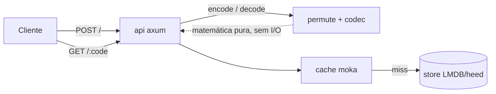
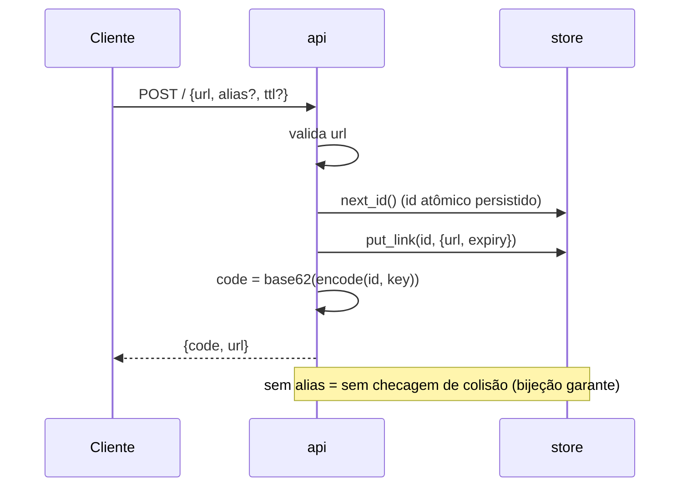
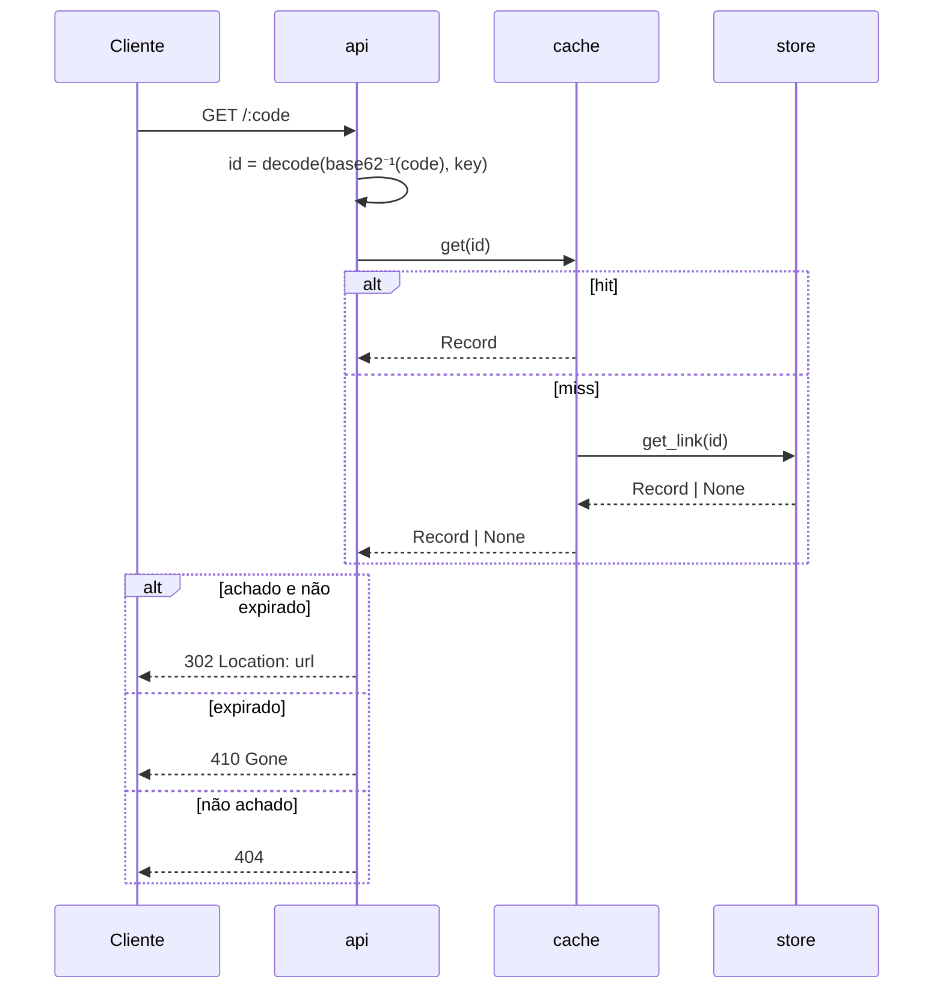

# quark — design

**Data:** 2026-07-12
**Status:** spec aprovado (aguardando revisão final do usuário)

Um encurtador de URL open-source cujo código curto é uma **permutação ARX de rounds reduzidos, calibrada por medição empírica de avalanche**. Códigos são **calculados, não armazenados**. Foco: latência de redirect surreal e footprint minúsculo numa VPS modesta — "fazer mais com menos".

---

## 1. Objetivo e princípios

- **Fase 1 (agora):** explorar os limites — construir o núcleo voador e *medir* (avalanche, throughput, footprint). O número medido é o troféu.
- **Fase 2 (depois):** virar serviço real operado na VPS (robustez, uptime, dados persistentes).
- **Princípio-guia:** fazer mais com menos. A VPS de referência (4 vCPU / 16 GB) é teto folgado; miramos usar uma fração dela.
- **Filosofia:** verificável, não teórico. Toda afirmação de performance/segurança vem com número medido e método reproduzível.

## 2. Escopo

**No v1:**
- Núcleo: criar link + redirecionar.
- Aliases customizados (usuário escolhe o código).
- Expiração (TTL) de links.

**Fora do v1 (fase 2):** analytics de cliques, contas/auth, painel web.

**Invariante sagrado:** o caminho do `GET /:code` (redirect) tem que voar. Nenhuma feature pode contaminá-lo com trabalho extra no caminho quente.

## 3. Escala-alvo

Combo completo, numa VPS modesta:
- Milhões de URLs armazenadas (footprint no banco).
- Milhões de redirects/dia (tráfego de leitura).
- Aguentar picos de tráfego.

Read-heavy clássico (ordem de 200:1 leitura:escrita). O jogo é latência de redirect + footprint.

## 4. O diferencial (o núcleo novel)

### 4.1 Contexto: o que o mundo faz e onde falha

Encurtadores escolhem um de dois caminhos para gerar o código curto:
- **Encoding reversível** (Hashids, Sqids): rápido, mas **não é segurança** — códigos parcialmente enumeráveis. Dá para raspar `/aaaa`, `/aaab`…
- **Cifra de verdade** (ex.: Feistly = Feistel + HMAC-SHA256): seguro/não-enumerável, mas **lento** (~60K ops/s) porque roda um hash criptográfico pesado por round.

Ninguém entrega *seguro E surreal-rápido* ao mesmo tempo.

### 4.2 A síntese com o lab de SHA-256

Uma rede de **Feistel** sobre o espaço de IDs é uma **bijeção** (format-preserving encryption). A pergunta cara é *quantos rounds da função de mistura* são necessários para o código parecer aleatório. O lab de SHA-256 nos deu exatamente a ferramenta para responder empiricamente: medição de **SAC / avalanche** (o `diffusion_sac.c`, "avalanche 50%/bit", o muro de difusão).

Construímos uma **função de round ARX minúscula** (add-rotate-xor + constante de round) — o motor de mistura do SHA sem o peso — e usamos o **nosso harness de avalanche** para achar o número **mínimo** de rounds onde a difusão fecha. Nem um a mais.

Resultado — um gerador de código que é simultaneamente:
1. **Zero colisão, para sempre** — é bijeção; sem checagem de unicidade no create.
2. **Não-enumerável** — avalanche ~50%/bit medida; mexer 1 bit no contador vira metade dos bits do código.
3. **Surreal rápido** — poucos rounds de ARX inteiro→inteiro, sem lib de cripto, sem hashear a URL. Alvo: ordens de magnitude acima dos 60K ops/s do Feistly.
4. **Medido, não achismo** — a contagem de rounds é *provada* pelo mesmo método empírico do lab, com o gráfico no README.

### 4.3 Bônus: códigos calculados, não armazenados

Se o código é a permutação bijetiva do ID inteiro, então `código → ID` é a **permutação inversa** (decifrar). O redirect decifra o código de volta ao inteiro e busca `ID → URL`. O banco guarda **`u64 → URL`**, sem índice de string. Milhões de links ocupam uma fração do footprint de um índice de código.

## 5. Arquitetura — componentes



Cada módulo tem um propósito único, interface bem definida, testável isolado.

| Módulo | Faz | Depende de |
|---|---|---|
| `permute` | Bijeção ID↔código: Feistel sobre N bits, round ARX. `encode(u64)→u64`, `decode(u64)→u64`. Sem estado, sem I/O. | — (núcleo puro) |
| `codec` | Inteiro ↔ string base62 URL-safe. | — |
| `store` | Persistência mmap: `id:u64 → {url, expiry, created}`; mapa `alias→id`; contador de ID persistido. | heed/LMDB |
| `cache` | LRU concorrente quente `id → url` na frente do store. | moka |
| `api` | HTTP: `POST /` cria, `GET /:code` redireciona, `GET /health`. | axum/hyper |
| `calibrate` | Harness de avalanche (porte do `diffusion_sac.c`): mede SAC da `permute` por nº de rounds; cospe a curva rounds×difusão. Offline; fixa a constante de rounds. | permute |

`permute` e `calibrate` são o coração nosso; o resto é engenharia sólida e substituível.

## 6. O gerador de código (detalhe)

- **Feistel balanceado** sobre domínio de largura configurável; **default 40 bits** → ~1,1 trilhão de IDs → **7 chars base62**. Dial: 32 bits→6 chars/4,3 bi; 48 bits→9 chars/281 tri.
- **Round = ARX** (add, rotate, xor + constante de round). Não HMAC-SHA256.
- **Rounds = calibrados** pelo `calibrate` (não chutados). Hipótese de partida ~6–8 rounds; o número final vem da medição SAC e vira constante compilada, com gráfico no README.
- **Chave secreta por instância** (env var). Sem ela nada muda; trocá-la remapeia todo o espaço de códigos. É o que separa "anti-scraping medido" de brinquedo.

## 7. Modelo de dados (store LMDB)

- **DB principal** `links`: chave `u64` (id, big-endian) → valor `{ url: String, expiry: Option<u64>, created: u64 }` (serialização compacta; timestamps em epoch secs).
- **DB `aliases`**: chave `String` (alias) → valor `u64` (id).
- **Meta**: contador de ID persistido (próximo id a alocar), largura/rounds/versão do scheme para migração.

## 8. Fluxos





- **Create** (`POST /` com `{url, alias?, ttl?}`):
  valida URL → se `alias`: checa colisão em `aliases` (único ponto de checagem), grava `alias→id`; senão: aloca próximo id atômico (persistido) → `code = codec(encode(id))` → grava `id→{url,expiry,created}` → devolve `{code, url}`. **Zero leitura para detectar colisão** no caminho sem alias.
- **Redirect** (`GET /:code`):
  `id = decode(codec⁻¹(code))` (matemática pura; código malformado ou fora do range → 404) → cache `id` → miss: 1 leitura mmap → expirado? 410 : **302** para o destino. Sem alocação no hit de cache.
- **Alias**: resolvido via `aliases→id` e então segue como redirect. Fora do caminho quente numérico.
- **Expiração**: gravada no registro, checada lazy na leitura; sweep opcional em background.

## 9. Tratamento de erros

- URL inválida → 400; código malformado / decode fora do range → 404; link expirado → 410; alias em uso → 409; store indisponível → 503.
- Nunca `panic!` no caminho de request — tudo `Result`. O caminho quente não aloca no hit de cache.

## 10. Testes (reaproveitando ativos do lab)

- **Round-trip byte-exato**: `decode(encode(x)) == x` para amostragem + fuzz — filosofia do oracle-diff harness (equivalência verificável).
- **Bijetividade**: em largura pequena (ex.: 20 bits), varre o domínio inteiro e prova que `encode` é permutação (sem colisão, sobrejetora).
- **Avalanche calibrado**: `calibrate` é teste *e* entregável — a contagem de rounds tem que passar o critério SAC medido.
- **Integração da API**: create → redirect → expira.
- **Carga**: bench de throughput/latência.

## 11. Stack e benchmark (o número troféu)

- **Rust**, binário estático único, sem runtime externo.
- HTTP: **axum/hyper**. Cache: **moka**. Store: **LMDB via `heed`** (leitura mmap mais rápida medida; `redb` puro-Rust anotado como alternativa sem-FFI para benchmark futuro).
- **Benchmarks no repo** (a vitrine):
  1. Redirects/s e latência p50/p99 (alvo de referência: 1 vCPU).
  2. Throughput do `permute` isolado (ops/s) vs. os ~60K do Feistly.
  3. Footprint de RAM com N milhões de links carregados.

## 12. Layout do repositório (open-source)

```
quark/
  Cargo.toml
  README.md            # pitch + curva de avalanche + números de bench
  src/
    main.rs
    permute.rs
    codec.rs
    store.rs
    cache.rs
    api.rs
  benches/             # criterion
  tests/               # round-trip, bijetividade, integração
  bin/
    calibrate.rs       # harness de avalanche (offline)
  docs/specs/
```

## 13. Decisões travadas

- Linguagem: **Rust**.
- Arquitetura: binário único + store mmap + cache quente (Abordagem A).
- Store: **LMDB via heed**.
- Largura default da permutação: **40 bits → 7 chars base62**.
- Scheme de código: **Feistel + round ARX, rounds calibrados por medição SAC**, chave secreta por instância.
- Códigos calculados (não armazenados); store chaveado por inteiro.

## 14. Riscos / questões em aberto

- **Nº de rounds real**: definido só após rodar `calibrate`. Se a difusão fechar mais tarde que o esperado, o código continua rápido (ARX é barato), só com mais rounds.
- **Segurança do ARX reduzido**: é anti-scraping medido, não AES. Documentar o modelo de ameaça honestamente no README (resistência a enumeração, não sigilo criptográfico forte). A chave por instância + largura são os diais.
- **Escala horizontal (fase 2)**: contador de ID atômico é single-node. Sharding do espaço de ID por nó fica para fase 2, se necessário.
