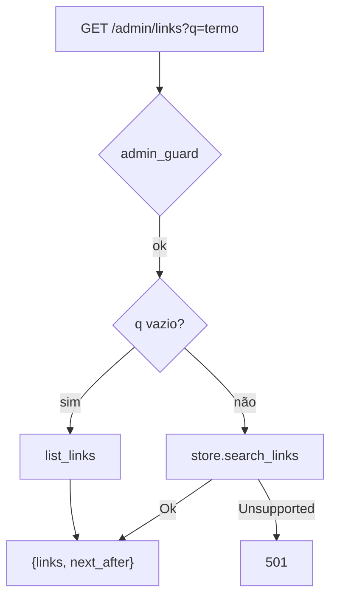

# Tijolo 10 — Busca server-side (Postgres) com paginação (design)

**Data:** 2026-07-13
**Estado:** aprovado no brainstorming, aguardando plano

## Objetivo

Busca server-side nos links, paginada, exposta em `GET /admin/links?q=<termo>`.
Recurso **do backend Postgres** (mesmo princípio de escala do projeto: capacidade
relacional = Postgres). O **LMDB não ganha busca server-side** — o painel mantém a
busca **client-side** atual quando o backend não suporta.

## Componentes

### 1. `Store::search_links` (trait)

`async fn search_links(&self, q: &str, after: Option<u64>, limit: usize) -> Result<Vec<(u64, Record)>, StoreError>`

- **Postgres:** keyset por id, casando `url` OU `alias` por substring, case-insensitive:
  ```sql
  SELECT l.id, l.url, l.expiry, l.created
  FROM links l LEFT JOIN aliases a ON a.id = l.id
  WHERE (($after)::bigint IS NULL OR l.id > $after)
    AND (l.url ILIKE $pattern OR a.alias ILIKE $pattern)
  ORDER BY l.id LIMIT $limit
  ```
  `$pattern` = `%<q>%` com os curingas `%`/`_`/`\` do termo escapados (busca literal).
- **LMDB:** retorna `Err(StoreError::Unsupported)` — não implementa busca server-side.

Nova variante `StoreError::Unsupported` (+ braço no `Display`, ex.: "operação não suportada por este backend").

### 2. Endpoint `GET /admin/links?q=&after=&limit=`

No `admin_links_list` (sob `admin_guard`, como hoje):
- `q` **ausente ou vazio** → `list_links` (comportamento atual, inalterado).
- `q` **presente** → `search_links(q, after, limit)`:
  - `Ok(links)` → mesma resposta de sempre (`{links, next_after}`), com enriquecimento de alias e `next_after` só em página cheia.
  - `Err(StoreError::Unsupported)` → **`501 Not Implemented`** (sinaliza ao painel que este backend não faz busca server-side).
  - outro `Err` → `503`.

### 3. Frontend (`web/`)

- `useLinks(q?: string)` — TanStack `useInfiniteQuery` **chaveado por `q`**; quando `q` não-vazio, chama `?q=` (keyset paginado, "carregar mais"); `q` vazio → listagem normal.
- **Debounce ~300ms** no input de busca antes de disparar a query.
- **Fallback:** se a resposta for **501** (backend sem busca server-side, ex.: LMDB), o painel volta ao **filtro client-side** sobre os links já carregados (comportamento atual). Assim: Postgres → server-side paginada; LMDB → client-side. Único caminho de UX.
- Estado vazio de busca: "nenhum link encontrado para '<q>'".

## Fluxo



## Erros

- `501` quando o backend não suporta busca (LMDB) → o front cai pro client-side.
- `503` erro de store; `401`/`404` auth (como hoje).

## Critérios de sucesso

1. Postgres: `GET /admin/links?q=git` devolve só links cujo url/alias contêm "git",
   paginado por keyset; `next_after` correto; sem `q` = lista tudo.
2. LMDB: `GET /admin/links?q=x` → `501`.
3. Escape de curingas: buscar `50%` não vira wildcard SQL.
4. Front: digitar na busca (debounced) filtra via servidor no Postgres; em 501, cai
   pro filtro client-side; estado "nada encontrado" tratado.
5. Testes verdes (lib + api_it + gated Postgres + web); `fmt`/`clippy`/`typecheck`/`lint`/`build` limpos.

## Global Constraints

- Busca server-side é **Postgres-only**; LMDB retorna `Unsupported` (→ 501 → front client-side).
- Casar `url` + `alias`, case-insensitive, com curingas escapados; keyset por id.
- `q` vazio/ausente = listagem atual (não quebra nada); redirect/leitura intocados.
- Testes de Postgres **gated** por `QUARK_TEST_DATABASE_URL`.

## Fora de escopo

- Busca no LMDB (client-side permanece); ranking/relevância; full-text/stemming; busca por `code`.
