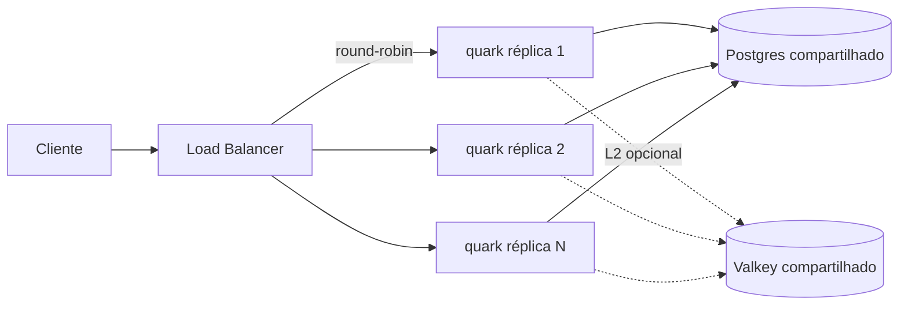

# Tijolo 6 — Escala Horizontal (design)

**Data:** 2026-07-13
**Estado:** aprovado no brainstorming, aguardando plano

## Objetivo

Permitir rodar **N réplicas do quark atrás de um load balancer sem colisão de
IDs nem perda de unicidade dos short-codes**, deixando explícito qual formato de
deploy escala e qual não — e blindando o caminho que escala contra regressão.

## Princípio central

"Escalar horizontalmente" no quark = **réplicas stateless sobre um Postgres
compartilhado**. O storage compartilhado resolve os dois problemas de uma vez:

- **Dado**: todo nó lê/escreve o mesmo banco, então qualquer réplica serve
  qualquer link.
- **ID**: `nextval('quark_id_seq')` é atômico e cluster-wide — múltiplas
  réplicas geram IDs únicos sem coordenação adicional.

O binário puro (LMDB embutido, sem banco) permanece **single-node por
natureza**. Isso é uma feature (modo de recurso mínimo, "fazer mais com menos"),
não uma limitação a corrigir.

## Os três formatos de deploy

| Formato | Storage | Multi-nó | Localidade de dados |
|---|---|---|---|
| **1. Binário puro** (LMDB, sem Valkey/DB) | Local por nó | Não (1 nó) | N/A |
| **2. Binário + Postgres compartilhado** | Externo, compartilhado | **Sim (já funciona)** | Não existe — storage compartilhado |
| **3. Múltiplos binários puros** (LMDB por nó) | Local, particionado | Não suportado p/ reads | **Sim** — cada nó só tem os dados dele |

Este tijolo entrega o **formato 2** como caminho de escala recomendado, e um
**guard-rail defensivo** para o formato 3 (evitar colisão silenciosa de código),
deixando claro na doc que o formato 3 não serve reads cross-nó.

## Componentes

### A. Postgres multi-réplica — verificar, não construir

`PostgresStore::next_id` já usa `nextval('quark_id_seq')`; nenhuma mudança de
código de produção. O trabalho é **prova + blindagem contra regressão** via
testes de integração (gated, rodam só com `QUARK_TEST_DATABASE_URL` no ambiente):

1. **Unicidade concorrente multi-réplica**: abrir 2+ `PgPool` independentes
   sobre o mesmo banco (simula réplicas separadas), disparar `next_id`
   concorrente de todos (ex.: 2 pools × 500 chamadas), coletar todos os IDs e
   afirmar **zero duplicatas** e contagem total exata.
2. **Dado compartilhado (create-em-A / redirect-em-B)**: dois `AppState`
   distintos sobre o mesmo Postgres; criar link via A, resolver o code via B,
   afirmar 302 + `Location` correto.

### B. LMDB node-id defensivo (opt-in, sem degradar o default)

Guard-rail barato contra o pior bug possível do formato 3: dois nós LMDB
gerando o **mesmo código para URLs diferentes** (colisão silenciosa → redirect
errado / corrupção lógica).

- **`QUARK_NODE_ID` ausente (default)** → comportamento atual **intacto**: o
  contador local ocupa os 40 bits inteiros (`MAX_ID` = 2⁴⁰−1, capacidade ~1,1
  trilhão). Zero mudança para o OSS single-node; IDs continuam 1, 2, 3, …
- **`QUARK_NODE_ID` definido (0–255)** → `id = (node_id << 32) | contador_local`.
  Cada nó ocupa uma faixa disjunta de 2³² IDs (~4,3 bilhões).
- **Invariante crítica de não-vazamento**: quando o contador local de um nó
  atingiria 2³² (estouro da faixa), `next_id` retorna erro de backend **antes**
  de compor o ID. Um ID nunca pode vazar para o prefixo do nó vizinho.
- **Validação de startup**: `QUARK_NODE_ID` fora de 0–255 → o processo falha ao
  abrir o store (fail-fast), com mensagem clara.

**Divisão de bits (fixa):** 8 bits de nó (topo) + 32 bits de contador local.
Até 256 nós, ~4,3 bilhões de links por nó.

**Compatibilidade com a permutação:** a Feistel (`permute::encode`/`decode`)
opera sobre os 40 bits inteiros e é indiferente a como o ID foi alocado. O
node-prefix só afeta **alocação**, nunca **codificação** — short-codes seguem
únicos e não-enumeráveis.

### C. Documentação — `docs/SCALING.md` (novo) + Mermaid

Arquivo dedicado (não enfiar em `ARCHITECTURE.md`):

- Diagrama **Mermaid** dos 3 formatos com storage e limites de cada um.
- Seção "como escalar de verdade": N réplicas stateless + Postgres compartilhado
  + (opcional) Valkey L2 compartilhado; load balancer round-robin simples.
- Tabela de capacidade (bits de nó × nós × links por nó).
- Regra de operação **tudo-ou-nada** do `QUARK_NODE_ID` e a nota honesta de que
  múltiplos nós LMDB **não servem reads uns dos outros** (o node-id só previne
  colisão de código, não torna o LMDB multi-nó de verdade).

## Fluxo de dados (formato 2, o recomendado)

Qualquer réplica atende qualquer request: `next_id` vem da sequência global,
`get_link` lê a tabela compartilhada. Sem afinidade de sessão, sem sticky.

## Tratamento de erros

- `QUARK_NODE_ID` inválido (não-numérico ou > 255) → erro de abertura do store,
  processo não sobe.
- Estouro do contador local (node-id definido) → `StoreError::Backend` mapeado
  para `INSUFFICIENT_STORAGE` no handler `create` (mesmo tratamento do
  `id > MAX_ID` já existente).
- Postgres indisponível → caminhos já retornam `SERVICE_UNAVAILABLE` (inalterado).

## Fora de escopo (YAGNI, consciente)

- Multi-nó com reads cross-nó no binário puro (LMDB): **restrição de design** — um
  binário puro é single-node; multi-nó = Postgres compartilhado (formato 2).
- Descoberta de nós, replicação de LMDB, re-sharding dinâmico.
- Particionar o contador do Postgres (a sequência global já basta; prefixá-lo
  desperdiçaria a coordenação nativa).

## Critérios de sucesso

1. Teste de integração prova unicidade de IDs sob 2+ réplicas Postgres
   concorrentes; teste prova dado compartilhado (create-A/redirect-B).
2. LMDB com `QUARK_NODE_ID` ausente é byte-compatível com hoje (mesmos IDs,
   mesma capacidade de 40 bits).
3. LMDB com `QUARK_NODE_ID` definido gera faixas disjuntas; estouro vira erro
   sem vazar para o vizinho; node-id inválido derruba o startup.
4. `docs/SCALING.md` com Mermaid válido cobrindo os 3 formatos, a regra
   tudo-ou-nada e os limites honestos.
5. `fmt`/`clippy -D warnings` limpos; CI existente verde.

## Global Constraints

- Divisão de bits do node-id: **8 bits de nó + 32 de contador local** (fixa).
- `QUARK_NODE_ID` ausente = **comportamento atual preservado** (40 bits, ~1,1T),
  sem degradar o single-node.
- Invariante de não-vazamento: contador local nunca ultrapassa 2³²−1 sem virar
  erro **antes** de compor o ID.
- Nenhuma mudança em `permute` (a Feistel é indiferente à alocação).
- Testes de Postgres são **gated** por env (`QUARK_TEST_DATABASE_URL`, o mesmo
  já usado nos tijolos anteriores); sem env, pulam.
- Documentação a nível humano com Mermaid válido (requisito do projeto).
