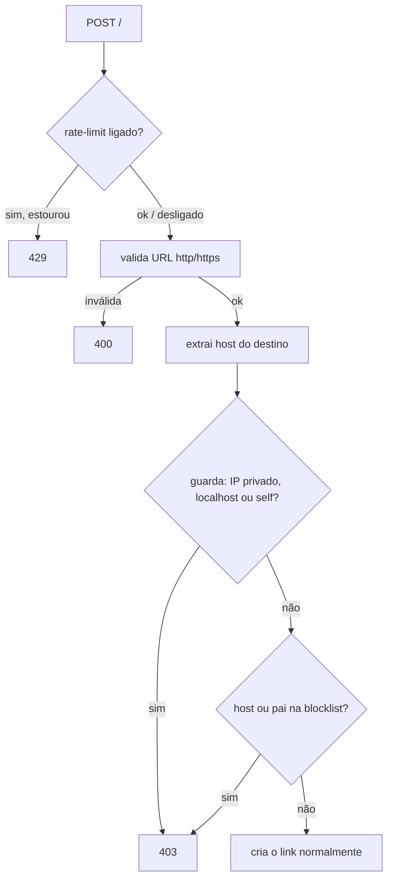

# Tijolo 7 — Proteção contra abuso (design)

**Data:** 2026-07-13
**Estado:** aprovado no brainstorming, aguardando plano

## Objetivo

Tornar seguro abrir a criação de links ao público, sem tocar no caminho quente
(redirect). Duas defesas no `POST /`: **rate-limit por IP** e **recusa de
destinos proibidos** (blocklist de domínio no banco + guarda embutida contra
rede interna e loop).

## Princípios

- **Só o `POST /` (criação) é afetado.** O redirect e o caminho de leitura ficam
  intocados — a mesma vazão medida continua valendo.
- **Rate-limit = config de operação → env.** Blocklist = dado gerenciável →
  banco (para um futuro painel editar), com cache.
- **Fail-open em infra:** erro de Valkey nunca derruba a criação.
- **Encaixa na arquitetura plugável:** reusa `QUARK_VALKEY_URL` (compartilhado) e
  `QUARK_ADMIN_TOKEN` já existentes; nada vira dependência obrigatória.

## Componentes

### 1. Rate-limit por IP (`POST /`)

- **Algoritmo:** janela fixa de 60 segundos por IP. Valkey: `INCR` na chave
  `quark:rl:<ip>:<janela>` + `EXPIRE 60`. Memória: `HashMap<String, (janela, u32)>`
  atrás de um `Mutex`, com poda da janela anterior.
- **Escopo/seleção de backend:** em memória por réplica por default; se
  `QUARK_VALKEY_URL` estiver definido, usa o Valkey compartilhado (limite global
  entre réplicas). **Fail-open:** qualquer erro/timeout de Valkey → a requisição
  passa (não conta, não bloqueia).
- **Fonte de IP:** header configurável por `QUARK_REAL_IP_HEADER` (default
  `CF-Connecting-IP`). Se o header estiver ausente, cai para o IP do socket via
  `axum::extract::ConnectInfo<SocketAddr>` (exige servir com
  `into_make_service_with_connect_info::<SocketAddr>()` no `main.rs`).
- **Liga/desliga:** `QUARK_RATELIMIT_PER_MIN` ausente ou `0` → rate-limit
  **desligado** (default, opt-in, consistente com Valkey/PG/CH). Valor `n>0` →
  limite de `n` criações por minuto por IP.
- **Resposta ao estourar:** `429 Too Many Requests`, corpo curto.

### 2. Blocklist de destino (banco + cache snapshot)

- **Fonte da verdade — `Store`:** novos métodos no `trait Store`:
  - `async fn add_blocked_domain(&self, domain: &str) -> Result<(), StoreError>`
  - `async fn remove_blocked_domain(&self, domain: &str) -> Result<(), StoreError>`
  - `async fn list_blocked_domains(&self) -> Result<Vec<String>, StoreError>`

  Implementados em LMDB (nova DB `blocked`, `max_dbs` sobe de 5 para 6) e em
  Postgres (nova tabela `blocked_domains (domain TEXT PRIMARY KEY)`, criada no
  `init_schema`). Domínios são normalizados (lowercase, sem espaços) na escrita.

- **Cache L1/L2 (modelo snapshot):** um componente `Blocklist`:
  - **L1:** a lista inteira como `HashSet<String>` em memória, recarregada quando
    o TTL (`QUARK_BLOCKLIST_TTL`, default 60s) expira.
  - **L2 (opcional):** se `QUARK_VALKEY_URL` setado, o snapshot serializado mora
    na chave `quark:blocklist`; o refresh lê o Valkey primeiro (evita todas as
    réplicas martelarem o banco) e cai para o `Store` se o Valkey falhar. Um
    `add`/`remove` grava no `Store` e invalida a chave do Valkey.
  - A lista é pequena e muda raramente, então o snapshot é barato e o **match de
    subdomínio fica trivial**.

- **Match:** dado o host do destino, bloqueia se o host **ou qualquer domínio-pai**
  estiver no conjunto. Ex.: `evil.com` no conjunto bloqueia `evil.com`,
  `x.evil.com`, `a.b.evil.com`. Case-insensitive.

- **Propagação entre réplicas:** eventual, em até `QUARK_BLOCKLIST_TTL` segundos
  (aceitável para blocklist). Documentado.

- **Resposta:** destino na blocklist → `403 Forbidden`, corpo curto.

### 3. Guarda embutida (default ON)

Independente da blocklist do banco, ligada por default e desligável com
`QUARK_BLOCK_PRIVATE=0`. Bloqueia (`403`) quando o **host do destino**:

- é um **IP literal** privado/loopback/link-local/unspecified
  (`Ipv4Addr::is_private()`/`is_loopback()`/`is_link_local()`/`is_unspecified()`
  e equivalentes de `Ipv6Addr`); ou
- é `localhost` ou termina em `.localhost`; ou
- é igual ao **host do próprio quark** (anti-loop): o host derivado do header
  `Host` da requisição, ou `QUARK_PUBLIC_HOST` se definido (override).

**Não faz resolução DNS** (resolver seria lento e um vetor de SSRF em si) —
bloqueia apenas IP literal e nomes óbvios. Limitação documentada explicitamente.

### 4. Endpoints admin da blocklist

Protegidos pelo `QUARK_ADMIN_TOKEN` (mesma checagem `constant_time_eq` do
`/stats`; sem token configurado → `404`, endpoint desligado):

- `GET /admin/blocklist` → `{"domains": [...]}` (lista atual).
- `POST /admin/blocklist` com `{"domain":"evil.com"}` → adiciona (idempotente); `200`.
- `DELETE /admin/blocklist` com `{"domain":"evil.com"}` → remove; `200`.

Token ausente/errado → `401`; sem `QUARK_ADMIN_TOKEN` no processo → `404`. São a
base que o futuro painel web vai consumir.

## Fluxo do `POST /` (ordem das checagens)

A ordem é barata→cara: rate-limit (checagem O(1)) antes de qualquer parse; a
validação de URL já existente; depois a guarda embutida (só cálculo local);
depois a blocklist (lookup no snapshot em memória).

## Configuração por env (resumo)

| Env | Default | Efeito |
|---|---|---|
| `QUARK_RATELIMIT_PER_MIN` | ausente (off) | Criações/min por IP; `0`/ausente = rate-limit desligado |
| `QUARK_REAL_IP_HEADER` | `CF-Connecting-IP` | Header de onde ler o IP do cliente |
| `QUARK_BLOCK_PRIVATE` | ligado | `0` desliga a guarda de rede interna/loop |
| `QUARK_PUBLIC_HOST` | ausente | Override do host próprio p/ anti-loop (senão usa o header `Host`) |
| `QUARK_BLOCKLIST_TTL` | `60` | Segundos até recarregar o snapshot da blocklist |
| `QUARK_VALKEY_URL` | ausente | (reuso) rate-limit global + L2 do snapshot |
| `QUARK_ADMIN_TOKEN` | ausente | (reuso) protege `/admin/blocklist`; ausente = endpoints off |

## Tratamento de erros

- Rate-limit estourado → `429`.
- Destino bloqueado (blocklist ou guarda) → `403`.
- Erro/timeout de Valkey no rate-limit ou no refresh do snapshot → **fail-open**
  (rate-limit deixa passar; snapshot cai para o `Store`).
- Erro do `Store` nos endpoints admin → `503` (padrão já usado).
- `/admin/*` sem `QUARK_ADMIN_TOKEN` → `404`; com token errado → `401`.

## Critérios de sucesso

1. `POST /` de um destino cujo host (ou pai) está na blocklist → `403`; destino
   normal → `200`.
2. `POST /` de destino com IP privado/loopback/`localhost`/próprio host → `403`
   com a guarda ligada; passa com `QUARK_BLOCK_PRIVATE=0`.
3. Com `QUARK_RATELIMIT_PER_MIN=n`, a `(n+1)`-ésima criação do mesmo IP na janela
   → `429`; IPs distintos não interferem; desligado por default.
4. `/admin/blocklist` add/remove/list funciona com token; `401` sem/errado;
   `404` sem `QUARK_ADMIN_TOKEN`.
5. Match domínio+subdomínio correto e case-insensitive; snapshot recarrega após
   o TTL; refresh e rate-limit são fail-open sob Valkey caído.
6. Redirect e leitura inalterados; `fmt`/`clippy -D warnings` limpos; CI verde.

## Global Constraints

- Nenhuma checagem nova no caminho de redirect/leitura — só no `POST /` e nos
  `/admin/*`.
- Rate-limit e blocklist são **fail-open** sob falha de Valkey.
- Rate-limit **default desligado** (opt-in por `QUARK_RATELIMIT_PER_MIN`); guarda
  embutida **default ligada** (`QUARK_BLOCK_PRIVATE=0` desliga).
- Blocklist é **dado no `Store`** (não env), com cache snapshot L1 (memória) + L2
  (Valkey opcional); match domínio+subdomínio, case-insensitive.
- A guarda embutida **não faz DNS** — só IP literal e nomes óbvios.
- Reusa `QUARK_VALKEY_URL` e `QUARK_ADMIN_TOKEN`; nenhum backend novo obrigatório.
- Testes de Postgres/Valkey são **gated** pelas envs já usadas
  (`QUARK_TEST_DATABASE_URL`, `QUARK_TEST_VALKEY_URL`); sem elas, pulam.
- Documentação a nível humano, com Mermaid válido.

## Fora de escopo (YAGNI, consciente)

- Rate-limit no redirect (o caminho quente permanece sem checagem).
- Resolução de DNS / bloqueio por IP resolvido.
- Captcha, prova-de-trabalho, ban persistente por IP.
- UI de gerência (vem no tijolo de Contas + painel; os endpoints admin já são a base).
- Allowlist (só blocklist neste tijolo).
