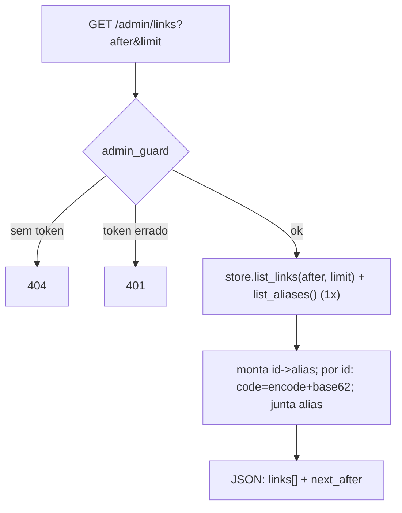

# Tijolo 8 — API do painel (design)

**Data:** 2026-07-13
**Estado:** aprovado no brainstorming, aguardando plano

## Objetivo

Transformar o quark numa **API completa** que um painel web externo (SPA, projeto
separado) possa consumir para gerenciar links sem `curl`: listar, buscar,
editar e apagar links, além dos endpoints de analytics e blocklist que já
existem. Escopo **OSS operador único** — um admin cuida da instância; contas /
multiusuário / multi-tenant são fase cloud, fora daqui.

## Princípios

- **Só adiciona superfície de API sob `/admin/*`.** O redirect e o caminho de
  leitura (`GET /:code`, `GET /:code/stats`) ficam intocados — a vazão medida
  continua valendo.
- **Reusa o que já existe:** auth via `QUARK_ADMIN_TOKEN` + `admin_guard`;
  analytics via `GET /:code/stats`; blocklist via `/admin/blocklist`.
- **Sem mecanismo de auth novo:** cross-origin resolve-se com token no header
  (`x-admin-token`), nunca cookie de sessão.
- **O SPA é um projeto separado** (repo próprio, deploy à parte, foco em
  UI/UX/heurísticas de Nielsen) — não faz parte deste tijolo.

## Componentes

### 1. Endpoints novos (todos sob `admin_guard`)

Autenticação idêntica à do `/stats` e `/admin/blocklist`: header `x-admin-token`;
sem `QUARK_ADMIN_TOKEN` configurado → `404` (endpoint opaco); token errado →
`401`.

- **`GET /admin/links?after=<id>&limit=<n>`** — lista paginada por **keyset**
  (id). `after` ausente = do início; `limit` default 50, teto 500. Resposta:
  ```json
  {
    "links": [
      { "id": 1, "code": "6lB362J", "alias": "promo", "url": "https://…",
        "expiry": 1750000000, "created": 1749000000 }
    ],
    "next_after": 1   // id do último item; ausente/null quando não há mais páginas
  }
  ```
  `code` é sempre recomputado por `to_base62(encode(id, key))`. `alias` presente
  só quando o link tem uma entrada de alias apontando para ele (enriquecido com
  **um único passe/join por página**, não um scan por id). **Sem contagem de
  cliques na lista** — evita N chamadas ao sink por página (caro no ClickHouse); o
  SPA busca o total via `GET /:code/stats` sob demanda. Contagem em lote pode
  entrar depois se necessário.

- **`DELETE /admin/links/:code`** — resolve `:code` → id (numérico ou alias,
  mesma lógica do redirect). Apaga o registro do link; se `:code` for um alias,
  apaga também a entrada de alias. `404` se o link não existe. `200` com corpo
  curto em sucesso.

- **`PATCH /admin/links/:code`** — corpo `{ "url"?: string, "ttl"?: number }`.
  Resolve `:code` → id, recarrega o `Record`, aplica os campos presentes
  (`url` validada como http/https; `ttl` recomputa `expiry = now + ttl`, ou
  remove a expiração se `ttl` for `null`) e regrava via `put_link` (upsert por
  id). `404` se não existe; `400` se `url` inválida. Invalida o cache L1/L2 do id
  (para o redirect refletir a mudança).

Os já existentes (não mudam): `POST /` (criar), `GET /:code` (redirect),
`GET /:code/stats` (analytics), `GET/POST/DELETE /admin/blocklist`.

### 2. `Store` trait — métodos novos

Implementados em LMDB e Postgres:

- `async fn list_links(&self, after: Option<u64>, limit: usize) -> Result<Vec<(u64, Record)>, StoreError>`
  — keyset por id (LMDB: `range((after, ..)).take(limit)`; Postgres:
  `WHERE id > $after ORDER BY id LIMIT $limit`).
- `async fn list_aliases(&self) -> Result<Vec<(String, u64)>, StoreError>`
  — todos os pares `alias → id` (LMDB: itera `aliases`; Postgres:
  `SELECT alias, id FROM aliases`). Aliases são a minoria (só links customizados);
  o handler do `GET /admin/links` chama isto **uma vez por request**, constrói um
  mapa `id → alias` e faz o join com a página — evita um scan por id. Se um dia o
  volume de aliases pesar, adiciona-se um índice reverso.
- `async fn delete_link(&self, id: u64) -> Result<(), StoreError>` — remove
  `links[id]` (idempotente).
- `async fn delete_alias(&self, alias: &str) -> Result<(), StoreError>` — remove
  a entrada de alias (idempotente).

O handler de delete decide o que chamar: se `:code` é alias → `delete_alias` +
`delete_link(id)`; se é código numérico → `delete_link(id)`.

### 3. CORS

- Env **`QUARK_CORS_ORIGINS`** — lista de origens permitidas separada por vírgula
  (ex.: `https://painel.meudominio.com`). Ausente → sem CORS (mesma origem
  apenas). Implementado com `tower-http`'s `CorsLayer`, aplicado às rotas
  `/admin/*` e `POST /` (as que o SPA chama). O redirect público não precisa.
- Métodos permitidos: `GET, POST, PATCH, DELETE`; headers: `x-admin-token`,
  `content-type`.

### 4. Auth

Reusa `QUARK_ADMIN_TOKEN` + `admin_guard` (constant-time). O SPA guarda o token
(inserido numa tela de login que só o captura) e o envia em `x-admin-token` a
cada request. Sem sessão, sem cookie, sem endpoint de login novo no backend.

### 5. `docker-compose.yml` (dev local / exemplo self-host)

Um `docker-compose.yml` na raiz que sobe:
- `quark` (build do `Dockerfile`), com `QUARK_KEY`, `QUARK_ADMIN_TOKEN`,
  `QUARK_DATABASE_URL`, `QUARK_VALKEY_URL`, `QUARK_CLICKHOUSE_URL`,
  `QUARK_CORS_ORIGINS` apontando para os serviços;
- `postgres`, `valkey`, `clickhouse` (mesmas imagens do CI).

Um `docker compose up` dá a stack plugável inteira — útil para dev, para rodar os
testes gated localmente e como referência de deploy full-stack.

## Fluxo — `GET /admin/links` (o mais novo)



## Tratamento de erros

- `401` token errado; `404` sem `QUARK_ADMIN_TOKEN` (endpoint opaco); `404`
  delete/patch de code inexistente; `400` payload/URL inválido; `503` erro de
  Store.
- Sem fail-open aqui — são rotas de admin, não caminho quente.

## Critérios de sucesso

1. `GET /admin/links` pagina por keyset, recompõe `code`, mostra `alias` quando
   existe (via um único `list_aliases`); `next_after` correto na virada de página.
2. `DELETE /admin/links/:code` faz o link virar `404` no redirect; alias removido
   quando o code é alias.
3. `PATCH /admin/links/:code` atualiza url/ttl e o redirect passa a refletir
   (cache invalidado).
4. CORS: com `QUARK_CORS_ORIGINS` setado, as respostas de `/admin/*` e `POST /`
   trazem os headers de CORS para as origens listadas; sem a env, não.
5. Auth: `401`/`404` corretos; endpoints opacos sem token.
6. `docker compose up` sobe quark + os 3 backends e o quark conecta nos três.
7. Redirect/leitura inalterados; `fmt`/`clippy -D warnings` limpos; CI verde.

## Global Constraints

- Nada novo no caminho de redirect/leitura — só `/admin/*` e o CORS em `POST /`.
- Auth reusa `QUARK_ADMIN_TOKEN`/`admin_guard`; nenhum mecanismo de sessão novo.
- Paginação **keyset por id** (não offset); `limit` default 50, teto 500.
- `code` sempre recomputado (`to_base62(encode(id, key))`); nunca armazenado.
- `PATCH`/`DELETE` invalidam o cache do id afetado para o redirect refletir.
- Backends novos de Store são implementados em **LMDB e Postgres**; testes de
  Postgres **gated** por `QUARK_TEST_DATABASE_URL`.
- Documentação humana; `docker-compose.yml` documentado no README.

## Fora de escopo (YAGNI, consciente)

- O **SPA/painel** em si (próximo projeto, repo próprio, foco UI/UX/Nielsen).
- **Busca server-side** — o `GET /admin/links` devolve tudo paginado; filtrar por
  texto é client-side no SPA por ora.
- Contas, login com senha/sessão, multiusuário, multi-tenant (fase cloud).
- Endpoint de "criar" novo — o `POST /` atual já serve o painel (só ganha CORS).
