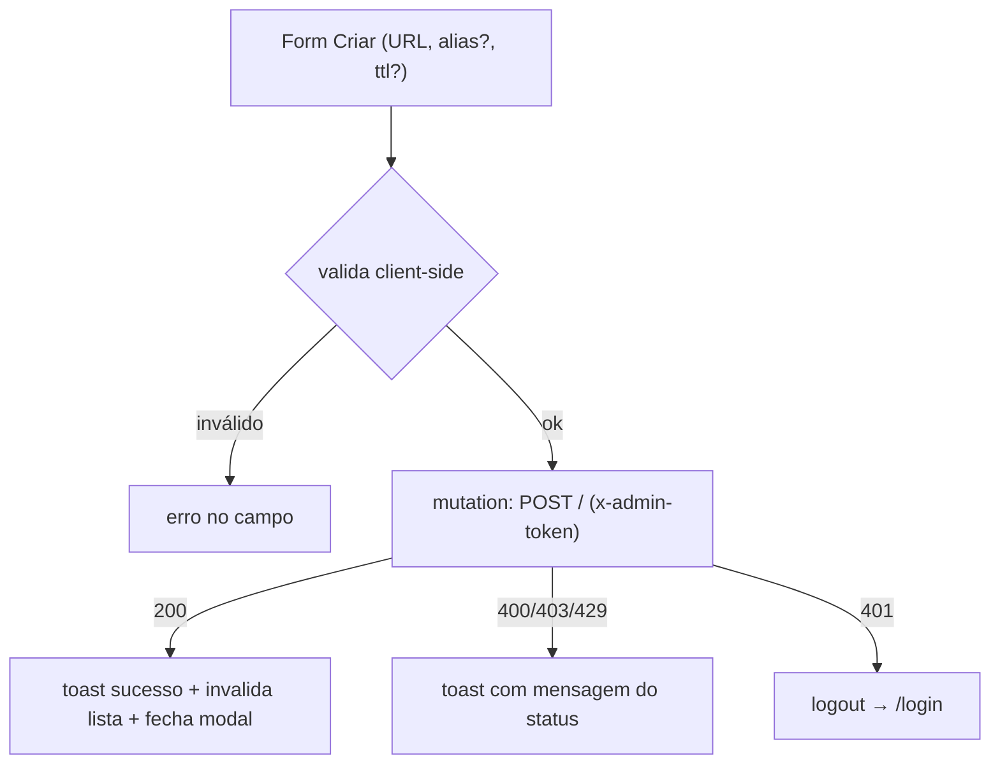

# Tijolo 9 — SPA do painel (design)

**Data:** 2026-07-13
**Estado:** aprovado no brainstorming, aguardando plano

## Objetivo

Um painel web (SPA) para o **operador único (OSS)** gerenciar o quark sem `curl`:
criar/listar/editar/apagar links, ver analytics por link e gerenciar a blocklist.
Consome a API `/admin/*` construída no Tijolo 8. **Contas / multiusuário /
multi-tenant são fase cloud, fora daqui.**

Requisito de primeira classe (enfatizado pelo usuário): **UI/UX excelente,
seguindo as heurísticas de Nielsen** (visibilidade de status, prevenção e
recuperação de erro, consistência, estados vazio/loading/erro, acessibilidade).

## Contexto travado (do brainstorming)

- **Monorepo:** o SPA vive em `web/` no repo `quark` (não é repositório à parte).
- **Deploy separado:** build estático (`web/dist`) hospedado em CDN/edge; o binário
  Rust segue **API-only** (não serve o SPA).
- **Auth:** cabeçalho `x-admin-token` = `QUARK_ADMIN_TOKEN`; sem sessão/cookie.
- **CORS:** a API já expõe `QUARK_CORS_ORIGINS`; em dev a origem é `:5173`.
- **Implementação usa a skill `frontend-design`** quando o código da UI for escrito
  (na execução), não neste design.

## Stack

React + Vite + TypeScript; **shadcn/ui** (primitivos Radix, acessíveis) + Tailwind;
**TanStack Query** (dados/cache/estados), **TanStack Table** (lista de links);
**React Router** (rotas); **Recharts** (gráficos do stats). Testes: **Vitest** +
Testing Library. Sem i18n no v1 (um idioma).

## Componentes / camadas

- **Cliente HTTP central** (`src/lib/api.ts`): injeta `x-admin-token` em toda
  requisição; base = `VITE_API_BASE_URL` (definida no build); em `401` dispara
  logout (limpa token + redireciona pro login). Uma função tipada por endpoint:
  `createLink`, `listLinks({after, limit})`, `deleteLink(code)`, `patchLink(code, {url?, ttl?})`,
  `getStats(code)`, `listBlocked`/`addBlocked`/`removeBlocked`.
- **Estado de auth** (`src/lib/auth.ts`): token em `localStorage`; hook `useAuth`.
- **Query hooks** (`src/lib/queries.ts`): wrappers TanStack Query por recurso, com
  invalidação após mutações (ex.: criar/editar/deletar link → invalida a lista).
- **Shell** (`src/app`): layout com sidebar (Links · Blocklist), header com toggle
  de tema (claro/escuro) e botão sair; `<Toaster>` global.
- **Telas** (`src/routes`): `Login`, `Links`, `LinkStats`, `Blocklist`.

## Telas (rotas)

- **`/login`** — campo de token; botão entrar; estado de erro ("token inválido")
  quando a sonda retorna 401. Redireciona pra `/links` em sucesso.
- **`/links`** (principal) — tabela paginada por keyset (`after`/`limit`, botão
  "carregar mais"); colunas: code (com **copiar URL curta**), URL (truncada com
  tooltip), alias, criado, expira. Ações por linha: copiar, editar (modal
  `PATCH`), deletar (com **diálogo de confirmação**). Botão **Criar** (modal:
  URL obrigatória + alias opcional + TTL opcional; validação client-side espelha
  a API — http/https, alias não pode ser 7-char base62). **Busca client-side**
  filtra os links já carregados.
- **`/links/:code`** — stats do link: cartões (total, primeiro/último clique) +
  gráficos (**per_day** = série temporal linha/barra; **per_country** = barras
  top-N; **per_device** = rosca) + tabela dos **eventos recentes** (ts, país,
  device, referer). Estado vazio: "sem cliques ainda".
- **`/blocklist`** — lista de domínios bloqueados + campo pra adicionar +
  remover (com confirmação). Estado vazio: "nenhum domínio bloqueado".

## Estados & heurísticas de Nielsen (mapeamento explícito)

- **Visibilidade do status do sistema:** skeletons durante loading; toasts de
  sucesso/erro; indicador de carregamento em botões de ação.
- **Prevenção de erros:** confirmação antes de deletar link/domínio; validação de
  formulário antes do submit (URL, alias, TTL).
- **Ajuda a reconhecer/recuperar de erros:** mensagens claras (401 → "faça login
  de novo"; 403 → "destino bloqueado/não permitido"; 429 → "muitas requisições");
  botão "tentar de novo" em falha de rede.
- **Estados vazios** desenhados (não telas em branco): CTA pra criar o primeiro
  link / bloquear o primeiro domínio.
- **Consistência & padrões:** componentes shadcn reusados; rótulos e posições de
  ação idênticos entre telas.
- **Controle do usuário:** copiar URL com feedback ("copiado!"); cancelar em
  qualquer modal; sair a qualquer momento.
- **Acessibilidade:** Radix garante foco/navegação por teclado/ARIA; contraste
  AA nos temas claro e escuro; alvos de toque adequados.

## Fluxo de dados (exemplo: criar link)

## Erros / mapeamento de status

- `401` → limpa token, vai pro login.
- `403` → toast "destino não permitido/bloqueado" (criar/editar).
- `429` → toast "muitas requisições, tente em instantes".
- `400` → erro inline no formulário.
- rede/5xx → toast + retry.

## Build / deploy / testes

- **Dev:** `npm run dev` (Vite em `:5173`), apontando `VITE_API_BASE_URL` pra API
  local (o `docker-compose` já libera essa origem via `QUARK_CORS_ORIGINS`).
- **Build:** `npm run build` → `web/dist` estático → deploy em CDN/edge.
- **Testes (Vitest + Testing Library):** validação do form de criar; render/
  paginação da tabela; fluxo login/401→logout; estados vazio/erro; toggle de tema.
- **CI:** job de frontend novo (lint + typecheck + build + testes) no workflow.

## Critérios de sucesso

1. Login por token funciona; 401 desloga; token persiste entre reloads.
2. Links: criar (com validação), listar paginado, buscar (client-side), copiar
   URL, editar (url/ttl), deletar (com confirmação) — refletindo na lista.
3. Stats: gráficos de per_day/país/device + eventos recentes renderizam; estado
   vazio tratado.
4. Blocklist: listar/adicionar/remover.
5. Todos os estados (loading/vazio/erro) desenhados; acessível (teclado + AA nos
   dois temas); build estático gera `web/dist`.
6. Testes de componente passam; CI de frontend verde.

## Global Constraints

- SPA em `web/` (monorepo); deploy separado; binário Rust **não** serve o SPA.
- Auth por `x-admin-token`; token em `localStorage`; sem cookie/sessão.
- Base da API por `VITE_API_BASE_URL` (build-time).
- **UI/UX seguindo Nielsen** é requisito, não enfeite — estados vazio/loading/erro
  e acessibilidade (Radix/AA) obrigatórios.
- **A implementação da UI usa a skill `frontend-design`.**
- Licença: o SPA OSS é **AGPL** (mesmo repo). CLA cobre contribuições ao `web/`.

## Fora de escopo (YAGNI, consciente)

- Contas, multiusuário, multi-tenant (fase cloud).
- Busca server-side (a client-side filtra o carregado; carregar mais páginas pra
  abranger tudo).
- Dashboards agregados multi-link; export; i18n.
- Servir o SPA pelo binário; o proxy/edge da cloud.
