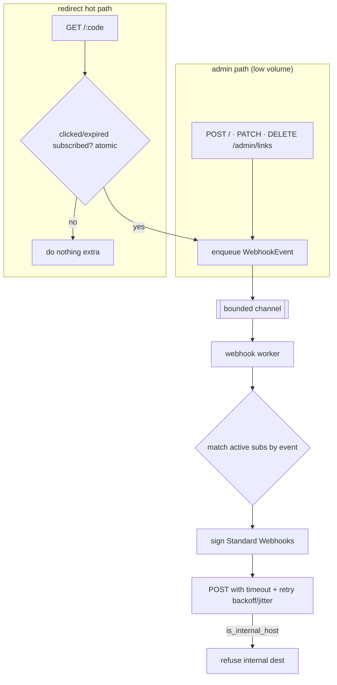

# Signed outgoing webhooks — design (roadmap #1)

**Date:** 2026-07-13
**Branch:** `feat/webhooks` (no merge to main until reviewed)
**Status:** design decided (user delegated all open questions), ready for plan

## Goal

Let a single-operator quark instance push signed HTTP events to external
endpoints (Zapier / Make / n8n / Slack / custom). Events:
`link.created`, `link.updated`, `link.deleted`, `link.expired`, `link.clicked`.
Configured in the panel: destination URL + selected events + HMAC secret +
active flag. This is the foundation for roadmap items #6 (Slack/Discord/Telegram)
and #10 (n8n/Zapier).

## Decisions (locked)

- **Delivery:** best-effort, in-memory bounded channel → worker → HTTP POST with
  exponential backoff + jitter (a few attempts over a few minutes). Subscription
  *config* is always persisted via `Store` (LMDB + Postgres). Durable, restart-
  surviving delivery (persisted attempt log, multi-day retry) is a **future
  Postgres-gated** enhancement, out of scope here. Rationale: matches the
  analytics worker model and the "scales down to one binary" ethos.
- **link.clicked:** emitted from the async path (never the 302 hot path), guarded
  by a cheap cached flag so a click costs nothing when no subscription wants it.
  Fail-open (dropped under extreme load, like analytics).
- **Multiple subscriptions:** each with its own URL, event set, secret, active
  flag.
- **Signing:** [Standard Webhooks](https://github.com/standard-webhooks/standard-webhooks/blob/main/spec/standard-webhooks.md)
  symmetric scheme (HMAC-SHA256).

## Signing (Standard Webhooks, symmetric v1)

Per delivery, send three headers:

- `webhook-id`: unique per delivery (also the **idempotency key** for the
  receiver). Format: `msg_<base62/uuid-ish>`.
- `webhook-timestamp`: unix seconds (receiver rejects if older than ~5 min →
  replay protection).
- `webhook-signature`: `v1,<base64>` where `<base64>` = base64(HMAC-SHA256(secret,
  `{webhook-id}.{webhook-timestamp}.{body}`)). Space-delimited list to allow
  secret rotation (multiple `v1,...` entries).

- **Secret** stored/displayed as `whsec_<base64>` (24–64 bytes of entropy,
  base64). The bytes signed are the raw base64-decoded secret.
- The signed `body` is the **exact** JSON bytes sent in the HTTP body (sign then
  send the same buffer; never re-serialize).
- Receiver guidance documented in `docs/WEBHOOKS.md` (verify example in
  several languages), including constant-time compare and the `webhook-id`
  idempotency window.

## Event payload

```json
{
  "id": "msg_...",           // == webhook-id header
  "type": "link.created",
  "timestamp": 1699999999,    // unix seconds, == webhook-timestamp
  "data": {
    "code": "aB3xZ9k",
    "url": "https://example.com/dest",
    "alias": "promo",          // omitted when none
    "expiry": 1700003599,      // omitted when none
    "created": 1699990000
  }
}
```

- `link.clicked` `data` additionally carries the click fields already captured
  (country, device, referrer, ts) — reusing the existing `ClickEvent` shape.
- `link.expired` fires lazily when a redirect resolves an expired link (410
  path), routed through the async path like clicked. (No background sweeper — an
  expiry is observed on access, consistent with how quark already treats TTL.)

## Components (files)

- `src/webhooks/mod.rs` — types: `EventType` (enum), `WebhookSubscription`
  `{ id: u64, url, events: Vec<EventType>, secret, active, created }`,
  `WebhookEvent { event_type, payload_json }`, secret generation
  (`generate_secret() -> String` → `whsec_...`), and `sign(secret, id, ts, body)
  -> String` (the `v1,<base64>` value). Pure, unit-tested.
- `src/webhooks/delivery.rs` — `WebhookDispatcher` (holds the `mpsc::Sender` +
  a cached snapshot of active subscriptions + `clicked_subscribed: AtomicBool`);
  `spawn_webhook_worker(rx, store, http)` mirroring `analytics::spawn_worker`:
  for each event, select matching active subscriptions, build headers, POST with
  timeout, retry with exponential backoff + jitter (e.g. 3 attempts). Uses
  `is_internal_host` to refuse internal/loop destinations at delivery time too.
- `Store` trait additions (in `src/store/mod.rs`): `list_webhooks`,
  `put_webhook`, `delete_webhook`, `get_webhook`. Implemented in LMDB (new
  `webhooks` db) and Postgres (new `webhooks` table). Subscriptions persist in
  both; delivery is in-memory either way.
- `src/api.rs` — admin endpoints under `QUARK_ADMIN_TOKEN`:
  `GET /admin/webhooks`, `POST /admin/webhooks` (validates URL is public via
  `is_internal_host`, generates secret if absent), `PATCH /admin/webhooks/:id`,
  `DELETE /admin/webhooks/:id`. Emit `link.created/updated/deleted` from the
  existing create/patch/delete handlers (low volume, direct enqueue). The
  redirect handler emits `link.clicked`/`link.expired` **only** when the cached
  `clicked_subscribed` / `expired_subscribed` flag is set (one atomic load on the
  hot path, then a non-blocking `try_send`).
- HTTP client for delivery: `reqwest` (add dep if not already present) with a
  per-request timeout (e.g. 5s) and no redirects followed.
- Frontend: `web/src/routes/Webhooks.tsx` (list + create/edit/delete, event
  checkboxes, secret shown once on creation with copy, active toggle, a "send
  test event" button hitting a `POST /admin/webhooks/:id/test`), nav entry in
  the Shell, i18n keys (EN + PT-BR), api.ts + queries.ts additions.
- Docs: `docs/WEBHOOKS.md` + `docs/WEBHOOKS.PT_BR.md` (event catalog, payload,
  signature verification examples, replay/idempotency guidance). Link from
  README + ROADMAP update (move #1 to Done).

## Data flow



## Error handling

- Create/patch: reject a subscription URL that is not http/https or resolves as
  internal (`is_internal_host`) → `400`. Reject > N subscriptions (sane cap,
  e.g. 50) → `400`.
- Delivery failure: retry with backoff+jitter up to the attempt cap; after that,
  drop and log (best-effort). Never blocks the request that emitted the event.
- Channel full: `try_send` drops (fail-open) and increments a dropped counter in
  the log, exactly like analytics.
- SSRF: internal destinations refused at both create time and delivery time.

## Testing

- Unit (`webhooks/mod.rs`): `sign()` matches a known Standard Webhooks test
  vector; `generate_secret()` shape; event-type (de)serialization; subscription
  event-matching.
- Unit (`delivery.rs`): worker delivers a matching event to a mock HTTP server
  (wiremock or a oneshot hyper server), sends the 3 headers, signature verifies;
  non-matching events are skipped; internal destination refused; retry fires on
  5xx then succeeds.
- Store: LMDB `put/get/list/delete_webhook` round-trip (unit); Postgres gated
  (`QUARK_TEST_DATABASE_URL`) round-trip.
- API (`tests/`): `POST /admin/webhooks` requires token; rejects internal URL;
  returns secret once; `GET` lists without leaking full secret (masked);
  creating a link fires `link.created` to a mock subscription.
- Frontend (Vitest): Webhooks route CRUD, event checkboxes, secret-copy, 501/err
  states; i18n keys present in both locales.
- Hot-path guard: a redirect with no clicked subscription does not enqueue
  (assert the atomic-gated path).

## Global constraints

- Redirect hot path pays at most one atomic load when no clicked/expired
  subscription exists; never a synchronous POST.
- All code English; UI strings via i18n (EN + PT-BR); docs EN + `PT_BR`.
- Signing follows Standard Webhooks exactly (test vector verified).
- SSRF guard (`is_internal_host`) applied to every destination.
- Subscription config persisted via `Store` (LMDB + Postgres); delivery
  in-memory best-effort.
- Work stays on `feat/webhooks`; do not merge to main.

## Out of scope (later)

- Durable/persisted delivery queue with multi-day retry (Postgres-gated).
- Asymmetric (Ed25519) signatures.
- Per-subscription rate limiting / clicked batching (revisit if volume hurts).
- The Slack/Discord/Telegram native UI (#6) and n8n/Zapier apps (#10) build on
  top of this later.
