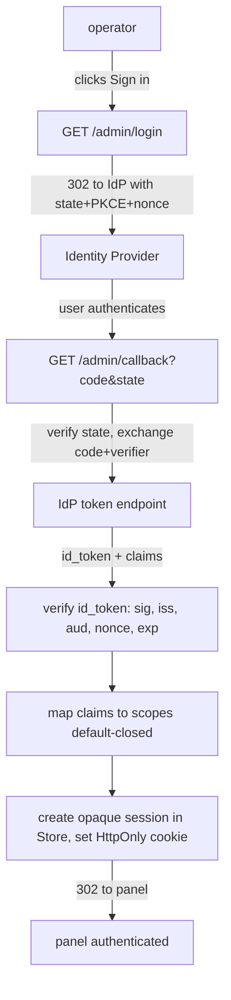

# OIDC login (stage 1): design + plan

**Date:** 2026-07-15
**Branch:** `feat/oidc-login` (off main; no merge until reviewed)
**Status:** SPEC FOR APPROVAL. Do not implement until the owner signs off (the
flow cannot be end-to-end tested without a real IdP, so the owner reviews the
design first). Decisions come from `docs/research/2026-07-14-login-system.md`.
**Effort:** medium-large. An OIDC Authorization Code + PKCE flow, an opaque
server-side session persisted in the `Store`, a claim to scope mapping, the
`admin_guard` plug, panel login/logout UI, and provider setup guides.

## Goal

Let an operator sign in to the panel with their own identity provider (Google,
GitHub, Authelia, Keycloak, or any standard OIDC IdP) instead of sharing one
admin token. Accounts become real, named, and revocable, and quark never stores
a password. The existing `QUARK_ADMIN_TOKEN` stays as a permanent break-glass.

## Decisions (from the owner; locked)

- Staged rollout. Token stays the zero-config default (stage 0). This spec is
  stage 1: OIDC opt-in "bring your own IdP". Stage 2 (built-in user/password) is
  OUT unless demand appears.
- `QUARK_ADMIN_TOKEN` remains a valid break-glass even with OIDC enabled, so a
  misconfigured or down IdP never locks the operator out.
- First-class setup guides: Authelia, Google, GitHub, Keycloak. Any other OIDC
  provider works the same, without a dedicated guide.
- Claim to scope mapping is default-closed: an admin group/claim grants `Full`,
  everyone else starts with nothing. The mapping is configured via environment.
- Session is opaque and server-side (revocable), in an HttpOnly cookie, behind
  the `Store` (LMDB and Postgres).
- A read-only role (`links_read` + `analytics`) is desirable; per-principal audit
  is deferred until accounts exist.

## Architecture

Standard OIDC Authorization Code flow with PKCE, run server-side:

- **Session token:** a random opaque id (like `generate_token`); only its hash is
  stored (reuse `hash_token`). The cookie holds the raw token. The row stores the
  principal (subject + display name/email), granted scopes, issued/expiry, so a
  logout or admin revoke kills it server-side.
- **`admin_guard` plug (`src/api.rs`):** the single choke point already used by
  every `/admin/*` route. Extend it to accept, in order: (1) `x-admin-token`
  break-glass (always `Full`, unchanged); (2) an `x-admin-token` that matches an
  API token (unchanged); (3) a valid session cookie resolving to a principal with
  scopes. The `covers(required)` check is unchanged. No route handler changes.
- **Verification:** discover the IdP config from `<issuer>/.well-known/openid-configuration`,
  fetch and cache the JWKS, verify the id_token signature (RS256), `iss`, `aud`
  (client id), `nonce`, and `exp`. Use a vetted crate (`openidconnect` or
  `jsonwebtoken` + a small discovery/JWKS fetch); the choice is a task decision.

## Configuration (all optional; OIDC is off unless `QUARK_OIDC_ISSUER` is set)

| Variable | Purpose |
|---|---|
| `QUARK_OIDC_ISSUER` | IdP issuer URL (enables OIDC when set). |
| `QUARK_OIDC_CLIENT_ID` / `QUARK_OIDC_CLIENT_SECRET` | Client credentials. |
| `QUARK_OIDC_REDIRECT_URL` | This instance's `…/admin/callback` URL. |
| `QUARK_OIDC_SCOPES` | Extra scopes to request (default `openid profile email`). |
| `QUARK_OIDC_ADMIN_CLAIM` | Claim to read for authorization (e.g. `groups`). |
| `QUARK_OIDC_ADMIN_VALUE` | Value in that claim granting `Full` (e.g. `quark-admins`). |
| `QUARK_OIDC_READONLY_VALUE` | Value granting `links_read`+`analytics` (optional). |

The unlock/session cookie is signed/opaque and reuses the deployment's
`QUARK_SIGNING_KEY` posture (already added for link passwords) where a secret is
needed; sessions themselves are opaque tokens, so no signing key is strictly
required for them.

## Store surface (new)

A `Session { token_hash, subject, display, scopes: Vec<Scope>, created, expires }`
and methods: `put_session`, `get_session_by_hash`, `delete_session`,
`gc_sessions(now)` (drop expired). LMDB new db `sessions`; Postgres new table.
Mirrors the `api_tokens` surface already in the `Store`.

## Routes (new, in `src/api.rs`)

- `GET /admin/login`: build the authorize URL (state + PKCE challenge + nonce,
  stashed in a short signed/temp cookie), `302` to the IdP.
- `GET /admin/callback`: verify state, exchange the code with the PKCE verifier,
  verify the id_token, map claims to scopes; if the principal gets no scopes,
  render an "access denied" page (authenticated but unauthorized). Otherwise
  create a session, set the cookie, `302` to the panel.
- `POST /admin/logout`: delete the session, clear the cookie.
- `GET /admin/me` (small): returns the current principal + scopes for the panel
  to render the signed-in state (or 401).

## Frontend (`web/`)

The login screen gains a "Sign in with <provider>" button (shown only when the
backend reports OIDC is configured, via `GET /admin/me` / a small `/admin/authinfo`)
that navigates to `/admin/login`. After the callback redirect the panel calls
`/admin/me` to confirm the session and drops the token-entry field when a session
exists. Logout hits `POST /admin/logout`. The existing admin-token entry stays as
the break-glass path. i18n EN + PT-BR.

## Security

- CSRF: `state` verified on callback; PKCE (S256) so a stolen code is useless
  without the verifier; `nonce` bound into the id_token and checked.
- Session cookie: `HttpOnly`, `SameSite=Lax`, `Secure` when HTTPS (reuse
  `request_is_https`), a bounded TTL, opaque and revocable server-side.
- Default-closed authorization: no matching claim value means no scopes, so a
  valid IdP user who is not an admin cannot act.
- The break-glass token path is unchanged and always available.

## Tasks (high level; expanded at implementation time)

1. Config parse + OIDC discovery/JWKS fetch with cache (`src/oidc.rs`), unit-tested
   against a static discovery/JWKS fixture.
2. `Session` type + `Store` methods (LMDB + Postgres, gated round-trip test).
3. `/admin/login` + `/admin/callback` + `/admin/logout` + `/admin/me`; state/PKCE/
   nonce handling; claim to scope mapping (default-closed), unit-tested.
4. Extend `admin_guard` to accept a valid session cookie; tests that a session
   with `links_read` cannot write, an admin-claim session gets `Full`, break-glass
   still works.
5. Frontend: provider button, `/admin/me` wiring, logout, i18n, Vitest.
6. Docs: `docs/OIDC-LOGIN.md` (+ PT), setup guides for Authelia/Google/GitHub/
   Keycloak, `CONFIGURATION` rows, `ROADMAP`, README index.

## Global constraints

- OIDC is opt-in and fully off unless `QUARK_OIDC_ISSUER` is set; the redirect hot
  path is never touched.
- `admin_guard` stays the single authorization choke point; no per-route auth.
- Break-glass `QUARK_ADMIN_TOKEN` always works.
- Sessions are opaque, server-side, revocable; only a hash is stored.
- Code in English; UI i18n EN + PT-BR; docs EN + PT_BR.
- Non-destructive Postgres migration (`CREATE TABLE IF NOT EXISTS`).
- `-j1` / `CARGO_BUILD_JOBS=1` for Rust builds/tests; Postgres tests gated.
