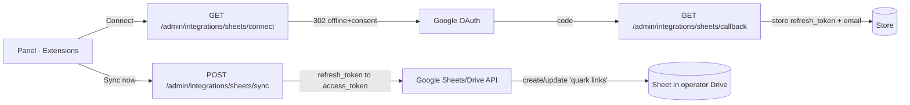

# Google Sheets integration — design

**Branch:** `feat/sheets` (off `main@dd925bf`). NOT merged until reviewed.

**Goal:** a native, OAuth-based Google Sheets connector that mirrors the link
catalog into a spreadsheet the operator owns. It is the first native OAuth
connector in quark and sets the pattern for later ones (Notion, etc.).

## Decisions (locked with the owner)

- **Data:** the link catalog only. One row per short link. No aggregated
  analytics, no multi-sheet, no column picker in v1 (YAGNI).
- **Sync model:** snapshot on demand (a "Sync now" button rewrites the sheet with
  the current state) plus an opt-in scheduled refresh. Never touches the redirect
  hot path.
- **OAuth scope:** `https://www.googleapis.com/auth/drive.file`. quark creates one
  spreadsheet in the operator's Drive and can only touch sheets it created. This
  is the most privacy-preserving scope and needs no pasted spreadsheet id.
- **Tenancy:** OSS single-tenant. One operator, one Google connection, one sheet.

## Opt-in and configuration

Off unless the operator sets the OAuth client (same shape as OIDC login):

| Variable | Purpose |
|---|---|
| `QUARK_SHEETS_CLIENT_ID` | Google OAuth 2.0 client id. Enables the connector. |
| `QUARK_SHEETS_CLIENT_SECRET` | Google OAuth 2.0 client secret. |
| `QUARK_SHEETS_REDIRECT_URL` | This instance's callback, `https://<host>/admin/integrations/sheets/callback` (Google permits `http://localhost` for local testing). Register the exact value in Google Cloud. |
| `QUARK_SHEETS_SYNC_SECS` | Optional. Seconds between scheduled snapshot syncs (floored to 60). Unset = on-demand only. Lease-coordinated (Postgres), safe on every replica. |

Operator one-time setup: a Google Cloud project, the Google Sheets API and Drive
API enabled, an OAuth consent screen (scope `drive.file`), and a Web-application
OAuth client with the redirect URI above.

## Architecture

A dedicated `src/sheets/` module. It reuses the *patterns* of `src/oidc.rs` (the
reqwest client, the Authorization Code exchange) without sharing the OIDC config
type; Google API access needs `access_type=offline` + `prompt=consent` (to obtain
a refresh token) and no id_token verification, so a small Google-specific OAuth
path is clearer than forcing the OIDC seam.

### Files

- `src/sheets/mod.rs` — `SheetsConfig::from_env` (opt-in), `SheetsConnection`
  record type, `connect_url`/`exchange_code` (Authorization Code, offline),
  `refresh_access_token`, and `sync(store, client, conn)` that reads the catalog
  and writes the rows. Unit tests: connect URL params, row building from a set of
  `Record`s, config default-off.
- `src/sheets/client.rs` — the Google HTTP calls behind a trait `SheetsApi`
  (`create_spreadsheet`, `update_values`) plus a real reqwest impl. The trait is
  the test seam: unit and integration tests inject a mock, so no real Google
  credentials are needed to test the sync logic. The real impl targets fixed
  Google hosts (`oauth2.googleapis.com`, `sheets.googleapis.com`) — no
  user-controlled URL, so no SSRF surface (unlike webhook destinations).
- `src/api.rs` — routes `sheets_connect`, `sheets_callback`, `sheets_sync`
  (POST, session/token + CSRF guarded, `Scope::Full`), and `sheets_status`
  (GET; returns connected email, spreadsheet URL, last sync + status, with the
  refresh token masked like a pixel secret). All under the existing `admin_guard`.
- `src/store/mod.rs` + `lmdb.rs` + `postgres.rs` — `put_sheets_connection` /
  `get_sheets_connection` / `delete_sheets_connection` for the single record; new
  LMDB db `sheets` (raise `MAX_DBS` by 1) and a Postgres `sheets_connection` table
  (single row). Round-trip tested; Postgres gated by `QUARK_TEST_DATABASE_URL`.
- `src/main.rs` — build the `SheetsConfig`, put it (and any `SheetsApi` client) in
  `AppState`; spawn the lease-coordinated scheduled-sync task when
  `QUARK_SHEETS_SYNC_SECS` is set, mirroring the link-health checker.
- Frontend `web/`: the Extensions card for Google Sheets flips from
  `poweredBy: "webhooks"` to a real connector — Connect / Disconnect / Sync now,
  connected email, a link to the sheet, and last-sync status. `api.ts` +
  `queries.ts` + `types.ts`; i18n EN + PT-BR (key parity). Vitest for the card
  states (disconnected, connected, syncing, error).
- Docs `docs/SHEETS.md` + `docs/SHEETS.PT_BR.md` (setup, scopes, what syncs,
  scheduled refresh), the `QUARK_SHEETS_*` rows in `docs/CONFIGURATION(+PT_BR)`,
  and `docs/ROADMAP` moves Sheets from Backlog to Done. avoid-ai-writing on prose.

## Data model

`SheetsConnection { refresh_token: String, email: String, spreadsheet_id: Option<String>, last_sync: Option<u64>, last_status: SyncStatus }`, one record. `SyncStatus` is `Ok | Never | Error(String)`. The refresh token is stored like other
secrets (pixel `api_secret`, webhook secret) and masked in every API response;
it is never logged. Encryption at rest is out of scope for v1 (consistent with
the rest of the codebase; the DB boundary is the trust boundary) and noted as a
possible follow-up.

## Sync behavior

1. Refresh: `refresh_token` → `access_token` at `oauth2.googleapis.com/token`.
2. First run: `spreadsheets.create` a sheet titled "quark links", store its id.
3. Build rows from `store.list_links` (paginated to the end): a header row plus
   one row per link — short code, short URL, destination, created, total clicks,
   tags, folder.
4. Overwrite the sheet's data range via `values.update` (idempotent: rewrite, not
   append, so re-syncing never duplicates).
5. Record `last_sync` and `last_status`.

Errors (revoked/invalid refresh token, API failure) set `last_status = Error(..)`
surfaced in the panel; they never crash the process and never touch the redirect
path. Sync is best-effort and safe to retry.

## Testing

- Unit (`src/sheets/`): connect-URL params (offline + consent + drive.file scope),
  row building from sample `Record`s, config default-off, `SyncStatus`
  transitions. The `SheetsApi` mock drives `sync` end to end with no network.
- Store round-trip for `SheetsConnection` (LMDB always; Postgres gated).
- Frontend Vitest: the Extensions card in each state.
- Real Google: a manual checklist in `docs/SHEETS.md` and an E2E spec
  (`web/e2e/sheets-real.spec.ts`) skipped unless `QUARK_E2E_SHEETS=1`, since the
  Google consent screen blocks automation. With the owner's OAuth client wired in
  (`QUARK_SHEETS_*`), a live connect + sync is verified by hand this round.

Build/test in this environment: `CARGO_BUILD_JOBS=1 cargo test -j1 --lib --test api_it`
green; `cargo fmt` + `cargo clippy -j1 --all-targets -- -D warnings` clean;
frontend `cd web && npx tsc --noEmit && npx vitest run` green. `api_it` uses LMDB
(no `QUARK_TEST_DATABASE_URL`).

## Global constraints

Code English; UI i18n EN+PT-BR; docs EN+PT-BR; the redirect hot path pays
nothing; the refresh token is masked in responses and never logged; Google hosts
are fixed (no SSRF); scheduled sync is lease-coordinated (multi-node safe); Rust
tests `-j1`; no merge to main until reviewed.
